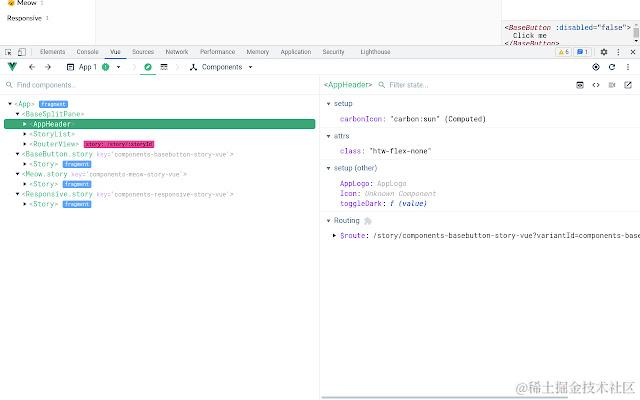
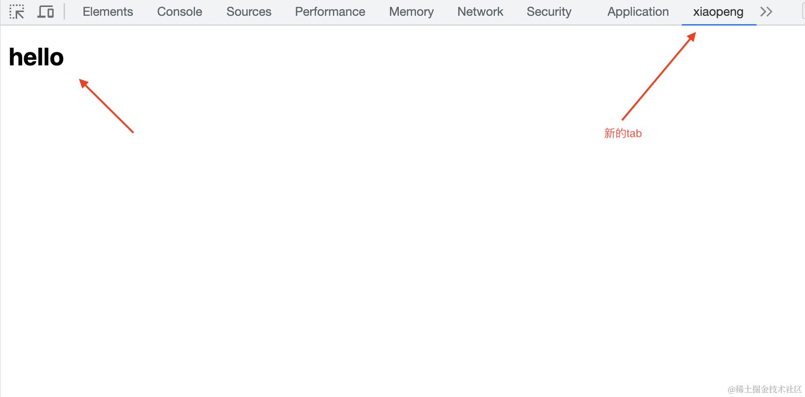
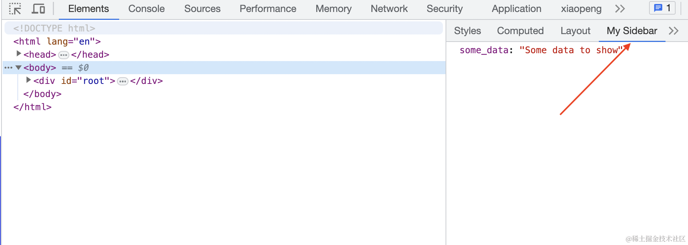
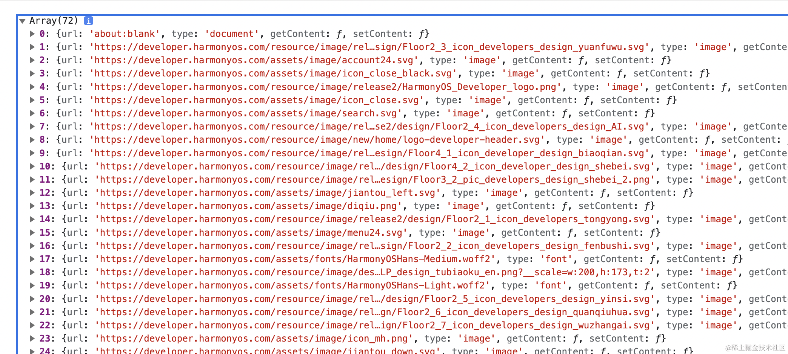
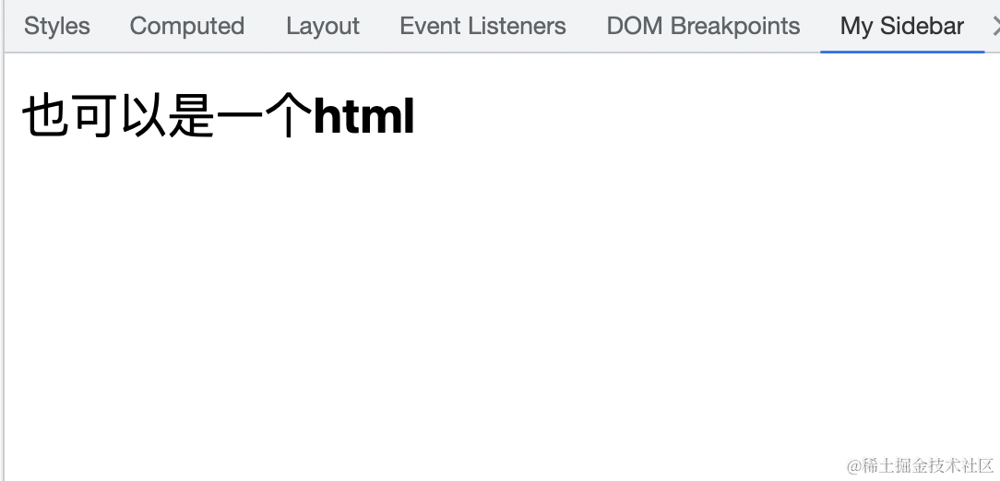
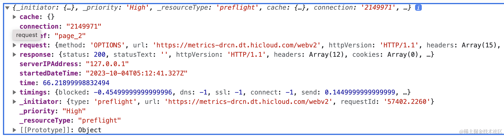

## 一、写在前面

如果你曾经是 vue 或者 react 的用户，可能都用过他们的开发工具，开发环境下，它可以监测你的站点是否是使用他们的框架开发的，并且能够管理好你的数据状态，极大的帮助我们提升开发效率。



这种结合 devtools 的插件，可以扩展浏览器中的 devtools 中的界面，然后自定义一些交互，完成更加炫酷和灵活的功能。

我们今天这篇文章就尝试来介绍如何使用插件来扩展 devtools 中的功能，以便我们更好的应对日常开发的各种需求。

## 二、扩展 DevTools

插件可以通过一些方式来扩展**DevTools**，DevTools 也就是在 chrome 浏览器中按下 F12 后，出现的那个新的界面，作为开发者我们都很熟悉了，以下我们都称其为 DevTools，而它又是由一个个的 UI 的界面组成的，这些界面我们称之为 DevTools Page。我们可以在其中增加标签、侧边栏、和 DevTools 进行交互等。所有的这一切都可以通过下面这些 API 来进行实现：

- [`devtools.inspectedWindow`](https://developer.chrome.com/docs/extensions/reference/devtools_inspectedWindow/)
- [`devtools.network`](https://developer.chrome.com/docs/extensions/reference/devtools_network/)
- [`devtools.panels`](https://developer.chrome.com/docs/extensions/reference/devtools_panels/)

一个用于扩展 DevTools 的插件可能有 background、content、option 等部分，但是这些环境都不能访问上面的 API，只有 DevTools 中的 page 可以访问上面的 API。并且他们的关系如下：


### DevTools page

DevTools page 是无法访问主站点的 DOM 的，只有 content 才可以访问。每一个 DevTools page 的实例都会在打开 DevTools 时被创建一次，随着 DevTools 的关闭而关闭。

在 DevTools page 中我们可以做下面几件事情：

- 可以通过**devtools.inspectedWindow**来获取站点资源信息、执行脚本。
- 可以通过**devtools.panels**在 DevTools 中来创建一个新的标签页，并且利用 html 来创建对应的 UI。
- 可以通过**devtools.network**来获取网络资源

需要注意的是有很多在插件 page 中使用的 ChromeAPI 的高级特性在 DevTools 也是无法使用的。但是它可以和插件 page 进行通信，以此来实现特定的功能。

### 创建一个扩展 devtools 的插件

首先需要做的就是书写**manifest.json**文件：

```json
{
  "name": "devtools",
  "description": "devtools",
  "version": "1.0",
  "manifest_version": 3,
  "devtools_page": "devtools.html",
  ...
}
```

我们需要指定一个新的属性“devtools_page”而不是像之前在“permissions”中增加字段了！它所制定的值必须是一个 html 的本地资源，我们可以在这个指定的 html 中添加脚本，脚本中可以通过**devtools.panels**来创建新的标签。

---

```html
// devtools.html
<!DOCTYPE html>
<button>Display Types</button>
<script src="devtools.js"></script>
```

```js
// devtools.js
chrome.devtools.panels.create("xiaopeng", "icon.png", "panel.html", () => {
  console.log("user switched to this panel");
});

// 创建slider
chrome.devtools.panels.elements.createSidebarPane(
  "My Sidebar",
  function (sidebar) {
    // sidebar initialization code here
    sidebar.setObject({ some_data: "Some data to show" });
  }
);
```

通过上面的代码实际上我们就可以创建好了一个新的 DevTools Page 的标签页以及一个新的 slider，效果如下：



## 三、API 详解

下面来学习一下 DevTools 的 API 的使用方法！

### inspectedWindow

我们可以通过使用`chrome.devtools.inspectedWindow`来和被检查的宿主页面进行交互，换句话说我们可以通过这个 API 来获取被`F12`打开的页面的 tabId、在 DevTools 上下文环境中执行脚本、刷新页面、或者获取一部分宿主环境的资源等等。

我们可以通过

```js
chrome.devtools.inspectedWindow.tabId; // 1685140446
```

直接获取当前被检查的 tab 的 tabId。

但是更为重要的就是可以在 DevPage 中执行脚本：

```js
chrome.devtools.inspectedWindow.eval(
  "jQuery.fn.jquery",
  function (result, isException) {
    if (isException) {
      console.log("当前站点不是使用jQuery搭建的");
    } else {
      console.log("当前站点使用了JQuery");
    }
  }
);

// 通过上面可以检查当前站点的环境中是否存在JQuery。
```

我们也可以通过下面的 API 获取当前站点使用了哪些资源：

```js
chrome.devtools.inspectedWindow.getResources((resources) => {
  // do something
  console.log(resources);
});
```

然后你就会得到资源的地址、类型等：


### panels

我们可以通过`chrome.devtools.panels`来创建一个新的 DevTools 的标签页，进入已有的标签页，添加侧边栏等。

**添加标签页**

```js
chrome.devtools.panels.create("new panel", // title
                              "example.png", // logo
                              "panel.html", // 对应的UI
                              function(panel) { ... });
```

**添加侧边栏**

```js
chrome.devtools.panels.elements.createSidebarPane(
  "new slider",
  function (sidebar) {
    // siderbar.setObject("key","value") 添加一个对象
    sidebar.setPage("slider.html"); //或者添加一个UI
  }
);
```

### network

我们可以通过`chrome.devtools.network`来检索在 DevTools 中 network 标签的所有请求。

```js
chrome.devtools.network.onRequestFinished.addListener(function (request) {
  if (request.response.bodySize > 40 * 1024) {
    chrome.devtools.inspectedWindow.eval(
      'console.log("Large image: " + unescape("' +
        escape(request.request.url) +
        '"))'
    );
  }
});
```

这是查看请求结束后针对 bodySize 的一个检查，request 的结构如下：


我们还可以通过

```js
chrome.devtools.network.onNavigated.addListener();
```

来监测站点是否发生了跳转

## 四、最后的话

以上就是关于如何使 chrome 插件和 devtools 结合起来的总结，更多细节可以阅读[文档](https://developer.chrome.com/docs/extensions/reference/devtools_network/)


