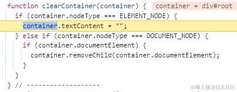
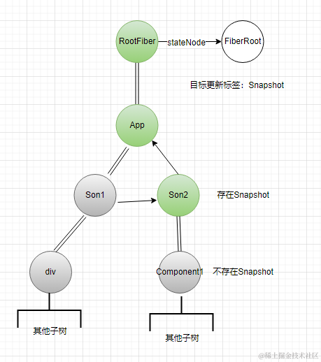

## 一、前面的话

如果把react的整个工作比作做一道菜的话，那么我们可以认为 `render` 阶段就是在准备菜谱，而真正干活的其实是`commit`阶段，在这个阶段，对于类组件来说会进行各种生命周期钩子函数的执行、函数式组件会执行`Effect hook`、纯原生组件会发生真正的DOM操作，因此这个过程就像把工作提交给了react，也算是完成了react的核心任务——**构建用户界面**

本篇文章我们就来探索一下`commit`阶段的详细过程，包括它分为哪几个部分，我们都会一一分析，希望能够帮助屏幕前的你扎实的掌握react执行流，从容应对面试官的各种问题，以及工作上可能出现的棘手问题；耐心看完本篇文章，你会对以下问题有更加深入的理解：

1. 如何理解副作用？
2. `commit`阶段分为哪几个阶段？
3. `useEffect`异步执行原理？
4. 其他更多的内容...


## 二、副作用（flag）

如果要给`render`阶段总结一下最核心的作用，我会认为它有两点

1. 构建fiber树
2. 打副作用的标签


对于第一点我们很容易理解，那到底有哪些副作用呢？(以下是删减版，只保留了最常用到的副作用)

```js
export type Flags = number;

export const NoFlags = /*                      */ 0b0000000000000000000000000000;
// 移动、新增
export const Placement = /*                    */ 0b0000000000000000000000000010;
// 更新
export const Update = /*                       */ 0b0000000000000000000000000100;
// 删除
export const ChildDeletion = /*                */ 0b0000000000000000000000010000;
// 内容重置
export const ContentReset = /*                 */ 0b0000000000000000000000100000;
// 回调
export const Callback = /*                     */ 0b0000000000000000000001000000;
// 引用
export const Ref = /*                          */ 0b0000000000000000001000000000;
// 快照
export const Snapshot = /*                     */ 0b0000000000000000010000000000;
// Hook
export const Passive = /*                      */ 0b0000000000000000100000000000;

// 生命周期相关
export const LifecycleEffectMask =
  Passive | Update | Callback | Ref | Snapshot ;


// 快照相关
export const BeforeMutationMask: number = Update | Snapshot 

// 改变，转变相关
export const MutationMask =
  Placement |
  Update |
  ChildDeletion |
  ContentReset |
  Ref 

// 布局相关
export const LayoutMask = Update | Callback | Ref 

// useEffect相关
export const PassiveMask = Passive | Visibility | ChildDeletion
```

### Placement

**情况一：**

当我们的组件在初始化时，我们的第一个根组件会被打上这个标签，例如：

```js
const App = ()=>{ ... }

React.createRoot(document.getElementById('root')).render(<App/>)
```
假设我们需要渲染**App**这个组件，那么只有**App**这个`fiber`节点会被打上`Placement`的标签，而它的子`fiber`节点是不会的，这样在commit时，只需要将离屏的DOM树挂载到`#root`下就好了

**情况二：**

当我们的列表发生变动的时候，react需要移动节点时

例如：

```JSX
// 旧
<div key='a'>A</div>
<div key='b'>B</div>

// 新
<div key='b'>B</div>
<div key='a'>A</div>
```

假设某次更新用户对列表做了以上的变动，那么根据Diff算法，会判定需要将 **div-a** 这个fiber节点往前移动一个位置，这个时候就会给**div-a**打上`Placement`标签

### Update

**情况一：**

当我们的类式组件定义了 `componentDidUpdate`时且满足`componentDidUpdate`的执行条件时，会打上这个标签，默认情况下只需要新旧`state`或者新旧`props`不同时就会执行

**情况二：**

原生text的内容发生变化 或者 原生组件内容发生了变化时，例如：

```jsx
// 旧
<span>
  a
  <a>hello<a/>
</span>

// 新
<span>
  b
  <a>hello<a/>
</span>
```

此时会给**a**这个`TextComponent`类型的fiber打上`Update`的标签

**情况三：**

```js
function finalizeInitialChildren(
    domElement,
    type, // Tag
    props,
    rootContainerInstance,
    hostContext
  ) {
    ...
    switch (type) {
      case "button":
      case "input":
      case "select":
      case "textarea":
        return !!props.autoFocus;

      case "img":
        return true;

      default:
        return false;
   }
}
```

原生组件这个函数返回true的也会打上 `Update`的标签

**情况四：**

如果函数式组件提供了`useEffect`，并且处于更新时会打上这个标签

### ChildDeletion

对于任何fiber，如果组件卸载了会打上这个标签，卸载就是原来有，这次更新没有了就会打上`ChildDeletion`

### ContentReset

对于原生组件来说，原来是纯文字、数字内容，但是本次更新不是了，变成复杂组件了，需要先清空原来的内容，在创建新的内容

```jsx
// 旧
<div>hello</div>

// 新
<div>
  <span>hello</span>
</div>
```

### Callback

**情况一：**

在调用`createRoot().render(JSX , callback)` 这个**API**时是可以传一个回调的，如果你传了，就会在`RootFiber`上打上这个标签

**情况二：**

如果你在调用类组件的`setState`时传入了回调时，例如：
```js
import React, { Component } from 'react';

class MyComponent extends Component {
  constructor(props) {
    super(props);
    this.state = {
      count: 0
    };
  }

  handleClick = () => {
    // 调用 setState 方法，将 count 加一，并传入回调函数
    this.setState({ count: this.state.count + 1 }, () => {
      // 在回调函数中输出当前的 count 值
      console.log('Count updated:', this.state.count);
    });
  };

  render() {
    return (
      <div>
        <h1>Count: {this.state.count}</h1>
        <button onClick={this.handleClick}>Increase Count</button>
      </div>
    );
  }
}

export default MyComponent;
```

此时 `MyComponent` 对应的fiber就会打上 `Callback` 标签

### Ref

**情况一：**

页面初始化时，原生组件、类组件、函数式组件被ref引用着时，会打上这个标签，如下所示：

```js
...
const ref = React.useRef();

<h1 id="h1" ref={ref}>hello</h1>
...
```
**情况二：**

更新时如果引用发生变化，会打上这个标签

```js
const App = ()=>{
  const [flag , setFlag] = useState(true)
  const ref1 = useRef();
  const ref2 = useRef();
  
  return (
    <div>
      <span ref={ flag ? ref1 : ref2 }></span>
      <button onClick={()=> setFlag(!flag)}>toggle ref</button>
    </div>
  )
}
```

### Snapshot

**情况一：**

如果类组件提供了 `getSnapshotBeforeUpdate` 且满足执行条件时

**情况二：**

初始化渲染时`RootFiber`会打上这个标签


### Passive

**情况一：**

如果函数式组件提供了`useEffect`，并且处于初始化时会打上这个标签

**情况二：**

在函数式组件中使用了`useSyncExternal`时，会打上这个标签


以上就是初级阶段我们需要掌握的所有副作用了，整理的情况可能会有遗漏，但是正常情况下的场景都列举到了，`render`阶段就是在打各种各样的标签，然后接下来才是`commit`发挥作用的时候


## 三、3个阶段

通过上面的内容我们已经了解到了各种各样的副作用，并且列举了它们发生的场景，接下来我们看一看`commit`阶段是如何处理这些副作用的，react将`commit`阶段分为3个部分，它们分别是：

1. beforeMutation
2. mutation
3. layout

我们可以通过`commitRootImpl`的源码来证明这一点：

```js
function commitRootImpl(
    root,
    recoverableErrors,
    transitions,
    renderPriorityLevel
  ) {
    ...
    var subtreeHasEffects =
      (finishedWork.subtreeFlags &
        (BeforeMutationMask | MutationMask | LayoutMask | PassiveMask)) !==
      NoFlags; // 子树有副作用吗？
    var rootHasEffect =
      (finishedWork.flags &
        (BeforeMutationMask | MutationMask | LayoutMask | PassiveMask)) !==
      NoFlags; // root有副作用么？

    if (subtreeHasEffects || rootHasEffect) { // 如果拥有副作用才会进行commit的三大部分
      
      // 1. beforeMutation 部分
      commitBeforeMutationEffects(
        root,
        finishedWork
      );

      // 2. Mutation 部分
      commitMutationEffects(root, finishedWork, lanes);

      resetAfterCommit(root.containerInfo); 
      
      // 将workInProgress树视为下一次的current树
      root.current = finishedWork; 
      // 3. Layout 部分
      commitLayoutEffects(finishedWork, root, lanes);
    }

    var rootDidHavePassiveEffects = rootDoesHavePassiveEffects;

    if (rootDoesHavePassiveEffects) {
      // 在末尾的时候，会将这个全局变量赋予真值，因此可以在第二个周期中 flushPassiveEffects 顺利执行
      rootWithPendingPassiveEffects = root; 
      pendingPassiveEffectsLanes = lanes;
    } 

    remainingLanes = root.pendingLanes;
   
    // 继续调度
    ensureRootIsScheduled(root, now());
    flushSyncCallbacks();
    return null;
  }
```

在之前的文章中，我们有提到过`render`流程中有一个细节，那就是每一个fiber节点都会在`completeWork`的时候收集自己子树上的`flags`作为自己的`subtreeFlags`，意味着对于每一个fiber节点来说都可以非常轻松的知晓自己的子树副作用的情况，因此就很容易理解在`commitRootImpl`开始的逻辑，它会站在根Fiber节点的位置判断下子树是否有相关的副作用需要处理，再进行后续的流程，绝不做无用功，假设有相关的副作用，就会进行下面的流程

### BeforeMutation

首先进行的是`beforeMutation`，它会遍历所有的fiber节点，然后如果遍历到的节点有`Snapshot`这个标签时，会执行`commitBeforeMutationEffectsOnFiber`这个函数，对相关的标签进行处理：

如果是类组件时，会调用用户提供的`getSnapshotBeforeUpdate`方法，这个时候甚至不用判断这个函数存不存在，因为既然有这个标签，说明`render`阶段已经判断过了，且符合执行条件。

如果是`HostRoot`类型（RootFiber），说明是初始化的时候，因为只有在初始化的时候，`HostRoot`才会打上`Snapshot`这个标签，那么就会对当前的根DOM节点清空内容：




这就是`beforeMutation`阶段做的全部的事情，可能有的小伙伴会思考，这种遍历操作是不是比较耗费性能，毕竟fiber树还是挺庞大的，而且每次`commit`都是从`RootFiber`开始的，实际上由于`render`阶段已经收集了所有fiber的子副作用集合，这个遍历其实能够做到非常高效的遍历，举个例子




假设我们的fiber树非常庞大，但是只有在**Son2**处打上了标签，那么无论**Son1**子树再多，以及**Component1**多么庞大，它们都会跳过遍历，实际处理的节点只有`RootFiber` 、`App`、`Son2`，因此这是一个很高效的遍历，性能并不差，以下我们把这样的遍历简称为**过滤遍历**


### Mutation


在mutation阶段做的事情就非常多了，根据上面副作用的说明，这个过程至少会处理以下副作用

```js
export const MutationMask =
  Placement |
  Update |
  ChildDeletion |
  ContentReset |
  Ref 
```

同样的这个阶段依然会过滤遍历每一个符合以上标签的fiber节点，命中之后，会执行`commitMutationEffectsOnFiber`，意思是对当前fiber节点进行`mutation`操作

**ChildDeletion**

如果当前fiber有子节点移除，会对他们的子节点依次检查

1. 如果这个被移除的子节点是一个原生DOM节点或者是一个`text`类型的节点，首先会调用`document.removeChild`移除他的DOM元素，其次会移除它引用的`ref`

2. 如果这是一个函数式组件，会依次调用它的销毁函数，如何调用呢？

    ```js
    import React, { useState, useEffect } from 'react';

    const MyComponent = () => {
      const [count, setCount] = useState(0);

      useEffect(() => {
        // 此处是副作用的代码，比如订阅外部事件、网络请求等
        console.log('Component mounted');

        // 返回一个清理函数，它将在组件被销毁时执行
        return () => { // destroy函数
          console.log('Component will unmount');
          // 在这里进行一些清理工作，比如取消订阅、清除定时器等
        };
      }, []); // 传递一个空数组作为第二个参数，以确保 useEffect 仅在组件挂载时执行一次

      return (
        <div>
          <p>Count: {count}</p>
          <button onClick={() => setCount(count + 1)}>Increment</button>
        </div>
      );
    };

    export default MyComponent;
    ```


   实际上在fiber节点上，每一个hook，都通过`updateQueue`保存在fiber上，它们形成了一个链表，`useEffect`的销毁函数就保存在`hook`对象上的`destroy`属性上，因此依次调用就可以了


3. 如果这是一个类组件，就会调用用户提供的`componentWillUnmount` 钩子函数


**Placement**

这个流程会通过`commitPlacement`来处理该节点，他只会对`HostComponent`、`HostRoot`、`HostPortal`三种fiber类型做处理

1. 如果是一个原生DOM元素，会通过`insertOrAppendPlacementNodeIntoContainer`将该fiber类型对应的DOM节点插入自己的父fiber对应的DOM节点，真实的DOM节点都保存在相应fiber的`stateNode`属性上。

2. 如果是`HostRoot`类型，就会将自己子节点的真实DOM插入根DOM`#root`上（初始化流程就是样的的操作）

3. 更新时如果经由Diff算法计算该fiber节点需要移动时，会调用`commitReconciliationEffects`来移动节点，至于如何移动的机制我们在后面的`diff`章节详细了解   


**Ref**

如果一个类组件或者原生DOM组件，且它们原本拥有引用时，此时会通过`safelyDetachRef`先清除他们的ref应用，初始化阶段不会调用`safelyDetachRef`


**ContentReset**

如果一个`Text`类型的节点，会通过`resetTextContent`清除内容

```js
function resetTextContent(domElement) {
    setTextContent(domElement, "");
}

// setTextContent
var setTextContent = function (node, text) {
    if (text) {
      var firstChild = node.firstChild;

      if (
        firstChild &&
        firstChild === node.lastChild &&
        firstChild.nodeType === TEXT_NODE
      ) {
        firstChild.nodeValue = text;
        return;
      }
    }

    node.textContent = text;
};
```

**Update**

如果原生组件内容发生变化，就会执行`commitUpdate`，用来更新DOM

如果Text内容发生变化，就会执行`commitTextUpdate`，用来更新text的内容

如果函数式组件内容发生变化，就会执行`commitHookEffectListUnmount` 以及 `commitHookEffectListMount`

1. `commitHookEffectListUnmount`主要用来执行某些被更新掉的组件的销毁函数

2. `commitHookEffectListMount` 主要用来执行新来的组件的mount函数，例如函数组件的`useEffect`函数


> 小结：以上就是在mutation阶段做的事情，总结一下就是：各种DOM操作，包括移动节点、删除节点、清除内容、添加节点；执行被删除组件的销毁钩子函数，执行被删除组件的`componentWillUnmount`；更新ref引用等等


### Layout

在layout阶段，会经历更多的生命周期函数，他会过滤遍历fiber树，寻找以下副作用

```js
export const LayoutMask = Update | Callback | Ref 
```

当寻找到了具有以上副作用的节点会通过`commitLayoutEffectOnFiber`去处理

**1.类组件**

初始化时，会在此时执行`componentDidMount`，更新时会在此时执行`componentDidUpdate`

类组件在调用`setState`时可以传入回调函数，如果传入了回调函数，在此时会执行这个传入的回调函数，这个回调函数获取的是最新的状态

**2.函数组件**

函数组件会执行`commitHookEffectListMount`，在这里会执行 `useLayoutEffect`的钩子函数，并得到`destroy`函数，将其保存在fiber中，我们知道所有的`hook`都会形成一个链表，保存在Fiber中的，那么在这一步的之后，是如何将`useLayoutEffect`和`useEffect`区分开的呢？

原来在初始化hook的时候，使用`tag`进行区分了，对于`useLayoutEffect` 而言，他创建Hook时注入了`Layout`这样的标识

```js
mountEffectImpl(fiberFlags, Layout /*标识*/, create, deps);
```

而对于`useEffect`，他是注入了`Passive`的标识

```js
mountEffectImpl(Passive | PassiveStatic, Passive$1, create, deps);
```

因此Layout阶段在遍历当前fiber的`hooks`链表的时候只会执行那些`Layout`标签的`hook`

**3.所有组件**

对于任意类型的fiber，如果被打上`Ref`的标签后，都会通过`commitAttachRef`给它的`ref`引用赋值

如果是一个原生DOM组件，就会将真实DOM节点赋值给`ref.current`

如果是一个类组件，就会将实例instance赋值给`ref.current`

实际上都是取的是fiber身上的`stateNode`所对应的值


> 小结：在Layout阶段，会做这些事情：执行componentDidMount，componentDidUpdate，useLayoutEffect；执行`setState`的回调函数；处理ref的引用；


## 四、useEffect

不知道大家发现没有，好像所有的内容中没有提到`useEffect`是在哪里执行，实际上`useEffect`还真不是在上面提到的三个阶段执行的，原来`commitRootImpl`的实现中，在三大阶段之前，它偷偷的发起了一个异步的调用

```js
function commitRootImpl(){
    ...
    // 如果整棵中存在有Passive副作用的化就会执行下面的逻辑
    if ((finishedWork.subtreeFlags & PassiveMask) !== NoFlags || (finishedWork.flags & PassiveMask) !== NoFlags) {
      if (!rootDoesHavePassiveEffects) { // 此时可以进得去
        rootDoesHavePassiveEffects = true;
        pendingPassiveTransitions = transitions;
        scheduleCallback$1(NormalPriority, function () {
          flushPassiveEffects();
          return null;
        });
      }
    } 
    
    // 下面是大阶段
    
    1. BeforeMutation
    
    2. Mutation
    
    3. Layout
}
```

在专栏的[《深入理解react》之调度引擎——Scheduler](https://juejin.cn/post/7348466339361194035) 这篇文章中，我们提到过通过`Scheduler`发起的都属于异步调用，因此虽然提前调用，但是会在三大阶段之后才会执行，准确来说，react发起了一个`NormalPriority`优先级的调度任务来执行`flushPassiveEffects`，他的名字其实就证明了是在将所有的`Passive`副作用进行处理，下面我们看下`flushPassiveEffects`的逻辑：


```js
function flushPassiveEffects(){
  
  ...
  // 核心逻辑是这两个
  commitPassiveUnmountEffects(root.current);
  commitPassiveMountEffects(root, root.current, lanes, transitions); 
  ...
}
```

`commitPassiveUnmountEffects`里面蕴含`commitHookEffectListUnmount`，它会将当前需要执行的**销毁函数**（destroy函数）进行执行，比如以下情况
 

`commitPassiveMountEffects`当中蕴含`commitHookEffectListMount`，会将当前需要执行的`useEffect`相关的`hook`进行执行（create函数）

```js
import React, { useState, useEffect } from 'react';

const MyComponent = () => {
  const [count, setCount] = useState(0);
  
  const destroy = () => {
      console.log('Component will unmount');
      // 在这里进行一些清理工作，比如取消订阅、清除定时器等
    }
  
  const create = () => {
    // 此处是副作用的代码，比如订阅外部事件、网络请求等
    console.log('Component mounted');

    // 返回一个清理函数，
    return destroy;
  }

  useEffect(create, [count]); 
  
  return (
    <div>
      <p>Count: {count}</p>
      <button onClick={() => setCount(count + 1)}>Increment</button>
    </div>
  );
};

export default MyComponent;
```

对于上面的例子来说


初始化：

render阶段 -> 完成commit三大阶段 -> `destroy()`不会执行，因为不满足条件 -> `create()`会执行

更新：

点击Increment之后 -> render阶段 -> 完成commit三大阶段 -> 执行`destroy()` -> 执行`create()`


## 五、最后的话

好了以上就是今天`commit`的全部内容，涉及副作用、过滤遍历、生命周期、effect的处理等内容，相信通过本节内容，你能够对react的`commit`有更加深入的认识！


后面的文章我们会依然会深入剖析react的源码，学习react的设计思想，如果你也对react相关技术感兴趣请订阅我的[《深入理解react》](https://juejin.cn/column/7348420268175114290)专栏，笔者争取至少月更一篇，我们一起进步，有帮助的话希望朋友点个赞支持下，多谢多谢！
