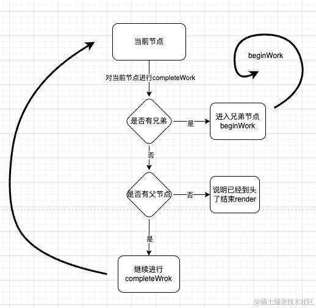

## 一、前面的话

每一个经历过`beginWork`的Fiber节点都会经历`completeWork`，当`beginWork`进行到不能再往下进行的时候，换句话说，当前的的节点已经没有子节点的时候，就会来到`completeWork`，如下面所示：

```js
function performUnitOfWork(unitOfWork) { // 当前的workInProgress节点
    next = beginWork(current, unitOfWork, subtreeRenderLanes);
    if (next === null) { // 也就是没有自己的子节点的时候，到头了
      completeUnitOfWork(unitOfWork);
    } else {
      workInProgress = next;
    }

    ReactCurrentOwner$2.current = null;
}
```

而`completeUnitOfWork`会先找自己的兄弟节点
1. 如果有兄弟节点，就进入兄弟节点的`beginWork`，在下一次的轮回中进行
2. 如果没有兄弟节点就会进入父节点的`completeWork`，在本次轮回中进行

```js
function completeUnitOfWork(unitOfWork) {
    var completedWork = unitOfWork; // 当前这个没有child的fiber节点
    do {
      var current = completedWork.alternate;
      var returnFiber = completedWork.return;
      
        var next = completeWork(current, completedWork, subtreeRenderLanes); 

        if (next !== null) { // 这个next一般情况下都返回null
          workInProgress = next;
          return;
        }
     
        var siblingFiber = completedWork.sibling;
        if (siblingFiber !== null) { // 如果有兄弟节点，进入兄弟节点的beginWork
         workInProgress = siblingFiber;
         return;
        } 
        // 没有兄弟节点进入父节点的completeWork
        completedWork = returnFiber; 
        workInProgress = completedWork;
    } while (completedWork !== null); // We've reached the root.
  }
```

用一张图来表示就是这样的：




而completeWork具体做了什么事情呢？

```js
function completeWork(current , workInProgress , renderLanes){
  var newProps = workInProgress.pendingProps
  // 根据不同的分支进入不同的逻辑
  switch(workInProgress.tag){
    case IndeterminateComponent:
    case FunctionComponent:
      ...
      bubbleProperties(workInProgress);
      return null;
      
    case ClassComponent:{
      ...
      bubbleProperties(workInProgress);
      return null;
    }
    
    case HostRoot: {
        var fiberRoot = workInProgress.stateNode;
        popHostContainer(workInProgress);
        updateHostContainer(current, workInProgress);
        bubbleProperties(workInProgress);
        return null;
    }
    ...
  }
}
```

`completeWork`会根据fiber的类型进入不同的分支，处理不同的情况，我们依然通过两种场景分别来看一下，分别是初始化和更新


## 二、初始化

### HostComponent

第一个进入completeWork的节点是第一个没有子节点的Fiber，通常情况下，它应该是`HostComponent`类型的Fiber，当他进入`completeWork`之后，命中的是下面的逻辑

```js
// 创建实例节点，对于HostComponent来说就是真实的DOM对象
var instance = createInstance(
  type, // div
  newProps,// { coClick , children , id , className ... }
  rootContainerInstance, // #root
  currentHostContext, // 不重要
  workInProgress // Fiber#div
);
// 将它的子DOM节点添加到自己的children列表中，这会触及到真实的DOM操作
appendAllChildren(instance, workInProgress, false, false);
// 将instance 添加到Fiber中的stateNode中
workInProgress.stateNode = instance;
// 对属性做处理
bubbleProperties(workInProgress);
```

`appendAllChildren`会通过遍历自己的子fiber节点，把他们的`stateNode`属性的值依次添加到`instance`中，由此可见如果这样循环往复一直到root节点，那么内存中就会有一颗离屏的真实DOM树，这就是为什么completeWork要设计为自下而上的，这样可以方便在初始化流程中从叶节点归并为一棵完成的DOM树，接下来就是`bubbleProperties`的内容，这是每种类型的fiber都会经历的，我们来分析一下：

```js
function bubbleProperties(completedWork) {
    var didBailout =
      completedWork.alternate !== null && 
      completedWork.alternate.child === completedWork.child;
    var newChildLanes = NoLanes;
    var subtreeFlags = NoFlags;

    if (!didBailout) { // 初始化
      var _child = completedWork.child;
      // 依次收集自己直接子节点的flag和lane，收集到childLanes 和 subtreeFlags再赋值给workProgress
      while (_child !== null) {
        newChildLanes = mergeLanes(
          newChildLanes,
          mergeLanes(_child.lanes, _child.childLanes)
        );
        subtreeFlags |= _child.subtreeFlags;
        subtreeFlags |= _child.flags; 
        _child.return = completedWork;
        _child = _child.sibling;
      }
      completedWork.subtreeFlags |= subtreeFlags; // 合并子树的副作用
    } else { // 更新时
       ...
    }

    completedWork.childLanes = newChildLanes;
    return didBailout;
}
```

每一个fiber节点都会收集自己的子节点的所有标签，这个标签代表着在后面commit阶段应该做什么样的操作来更新真实的DOM，这一步是为了在后面的`commit`阶段使用，其中flag我们也可以将其称为**副作用**，在react中有各种各样的副作用，如下所示：

```js
export const NoFlags = /*                      */ 0b00000000000000000000000000; // 乌副作用
export const PerformedWork = /*                */ 0b00000000000000000000000001; // 这个是跟devTools有关的，可以不用管

export const Placement = /*                    */ 0b00000000000000000000000010; // 插入
export const Update = /*                       */ 0b00000000000000000000000100; // 更新
export const Deletion = /*                     */ 0b00000000000000000000001000; // 删除
export const ChildDeletion = /*                */ 0b00000000000000000000010000; // 删除子节点
export const ContentReset = /*                 */ 0b00000000000000000000100000; // 重置内容
export const Callback = /*                     */ 0b00000000000000000001000000; // 回调函数
其他很多...

export const LifecycleEffectMask =
  Passive | Update | Callback | Ref | Snapshot | StoreConsistency; // 生命周期副作用
```

我们在这里只是简单认识一下，实际上在`beginWork`和`completeWork`，在特定的时候都会给当前的fiber打上相应的副作用标记，这些标记服务于后面的`commit`阶段，执行具体的DOM操作或者副作用函数。

### HostRoot

在初始化阶段，进入RootHost时会有下面的过程

```js
简化后...
workInProgress.flags |= Snapshot;
bubbleProperties(workInProgress);
```

他会给`HostRoot`打上`Snapshot`的标记，这个为了在commit阶段清空原来的整个界面的，如果`HostRoot`有这样的标记，会做类似这样的操作：`root.textContent = ''`，`bubbleProperties`的逻辑已经讲过了，其实就是收集子标记集合。

当completeWork来到`HostRoot`之后也就意味着，初始化的render流程结束，接下来是更新流程

## 三、更新

在更新流程中，第一个节点还是一样的是`HostComponent`，它的逻辑如下

```js
{
  if (current !== null && workInProgress.stateNode != null) { // 更新时
    updateHostComponent$1( // 如果有更新就打标记
      current,
      workInProgress,
      type,
      newProps,
      rootContainerInstance
    );

    if (current.ref !== workInProgress.ref) {
      markRef$1(workInProgress); // 打标签
    }
  } else{
    // 初始化..
  }
  bubbleProperties(workInProgress);
}
```

对于`HostComponent`来说，在更新阶段，主要的目的不是创建DOM了，而是看看有没有更新，在`updateHostComponent$1`的内部，会通过`diffProperties()`检查新旧`props`的异同情况，如果有不同就打上`Update`的标记

```
updateHostComponent$1 = function (
  current,
  workInProgress,
  type,
  newProps, // 新的props
  rootContainerInstance // 当前DOM对象
) {
      var oldProps = current.memoizedProps;
      if (oldProps === newProps) {// 如果一样，就不打标记了
        return;
      } 
      var instance = workInProgress.stateNode;
      var currentHostContext = getHostContext(); 
      var updatePayload = prepareUpdate( // 是否有异同点
        instance,
        type,
        oldProps,
        newProps,
        rootContainerInstance,
        currentHostContext
      ); 
      workInProgress.updateQueue = updatePayload; 
      if (updatePayload) { // 打update的标记
        markUpdate(workInProgress);
      }
  };
```

这就是在更新阶段对于HostComponent的主要表现

`bubbleProperties`的作用，在更新的阶段依然是主要为了收集子树的`flags`集合

> 小结：
> 至此completeWork的主要流程就讲完了，在这里我们可以总结completeWork主要的作用有这么几点：
> 1. 创建DOM
> 2. 打标签
> 3. 收集子标签
> 4. 构建离屏DOM树


当`completeWork`完成最后一个`fiber`节点之后，标志着rende流程正式结束，在`completeUnitOfWork`的末尾，会将`workInProgressRootExitStatus` 标记为 `RootCompleted`，意味着本次render流程的fiber构建完成。

```js
function completeUnitOfWork(unitOfWork){
  var completedWork = unitOfWOrk
  
  do{
     ...
  }while(completedWork !== null)
  
  if (workInProgressRootExitStatus === RootInProgress) {
    workInProgressRootExitStatus = RootCompleted;
  }
}
```

最后回到`renderRootSync` 或者 `renderRootConcurrent`的时候会将 `workInProgressRootExitStatus` 返回给上一层，然后根据这个fiber树的构建状态来决定如何进行后面的操作，如果状态是`RootCompleted`，就会将构建好的`workInProgress`树赋值给root的`finishedWork`，然后最后进入`commit`流程

```js
function performSyncWorkOnRoot(root) {
    ...
    var exitStatus = renderRootSync(root, lanes); // render流程

    if (exitStatus === RootFatalErrored) { // 未完成的情况
      ...
      throw fatalError;
    }

    if (exitStatus === RootDidNotComplete) { // 未完成的情况
      throw new Error("Root did not complete. This is a bug in React.");
    }
    var finishedWork = root.current.alternate ; // 就是workInProgress树
    root.finishedWork = finishedWork;
    root.finishedLanes = lanes;
    // 进入commit流程
    commitRoot(
      root,
      workInProgressRootRecoverableErrors,
      workInProgressTransitions
    ); 
    // 进行下一次调度
    ensureRootIsScheduled(root, now());
    return null;
}
```


## 四、最后的话


接下来我们就可以进入`commit`流程了，`commit`流程才是那个真正干DOM操作这个活的人，而且富含很多副作用的处理，一起期待后面的文章吧！

后面的文章我们会依然会深入剖析react的源码，学习react的设计思想，如果你也对react相关技术感兴趣请关注我的[《深入理解react》](https://juejin.cn/column/7348420268175114290)专栏，我们一起进步，有帮助的话希望朋友点个赞支持下，多谢多谢！


