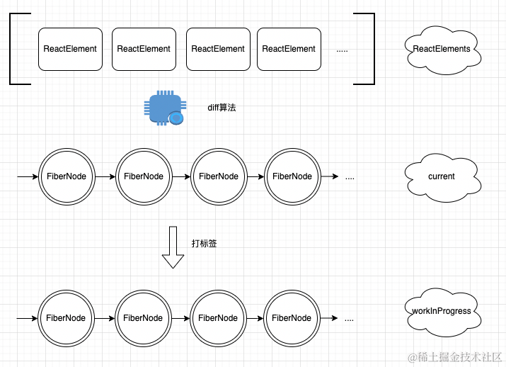

## 一、前面的话


在之前的文章中，我们分别介绍了**react**的`初始化流程`、`render流程`、`commit流程`等，算是粗浅的了解了下**react**的工作流全貌，接下来我们需要慢慢深入**react**在工作中的细节部分，了解这些核心的细节不仅可以帮助我们更好的认识**react**还能够从中学习到react的设计思想，更重要的是在面试的时候也能够得心应手的和面试官装杯！


记得笔者在两年前写过一篇文章[《浅析react和vue中的diff策略》](https://juejin.cn/post/7110843300373856287)，推荐大家业余时间可以看看，在这篇文章中我分别介绍了不同主流的框架在diff层面所实现的细节的不同，但凡基于虚拟DOM的前端框架，基本都要通过diff算法来实现最小量的更新，而本篇文章我会跟大家详细介绍一下专栏之前提到的`beginWork`流程中，react是如何找出新旧两次虚拟DOM的不同的，包括如何打标签、如何在`commit流程`进行移动的，耐心看完本篇文章你会对以下问题有一个更加深入的理解：

1. 参与react的diff的对象是什么？
2. 真实DOM需要更新，那么Fiber需要更新吗？
3. diff的全流程？
4. 更多其他的内容...


## 二、源码

### 参与的角色

通过之前的文章我们知道在构建`workInProgress`树🌲的过程中，我们需要经历`beginWork流程`，而今天的主角diff算法就是发生在这个过程中的，在`beginWork`流程中会根据最新的`ReactElement`和`current Fiber树`来生成`workInProgres`，因此参与diff算法的对象就是`新ReactElement`和`current🌲`，因此整个diff的流程可以用下面图来描述一下：





在`beginWork`流程中，我们知道`ReactElement`是一个数组结构，而对于特定层的`fiber树`是一个链表结构，因此无法采用传统的双指针的策略，`diff`的核心作用就是在新生成的`workInProgress树`上打上标签，以供后面的`commit流程`使用

### 核心代码

对于单个节点，没有diff的意义，直接判断就好了，因此diff只会发生在某一层有多个节点的情况，核心就是`reconcileChildrenArray`这个函数，接下来我们就来一一看一下


```js
function reconcileChildrenArray(
  returnFiber,
  currentFirstChild,
  newChildren,
  lanes
) {
  var resultingFirstChild = null; // 新构建的第一个childFiber
  var previousNewFiber = null; // 前一个新fiber
  var oldFiber = currentFirstChild; // 第一个oldFiber
  var lastPlacedIndex = 0; // 标记
  var newIdx = 0; // 索引
  var nextOldFiber = null; 

  // 第一轮判断
  for (; oldFiber !== null && newIdx < newChildren.length; newIdx++) {
    if (oldFiber.index > newIdx) {
      nextOldFiber = oldFiber;
      oldFiber = null;
    } else {
      nextOldFiber = oldFiber.sibling;
    }

    var newFiber = updateSlot( // 从第一个old fiber 开始与 第一个 newChild 比较，看是否相同
      returnFiber,
      oldFiber,
      newChildren[newIdx],
      lanes
    );

    if (newFiber === null) { // 说明开始不同了 开始退出；
      if (oldFiber === null) {
        oldFiber = nextOldFiber;
      }

      break;
    }

    lastPlacedIndex = placeChild(newFiber, lastPlacedIndex, newIdx);

    if (previousNewFiber === null) {
      resultingFirstChild = newFiber;
    } else {
      previousNewFiber.sibling = newFiber;
    }

    previousNewFiber = newFiber;
    oldFiber = nextOldFiber;
  }


  // 说明 新的ReactElements被用完了 ， 直接删除所有的旧节点就好了
  if (newIdx === newChildren.length) {
    deleteRemainingChildren(returnFiber, oldFiber); // 标记删除节点
    return resultingFirstChild;
  }

  // 说明 oldFiber被用完了，直接创建新的节点就好了
  if (oldFiber === null) {
    for (; newIdx < newChildren.length; newIdx++) {
      var _newFiber = createChild(returnFiber, newChildren[newIdx], lanes);

      if (_newFiber === null) {
        continue;
      }

      lastPlacedIndex = placeChild(_newFiber, lastPlacedIndex, newIdx);

      if (previousNewFiber === null) {
        resultingFirstChild = _newFiber;
      } else {
        previousNewFiber.sibling = _newFiber;
      }

      previousNewFiber = _newFiber;
    }
    return resultingFirstChild;
  } 


  // 说明都没有被用完，只是找到不同的节点而已，开始diff真正的逻辑；
  var existingChildren = mapRemainingChildren(returnFiber, oldFiber); // Keep scanning and use the map to restore deleted items as moves.

  for (; newIdx < newChildren.length; newIdx++) {
    var _newFiber2 = updateFromMap( // 从existingChildren中找存在的fiber
      existingChildren,
      returnFiber,
      newIdx,
      newChildren[newIdx],
      lanes
    );

    if (_newFiber2 !== null) {
      if (_newFiber2.alternate !== null) {
        existingChildren.delete(
          _newFiber2.key === null ? newIdx : _newFiber2.key
        );
      }

      lastPlacedIndex = placeChild(_newFiber2, lastPlacedIndex, newIdx);

      if (previousNewFiber === null) {
        resultingFirstChild = _newFiber2;
      } else {
        previousNewFiber.sibling = _newFiber2;
      }

      previousNewFiber = _newFiber2;
    }
  }

  existingChildren.forEach(function (child) {
    return deleteChild(returnFiber, child);
  });

  return resultingFirstChild;
}
```

代码虽然有点多，但是没事，我们慢慢分析，将这段代码一一拆解，可以分成三个部分

1. 第一轮判断，找出不同
2. 断言
3. 真正的diff逻辑


### 第一轮

为了通俗易懂，接下来我们把`current 树（链表）`叫作`old`，新的`ReactElements 数组` 叫做`new`，首先准备几个全局变量`oldFiber` 代表`old`的第一个节点，`newIdx`代表递增索引，接下来看是第一轮遍历


第一轮会依次遍历`new`的每个节点，从`new`的第一个节点开始与`old`的第一个节点开始对比，如果两个节点相同，则复用，将`oldFiber`指向链表下一个，将索引递增，继续第一轮循环；如果不同，则退出第一轮循环，在退出时需要将新的fiber节点的引用关系重新设定。

假设我们有以下的例子：


那么从现在开始就会进入第一轮对比，对比后发现a相同，就会尝试复用这个fiber，注意**复用**并不是直接拿来用，而是**属性的选择性克隆**，因此可以得到一个`newFiber`，继续循环


来到当前的节点，继续对比，发现不相同，不能复用，就会退出当前循环

因此我们可以总结一下能够退出第一轮的有三种情况

1. old节点被用完了
2. new节点被用完了
3. 发现了不可复用的节点

### 断言

在断言的部分就是对第一和第二两种情况的处理，如果old节点被用完了，那么说明本次更新中很多新的节点，需要将他们添加到页面中，所以给他们直接创建fiber节点并打上添加的标签就好了

```js
  // 说明 oldFiber被用完了，直接创建新的节点就好了
  if (oldFiber === null) {
    for (; newIdx < newChildren.length; newIdx++) {
      var _newFiber = createChild(returnFiber, newChildren[newIdx], lanes); // 直接创建
      if (_newFiber === null) {
        continue;
      }
      lastPlacedIndex = placeChild(_newFiber, lastPlacedIndex, newIdx);//打上 Placement标签
      if (previousNewFiber === null) {
        resultingFirstChild = _newFiber;
      } else {
        previousNewFiber.sibling = _newFiber;
      }

      previousNewFiber = _newFiber;
    }
    return resultingFirstChild;
  } 
```

如果new节点被用完了，说明在新的更新中，需要删除了后面的节点，因此直接在父fiber节点中打上需要删除子节点的标签

```js
// 说明 新的ReactElements被用完了 ， 直接删除所有的旧节点就好了
if (newIdx === newChildren.length) {
  deleteRemainingChildren(returnFiber, oldFiber); // 标记删除节点
  return resultingFirstChild;
}
```


### 不可复用节点

如果发现了第一个不可复用节点，就要开始进入真正diff策略的执行了，核心就是用一个叫做`lastPlacedIndex`的变量来记录是否需要右移的判断标准，它的初始值是0，它只会变得更大，不会变的更小，react的思路就是通过将`old`的节点不断的向右移动，逐渐使其变成`new`的样子，回到我们之前的例子


首先会先用一个map将key的对应关系fiber保存起来


创建好了这个map之后，依次遍历`new`的每个节点，然后判断是否存在于map中，如果存在就说明可以复用，并且可以决策是否打标签了，打标签的依据如下：

因为fiber身上其实也保存了自己在当前列表中处于的索引，我们获取当前这个可以复用的fiber的old索引
    
1. 如果这个索引小于 `lastPlacedIndex`的话，就打上标签
2. 否则将 `lastPlacedIndex` 赋值为这个索引


在之前的例子中，可以看到c其实是在`2`位置的，因此不打标签，继续遍历


然后继续重复上面的过程，可以看到d是可以复用的，并且oldIndex为3，不符合条件，执行逻辑2，继续循环


进入最后一个节点，它可以复用，且oldIndex为1，符合条件，执行逻辑1，因为这是最后一个节点了，因此退出循环


可以看到通过diff算法之后，创建了一棵新的workInProgress，它不需要移动，因为他就是根据最新的ReactElement创建出来，打上标签的目的是移动真实的DOM，在commit流程中，当遍历到d这个fiber节点的时候，只需要将b对应的真实DOM移动到这个列表最右侧，大家可以肉眼验证一下，这样其实真实的DOM就变成了预期中的样子

```js
// 原DOM

a b c d

将 b -> 最右侧

a c d b
```


至此diff算法便完成了它的使命


## 三、再谈最右移动策略


实际上，上面提到的最右移策略是不严谨，这里我们就要用一个例子来修正上面的说法，假设现在有下面的变动


经过我们上面提到的diff策略，我们打标签的效果就是下面这个样子：


假设我们将带有标签的元素都往最右侧移动的话，得到的结果可能并不是我们想要的

```js
a b c d

将a向右侧移动

b c d a

再将c向右侧移动

b d a c

```

可以看到，这样移动过后得到的是`bdac` 而不是预期的`badc`，因此我们要将策略调整一下，将移动策略变成**移动到右侧第一个没有打标签的元素之前**，而不是移动到最右侧；在上面的例子中，a的第一个右侧的没有打标签的是d，c的第一个没有打标签的就是最右侧的边界，经过这样的调整之后我们再来看一下

```js
a b c d 

将a移动到d之前

b c a d

将c移动到最右侧

b a d c
```

这样就达到了预期的效果，不仅如此之前的例子同样可以达到预期


在react源码中通过`var before = getHostSibling(finishedWork);`来找到当前打标签的元素应该插入到哪个元素之前，它的策略就是找到最右侧第一个未打上标签的元素。


> 小结：因此react的diff策略我们可以认为他是右移策略，将需要移动的节点打上标签，然后在commit依次遍历这些具有标签的节点将她们移动到右侧的第一个未打标签的元素之前

## 四、原理

在上面的内容中，我们可以知道react采用的diff算法的具体步骤是什么样子的，但是如果我们只是知道它如何做，网上其实有不少内容都是讲这个过程，但如果仅仅只是知道这一点，那么就是知其然不知其所以然了，可能过了一段时间就会忘掉，因此接下来我们来聊聊为什么上面的做法能够起作用，它为什么是这样子的？


大家仔细观察一下上面这几个节点，diff的目的其实是希望把`old`变成`new`的样子，我们采取自然智慧来思考，其实如果我们希望一个东西经过某些修改变成一个新的东西，其实自然的做法就是我努力观察新的东西，把旧的部分修修补补慢慢使其变成新的东西，在diff中我们的目的就是观察`new`，看如何移动可以使得`old`变成`new`的样子，为了使问题变的更加方便，我们定义一个原则，就是移动**只能是每次往右边移动**，因为的确**任何一个列表都可以通过若干次向右的移动调整成为任何样子**，

1. 观察`new`的第1个节点，会发现它在`old`中处于第2个位置

2. 它在`new`的列表中是第1个位置，因此我们要想办法让`old`中处于第2位置的它处于第1的位置

3. 遵循只将节点向右移动的原则，我们可以想要我们可以将`old`中第2位置**之前**的所有节点向右移动就好

4. 因为在移动的过程中，**如果你将一个节点向右移动，它的效果等价于将这个节点之后的节点向前移动**

5. 我们暂且将其移动到最右侧

6. 所以其实我们可以通过一个变量记录，当前节点在`old`节点中所处的位置，也就是上面的`lastPlacedIndex`，这个变量

7. 它的含义其实代表的是在我之前的节点都需要移动，因为我在`new`中处于比较靠前的位置，需要让`old`中我前面的位置移动到右侧使得我能够变相的来到靠前的位置 

而react的diff算法就是对这7点的践行，实际上不同框架在不同的场景中diff策略都有所不同，因此这并非是唯一的做法，我们也可以自己设计一些策略同样可以达到diff的目的。

## 五、最后的话

好了本节的关于react的diff策略到这里就分析完了，接下来我们继续学习react的更多细节部分包含位运算、各种hooks的原理、设计模式等等。


后面的文章我们会依然会深入剖析react的源码，学习react的设计思想，如果你也对react相关技术感兴趣请订阅我的[《深入理解react》](https://juejin.cn/column/7348420268175114290 "https://juejin.cn/column/7348420268175114290")专栏，笔者争取至少月更一篇，我们一起进步，有帮助的话希望朋友点个赞支持下，多谢多谢！


