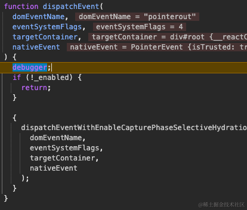
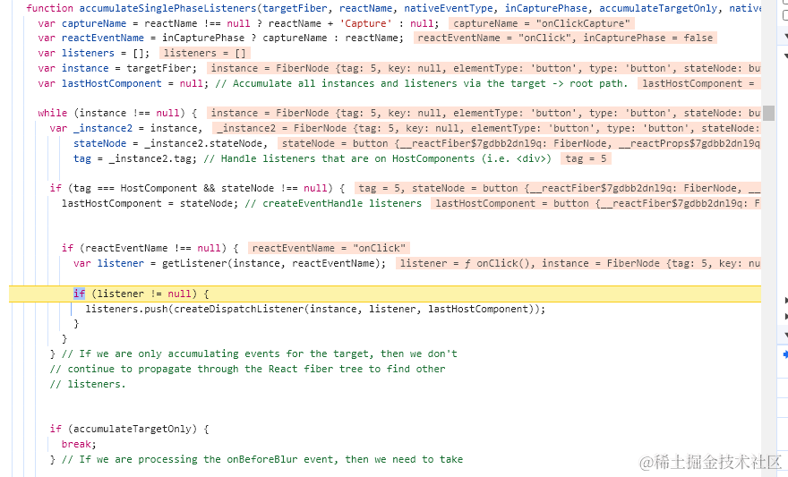
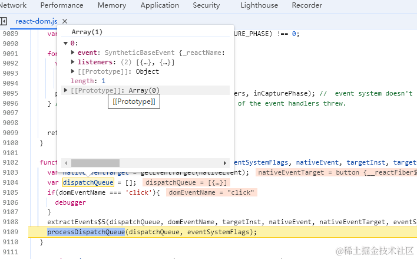

## 一、前面的话

在前面的[这篇](https://juejin.cn/post/7350200488456159243)文章中，我们有提到过 react 通过事件委托的方式将所有的用户事件都代理到了**root**这个节点上面，因此每当用户触发对应的事件 时实际上是触发了`dispatchEvent`这个函数，本篇文章我们就来剖析 react 的事件机制，学习它是如何从`dispatchEvent`执行到用户注册的自定义事件的呢？

### 知识回顾

在前面的文章中我们知道了事件也是分优先级的，我们将其称为`事件优先级`，简单来说就是每一种事件从出生开始就代表了不同的优先级，在 react 中通过`getEventPriority`这个函数大体将事件分为以下几种：

**离散事件**

例如 click、input、blur 等等

**持续触发事件**

例如 mouseenter、mouseleave、wheel、scroll 等

**其他事件**

例如 message 等

对应的在根节点上委托的函数实现也不一样，例如

| 事件类型     | 函数名                    |
| ------------ | ------------------------- |
| 离散事件     | `dispatchDiscreteEvent`   |
| 持续触发事件 | `dispatchContinuousEvent` |
| 其他事件     | `dispatchEvent`           |

虽然如此，但是实际上不管任何事件的发生，最终调用的其实都是`dispatchEvent`，我们只需要关注他的实现就好了，你可以通过查看`dispatchContinuousEvent`或者`dispatchDiscreteEvent`的实现来验证这一点

接下来我们就来看看`dispatchEvent`的实现逻辑

## 二、源码分析

正常情况下我们的 react 应用所有的事件都是通过事件代理来完成交互的，当用户点击了某个按钮时这个事件会冒泡到应用节点上，也就是`#root`节点上触发`dispatchEvent`，他会收到这么几个参数

`domEventName`代表的是原生事件名、`targetContainer`代表的是应用根节点`#root`、`nativeEvent`代表的是原生事件对象



接下来有这么些过程

### 找到事件源 fiber

接下来会紧接着执行`findInstanceBlockingEvent`，他是用来找寻事件源 fiber 的，例如假设这个事件是用户点击某个`button`触发的，那么这个函数就是用来找到这个`button`所对应在内存中的那个 fiber 的，我们一起来看一下

```js
function findInstanceBlockingEvent(
    domEventName,
    eventSystemFlags,
    targetContainer,
    nativeEvent
  ) {
    return_targetInst = null;
    var nativeEventTarget = getEventTarget(nativeEvent); // e.target || e.srcElement
    var targetInst = getClosestInstanceFromNode(nativeEventTarget);

    if (targetInst !== null) {
      ...
    }
    return_targetInst = targetInst;
    return null;
  }
```

其方法也很简单，就是通过事件源对象获取事件发生的源 DOM 对象，它们存储在事件源对象的`target`属性身上，获取到了源 DOM 对象，在之前的文章中我们有提到过在创建`fiber`时，fiber 对象和 DOM 对象是相互引用着的，因此他的身上有一根指针指向对应的`fiber`节点，直接获取即可。

然后将这个 fiber 节点赋值给全局变量`return_targetInst`即可，至此`fiber`寻找成功

### 事件插件系统

紧接着执行`dispatchEventForPluginEventSystem`，在他的逻辑中主要是执行这个函数，而且整个过程属于同步的

```js
function dispatchEventsForPlugins(
  domEventName, // 事件名称
  eventSystemFlags, // 标记，冒泡时是4，捕获时是0
  nativeEvent, // 事件源对象
  targetInst, // 事件发生源的fiber节点
  targetContainer // 根节点#root;
) {
  var nativeEventTarget = getEventTarget(nativeEvent); // 获取事件发生的真实DOM对象
  var dispatchQueue = []; // 准备一个队列
  extractEvents$5(
    dispatchQueue,
    domEventName,
    targetInst,
    nativeEvent,
    nativeEventTarget,
    eventSystemFlags
  ); // 收集事件
  processDispatchQueue(dispatchQueue, eventSystemFlags); // 触发事件
}
```

通过上面函数的逻辑，我们可以分析出触发事件系统的逻辑是以下几步：

1. 通过`getEventTarget`获取事件发生的源 DOM 对象，如果是 Text 类型的 DOM 节点，那么则会获取包裹着它的父节点。
2. 通过`tractEvents$5`来抽取事件，换句话说，就是从事件发生源的 fiber 节点开始一路上向收集所有的事件，来模拟冒泡的行为
3. 触发事件，既然收集到了这些事件，那么就依次触发他们所对应的事件，也就是用户在`nXXX`绑定的函数

第一步比较简单我们就不看了，我们直接来看后面的部分

### 收集事件

实际上收集事件的函数在`extractEvent$4`中，我们简单看一下它的逻辑

```js
function extractEvents$4(dispatchQueue, domEventName, targetInst, nativeEvent, nativeEventTarget, eventSystemFlags, targetContainer) {
    var reactName = topLevelEventsToReactNames.get(domEventName);

    if (reactName === undefined) {
      return;
    }

    var SyntheticEventCtor = SyntheticEvent;
    var reactEventType = domEventName;

    switch (domEventName) {
      case 'keypress':
      ...
      case 'click':
        if (nativeEvent.button === 2) {
          return;
        }
      ...
    }

    var inCapturePhase = (eventSystemFlags & IS_CAPTURE_PHASE) !== 0;
    // 是否是捕获，在18版本中，会经过两次注册，一次是冒泡，一次是捕获，我们只用看冒泡即可。
    {
      var accumulateTargetOnly = !inCapturePhase && domEventName === 'scroll'
      // 是否只收集目标节点下的事件，众所周知的。
      var _listeners = accumulateSinglePhaseListeners(targetInst, reactName, nativeEvent.type, inCapturePhase, accumulateTargetOnly);
      // 收集过程
      if (_listeners.length > 0) {
        var _event = new SyntheticEventCtor(reactName, reactEventType, null, nativeEvent, nativeEventTarget);

        dispatchQueue.push({
          event: _event,
          listeners: _listeners
        });
      }
    }
  }
```

在上面的实现过程中我们可以知道，react 首先会通过原生事件名找到 react 体系下的事件名，方便后面我们去获取事件，例如`click` 对应的是 `onClick` 等等...

然后 `accumulateSinglePhaseListeners` 来具体进行收集

```js
function accumulateSinglePhaseListeners(
  targetFiber, // 事件源fiber节点
  reactName, // react体系下的事件名 onClick
  nativeEventType, // 原生事件名
  inCapturePhase, // 是否捕获
  accumulateTargetOnly, // 是否只需要收集源节点的函数
  nativeEvent // 事件源对象
) {
  var captureName = reactName !== null ? reactName + "Capture" : null;
  var reactEventName = inCapturePhase ? captureName : reactName;
  var listeners = [];
  var instance = targetFiber;
  var lastHostComponent = null;

  while (instance !== null) {
    var _instance2 = instance,
      stateNode = _instance2.stateNode,
      tag = _instance2.tag; // 获取fiber类型

    if (tag === HostComponent && stateNode !== null) {
      // 所有的事件必须发生在原生DOM节点上，而且这个DOM节点必须存在
      lastHostComponent = stateNode;
      if (reactEventName !== null) {
        var listener = getListener(instance, reactEventName); // 实际上是从fiber节点的props上获取对应的事件函数
        if (listener != null) {
          listeners.push(
            createDispatchListener(instance, listener, lastHostComponent)
          );
        }
      }
    }
    if (accumulateTargetOnly) {
      break;
    }
    instance = instance.return;
  }
  return listeners;
}
```

如果我们对这个函数仔细研究一下，就会发现其实逻辑很简单，假设本次触发的事件为点击事件，那么本质上就是从源 fiber 节点开始一直向上收集对应的`onClick`函数，将其添加到`listeners`中，然后再返回，当然不是直接添加的用户定义的`onClick`，而是使用`createDispatchListener`包装了一下，它的包装也特别简单：

```js
function createDispatchListener(instance, listener, currentTarget) {
  return {
    instance: instance,
    listener: listener,
    currentTarget: currentTarget,
  };
}
```

截个图大家感受一下



然后将收集到的事件用一个数组返回

### 执行事件

经过收集过后就会有一个`dispatchQueue`，执行事件的时候，需要用到它，假设我们在页面上上具有父子关系的两个元素上分别绑定一个点击事件，那么收集到的`dispatchQueue`就是这样的



每一种事件都会有自己的收集列表，然后接下来进行`processDispatchQueue`

```js
function processDispatchQueue(dispatchQueue, eventSystemFlags) {
  var inCapturePhase = (eventSystemFlags & IS_CAPTURE_PHASE) !== 0;
  for (var i = 0; i < dispatchQueue.length; i++) {
    var _dispatchQueue$i = dispatchQueue[i],
      event = _dispatchQueue$i.event,
      listeners = _dispatchQueue$i.listeners;
    // 取出每种事件的listeners列表，然后对他们进行处理
    processDispatchQueueItemsInOrder(event, listeners, inCapturePhase);
  }
}
```

我们现在单看`click`这一种事件，因此关注`processDispatchQueueItemsInOrder`即可

```js
function processDispatchQueueItemsInOrder(
  event,
  dispatchListeners,
  inCapturePhase
) {
  var previousInstance;
  if (inCapturePhase) {
    // 模拟捕获，从根节点开始依次向事件源执行
    for (var i = dispatchListeners.length - 1; i >= 0; i--) {
      var _dispatchListeners$i = dispatchListeners[i],
        instance = _dispatchListeners$i.instance,
        currentTarget = _dispatchListeners$i.currentTarget,
        listener = _dispatchListeners$i.listener;

      if (instance !== previousInstance && event.isPropagationStopped()) {
        return;
      }
      executeDispatch(event, listener, currentTarget);
      previousInstance = instance;
    }
  } else {
    // 模拟冒泡，从事件源依次向跟节点开始执行
    for (var _i = 0; _i < dispatchListeners.length; _i++) {
      var _dispatchListeners$_i = dispatchListeners[_i],
        _instance = _dispatchListeners$_i.instance,
        _currentTarget = _dispatchListeners$_i.currentTarget,
        _listener = _dispatchListeners$_i.listener;

      if (_instance !== previousInstance && event.isPropagationStopped()) {
        return;
      }

      executeDispatch(event, _listener, _currentTarget);
      previousInstance = _instance;
    }
  }
}
```

这个逻辑也是情理之中的，react 会根据冒泡和捕获的特点来决定以什么样的顺序来执行收集到的事件列表，他们是通过`executeDispatch`来调用的

```js
function executeDispatch(
  event, // 这个是react事件对象，也就是将原生事件对象包装了一层
  listener, // 用户的函数
  currentTarget // 事件源真实DOM对象
) {
  var type = event.type || "unknown-event";
  event.currentTarget = currentTarget;
  invokeGuardedCallbackAndCatchFirstError(type, listener, undefined, event);
  event.currentTarget = null;
}
```

实际上 react 是通过`invokeGuardedCallbackAndCatchFirstError`来真正的调用用户提供的事件函数的，它在开发环境和生产环境的调用逻辑也不一样，这是为了处理错误而区分的，因为大家可以想象一下，这个函数是由用户提供的自定义函数，因此是不安全的，react 需要在这个过程中处理好错误，在生产环境下调用的是这个

```js
function invokeGuardedCallbackProd(name, func, context, a, b, c, d, e, f) {
  var funcArgs = Array.prototype.slice.call(arguments, 3);
  try {
    func.apply(context, funcArgs); // 这个func就是用户提供的事件
  } catch (error) {
    this.onError(error);
  }
}
```

而在开发环境下是通过`invokeGuardedCallbackDev`来执行的，它能够更好的将错误暴露给开发者，如果你的提供的事件出现了错误，在开发环境下会由更细致的报错，方便开发者进行调试。

好了接下来我们就来总结下，整个事件执行的过程：

假设我们在注册的事件当中存在更新状态的逻辑，实际上这也是常规操作例如：

```js
const App = () => {
  const [num, setNum] = React.useState(0);

  let f1 = () => setNum(num + 1);
  let f2 = () => setNum(num + 1);

  return (
    <div onClick={f1}>
      <button onClick={f2}>num++</button>
    </div>
  );
};
```

当我们点击按钮之后，会经历以下过程：

1. 原生事件从`button`冒泡到`root`根节点，从而触发`dispatchEvent`
2. `dispatchEvent`执行得知是一个`click`事件
3. 获取`button`对应的`fiber`节点
4. 从这个`fiber`节点向上收集所有的`onClick`事件，将他们添加到一个容器中
5. 根据这个容器里的函数，决定以什么样的顺序一一执行
6. 区分开发环境和生产环境的执行逻辑
7. 真正的执行
8. 由于执行了函数，触发了`setState`，进入更新调度流程....

## 三、最后的话

好啦，今天我们学习了 react 中的事件机制，从中我们可以看出当我们在与 react 应用程序进行交互时中间居然还发生了这么多事情，这篇文章适合在 [《深入理解 react》之初始化流程](https://juejin.cn/post/7350200488456159243) 之后阅读，体验会更佳！

后面的文章我们会深入剖析 react 的源码，学习 react 的设计思想，如果你也对 react 相关技术感兴趣请关注我的[《深入理解 react》](https://juejin.cn/column/7348420268175114290 "https://juejin.cn/column/7348420268175114290")专栏，我们一起进步，有帮助的话希望朋友点个赞支持下，多谢多谢！
