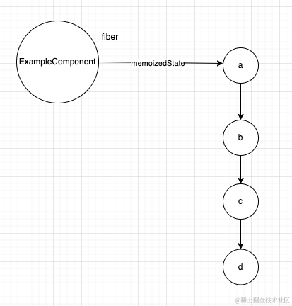
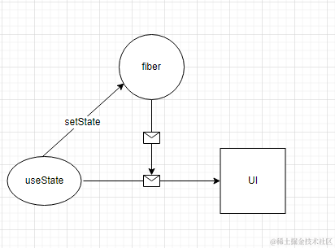
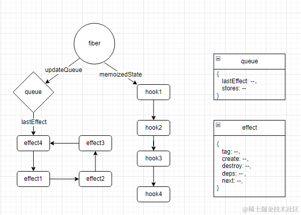

## 一、前面的话

`hooks`是react的一个标志性的特点，它是react拥抱函数式编程的一个重要的突破；通过使用`hooks`，我们可以让一个函数式组件也能够有自己的状态，相信大家在平常开发中都已经感受到`hooks`所带来的收益了，本篇文章就来探究一下hooks的工作原理，以及如何优雅的使用`hooks`，耐心看完本篇文章你能够对下面的问题有更加深入的理解：

1. `useState`的状态保存在哪里？
2. 函数式组件是怎么维护多个`hook`的?
3. `useEffect`的依赖是如何起作用的？
4. 其他更多的内容...

废话不多说我们开始吧！

## 二、useState

当我们的组件进入`render`阶段的时候会调用`renderWithHooks`，在这里会调用我们定义的组件，我们的写在函数中的各种各样的hook也就会被调用了，在前面的文章中我们提到过react会将hooks的引用对象设置为真正的引用对象，如果是初始化（也就是第一次调用`renderWithHooks`）的时候会将引用对象置为`HooksDispatcherOnMountInDEV`，它身上就是初始化的时候的各种hooks对象，就像下面这个样子：


```js
HooksDispatcherOnMountInDEV = {
      readContext: function (context) { ... },
      useCallback: function (callback, deps) {...},
      useContext: function (context) {...},
      useEffect: function (create, deps) {...},
      useImperativeHandle: function (ref, create, deps) {...},
      ...
      useState: function (initialState) {...},
      ...
};
```

### 初始化

我们首先就来看一下`useState`是如何实现的，他在初始化时会执行的代码如下：

```js
function (initialState) {
    currentHookNameInDev = "useState";
    var prevDispatcher = ReactCurrentDispatcher$1.current;
    ReactCurrentDispatcher$1.current =
      InvalidNestedHooksDispatcherOnMountInDEV;
    try {
      return mountState(initialState);
    } finally {
      ReactCurrentDispatcher$1.current = prevDispatcher;
    }
}
```

直接返回`mountState`对应的值

```js
function mountState(initialState) {
    // 1 创建hook对象
    var hook = mountWorkInProgressHook();
    if (typeof initialState === "function") {
      // $FlowFixMe: Flow doesn't like mixed types
      initialState = initialState();
    }
   
    hook.memoizedState = hook.baseState = initialState;
    // 创建一个更新队列
    var queue = {
      pending: null,
      interleaved: null,
      lanes: NoLanes,
      dispatch: null,
      lastRenderedReducer: basicStateReducer,
      lastRenderedState: initialState,
    };
    hook.queue = queue;
    // 返回dispatchSetState
    var dispatch = (queue.dispatch = dispatchSetState.bind(
      null,
      currentlyRenderingFiber$1, // 这个就是组件对应的那个fiber对象
      queue
    ));
    return [hook.memoizedState, dispatch];
}
```

在初始化时的步骤有这么几个过程：

1. 创建hook对象
2. 返回初始值，以及dispatch函数，并将其与当前的fiber关联起来

我们来看一下hook是什么样子的

```js
function mountWorkInProgressHook() {
    var hook = {
      memoizedState: null, // 当前hook的状态
      baseState: null, // 前提状态
      baseQueue: null, // 前提更新队列
      queue: null, // 当前hook的更新队列
      next: null, // 下一个hook
    };
    if (workInProgressHook === null) {// 说明第一个hook
      currentlyRenderingFiber$1.memoizedState = workInProgressHook = hook;
    } else {// 将其添加到上一个hook的next指针后
      workInProgressHook = workInProgressHook.next = hook;
    }
    return workInProgressHook;
}
```

我们可以看到hook的对象有基本5个属性，我依次解释一下：

1. `memoizedState` 代表的是当前hook的状态，也是直接返回给用户消费的值
2. `baseState` 代表的是本次更新的基本状态，它只会存在于前一次有一个高优先级更新任务导致某次更新被跳过的情况 
3. `baseQueue` 同样是代表的是本次更新的基本队列，和2一样它们是一起使用的
4. `queue` 代表的是本次更新队列
5. `next` 代表的是下一个`hook`对象

从这点我们可以看出其实函数式组件是使用一个**单向链表**来维护函数中的hooks的，如果我们定义了以下的状态：

```js
import React, { useState } from 'react';

const ExampleComponent = () => {
  // 定义状态Hook a
  const [a, setA] = useState('初始值A');

  // 定义状态Hook b
  const [b, setB] = useState(0);

  // 定义状态Hook c
  const [c, setC] = useState({ key: '初始值C' });

  // 定义状态Hook d
  const [d, setD] = useState(['初始值D']);

  return (
    <div>
      ...
    </div>
  );
};

export default ExampleComponent;
```

在`ExampleComponent`对应的`fiber`对象身上就会有这样的一个hook链表了




紧接着，每个`useState`类型的hook身上都会在初始化时挂一个空的更新队列的链表，这个和我们之前在专栏讲到的`updateQueue`结构是一致的。

当我们创建好hook对象之后，然后将用户给的初始值赋值给`hook`对象的`memoizedState`身上，然后返回`dispatchSetState`就好了，至于`dispatchSetState`到底是什么我们可以后面再分析，通过上面的分析，我们可以得出一个结论，函数式组件的状态实际上是保存在`fiber`的`hook`对象身上的


### dispatchSetState

当初始化结束后，用户通常可以通过某些交互来触发更新，触发更新时会调用`dispatchSetState`，也就是用户定义的`setXXX`，一般情况下它会做以下几件事情：

1. 创建更新优先级
2. 创建更新对象
3. 将更新对象加入当前`hook`对象的更新队列中，形成一个环形链
   > 专栏的[《深入理解react》之优先级（上）](https://juejin.cn/post/7352079364610916371)有对这个链表形成过程做了详细表述，这里就不啰嗦了
4. 从当前发生更新的地方顺着自己的祖先节点打标签
5. 调度更新


这个就是`dispatchSetState`触发更新的过程，然后进入到更新流程的`render`阶段
### 更新

在更新时，`render`阶段也会执行`renderWithHooks`去生成最新的`ReactElement`，这个时候调用的`hook列表`就不是初始化时的了，而是更新时的，如下所示：

```js

HooksDispatcherOnUpdateInDEV = {
  readContext: function (context) { ... },
  useCallback: function (callback, deps) {...},
  useContext: function (context) {...},
  useEffect: function (create, deps) {...},
  useImperativeHandle: function (ref, create, deps) {...},
  ...
  useState: function (initialState) {...},
  ... 
};
```

更新时的`useState`的实现如下：

```js
function (initialState) {
    ...
    try {
      return updateState(initialState);
    } finally {
      ReactCurrentDispatcher$1.current = prevDispatcher;
    }
}
```

`updateState`会直接调用`updateReducer`，下面看看`updateReducer`的实现，

```js
function updateReducer(reducer, initialArg, init) {
    var hook = updateWorkInProgressHook(); // 获取当前workInProgress的hook对象；
    var queue = hook.queue; // 获取这个hook对象的更新队列
    queue.lastRenderedReducer = reducer; // 默认计算逻辑，setXX(fn) 传入函数时采用的到
    var current = currentHook; // 全局变量，保存的是程序当前来到的hook对象，用户setXX()时其实是将update对象保存在此时的current树上的，所以关键要获取这个来进行后面的状态计算
    var baseQueue = current.baseQueue; // 初始化是 null，这个是前一次被调过的优先级队列，暂时可以不管，特殊场景下才会用到
    // 这就是
    var pendingQueue = queue.pending; // 更新队列

    if (pendingQueue !== null) {
      ...
      current.baseQueue = baseQueue = pendingQueue;
      queue.pending = null;
    }

    if (baseQueue !== null) { // 会进入到这里，进行状态计算
      var first = baseQueue.next;
      var newState = current.baseState;
      var newBaseState = null;
      var newBaseQueueFirst = null;
      var newBaseQueueLast = null;
      var update = first;

      do {
        var updateLane = update.lane;

        if (!isSubsetOfLanes(renderLanes, updateLane)) { // 跳过优先级的情况
          ...
        } else {
          ...
          if (update.hasEagerState) {
            newState = update.eagerState;  // 如果是 setXX('xx') 这样的简单类型 走这里
          } else {
            var action = update.action;
            newState = reducer(newState, action); // 如果是 setXX(fn) 这样的函数 走这里
          }
        }

        update = update.next;
      } while (update !== null && update !== first);

      ...

      hook.memoizedState = newState;
      hook.baseState = newBaseState;
      hook.baseQueue = newBaseQueueLast;
      queue.lastRenderedState = newState;
    } 
    ...

    var dispatch = queue.dispatch;
    return [hook.memoizedState, dispatch];
 }

```

在上面可以看到，其实本次更新流程中，核心是将更新队列进行遍历然后来做状态的计算，得到最新的`状态`，然后返回给组件，让组件去消费，只有这样的才能是基于最新状态的`ReactElement`


以上便是`useState`的核心实现，如果用伪代码来表示就像下面这个样子：

```js
const fiber = {
  state:状态信息
}

function useState(){
  reurn [fiber.state , setState]
}

function setState(xxx){
  fiber.state = xxx
  调度
}

function Component(){
  const [ , setState] = useState();
  return 界面
}
```

形象点表示就是下图


## 三、useEffect

所有的hook在更新时和初始化时函数的实现都不相同，因此我们依然分别来看一下

### mount

在`mount`阶段，`useEffect`的实现是这样的

```js
function (create, deps) { // 其中create是用户定义的函数，deps是依赖项
   return mountEffect(create, deps);
}
```

然后会执行这个`mountEffectImpl(Passive | PassiveStatic, Passive$1, create, deps)`，注意看，在这个过程中传入了`Passive`这个副作用

```js
function mountEffectImpl(fiberFlags, hookFlags, create, deps) {
    var hook = mountWorkInProgressHook(); // 创建hook对象
    var nextDeps = deps === undefined ? null : deps;
    currentlyRenderingFiber$1.flags |= fiberFlags;
    hook.memoizedState = pushEffect(HasEffect | hookFlags, create, undefined, nextDeps);
}
```
`mountWorkInProgressHook`这个我们在前面分析过了，其实就是创建一个hook对象，除了这一点，很重要的一点就是给当前的这个fiber对象打上了含有`Passive`的标签，方便在`commit`进行消费，因此我们可以得出一个结论，**但凡是我们的函数式组件使用了`useEffect`这样的`hook`，那么在都会被打上含有`Passive`副作用的标签**

最重要的是第三步，封装`effect`，我们来看一下`pushEffect`的实现

```js
function pushEffect(tag, create, destroy, deps) { 
    var effect = {
      tag: tag, // tag为含有Passive的副作用常量
      create: create, // 一个函数
      destroy: destroy, // 暂时是undefined
      deps: deps, // 依赖项
      // Circular
      next: null // 很显然，它是一个链表
    };
    var componentUpdateQueue = currentlyRenderingFiber$1.updateQueue; // 更新队列

    if (componentUpdateQueue === null) { // 第一个hook的时候是null
      componentUpdateQueue = createFunctionComponentUpdateQueue(); 创建一个 { lastEffect: link , stores:null } 这样的对象
      currentlyRenderingFiber$1.updateQueue = componentUpdateQueue;
      componentUpdateQueue.lastEffect = effect.next = effect;
    } else { // 如果存在queue
      var lastEffect = componentUpdateQueue.lastEffect;
      if (lastEffect === null) { // 构建环形链表
        componentUpdateQueue.lastEffect = effect.next = effect;
      } else { // 
        var firstEffect = lastEffect.next;
        lastEffect.next = effect;
        effect.next = firstEffect;
        componentUpdateQueue.lastEffect = effect;
      }
    }

    return effect;
  }
```

通过这一步我们可以发现，当我们在函数式组件中声明多个hook的时候，会形成一个环形链表，并且这个环形链表会由当前`fiber`的`updateQueue`引用

总而言之，假设我们当前书写了以下的`useEffect`列表

```js
function FunctionComponent(){
    useEffect(...); // 1
    useEffect(...); // 2
    useEffect(...); // 3
    useEffect(...); // 4
    return ...
}

```

在内存中就会有下面的结构




### 更新

无论是初始化还是更新其实都是给新构建的这棵fiber树中的fiber挂上这个副作用的effect链表，因此更新时做的事情和mount时是差不多的

```js
function updateEffectImpl(fiberFlags, hookFlags, create, deps) {
    var hook = updateWorkInProgressHook();
    var nextDeps = deps === undefined ? null : deps;
    var destroy = undefined;

    if (currentHook !== null) { // 更新时，存在的
      var prevEffect = currentHook.memoizedState;
      destroy = prevEffect.destroy;

      if (nextDeps !== null) {
        var prevDeps = prevEffect.deps; // nextDeps实际上就是依赖最新的值
        if (areHookInputsEqual(nextDeps, prevDeps)) { // 如果不一致，需要将新的依赖项放入这个链表中
          hook.memoizedState = pushEffect(hookFlags, create, destroy, nextDeps);
          return;
        }
      }
    }

    currentlyRenderingFiber$1.flags |= fiberFlags;
    hook.memoizedState = pushEffect(HasEffect | hookFlags, create, destroy, nextDeps);
 }
```

但是在更新时需要判断一下，依赖项是否和之前是一致的，一致就说明依赖没变，在本次更新中不用执行`hook`对应的函数，他的实现是通过给`effect`，传递不同的`tag`来实现的，还记得吗，初始化时给`pushEffect`传递的是`HasEffect | hookFlags`，而如果依赖项不变则仅仅传递`hookFlags`，方便在commit阶段判定不执行相应的`hook函数`。

### 执行副作用

调用`useEffect`hook实际上仅仅只是将相关信息保存在fiber上，然后打上标签，真正执行副作用的时候是在`commit`阶段，因此`useEffect`的实现是`render`流程和`commit`流程配合在一起实现的


在[《深入理解react》之commit阶段](https://juejin.cn/post/7355448283227570202) 这篇文章中我们有提到过`useEffect`会通过`flushPassiveEffects`异步执行，因此我们可以直接看它是怎么做的，具体的行为在`commitHookEffectListMount`里

```js
function commitHookEffectListMount(flags, finishedWork) {
    var updateQueue = finishedWork.updateQueue;
    // 获取fiber身上的副作用链表
    var lastEffect = updateQueue !== null ? updateQueue.lastEffect : null;
    // 判断
    if (lastEffect !== null) {
      var firstEffect = lastEffect.next;
      var effect = firstEffect;
      do {
        if ((effect.tag & flags) === flags) { // 判断与之前的tag是否相同，相同才往下走，依赖项未变的则不会进入下面，也就不会执行下面的逻辑 ， useLayoutEffect对应的也不会走这里
          var create = effect.create;
          effect.destroy = create();
          ...
        }

        effect = effect.next;
      } while (effect !== firstEffect);
    }
  }
```

逻辑非常清晰本质上就是获取fiber身上的副作用链表，然后依次执行，凡是遇到依赖项未变的或者`useLayoutEffect`的hook就跳过，此时用户书写的符合条件的就会在这里执行啦！


## 四、useLayoutEffect

其实到这里大家或许已经猜到`useLayoutEffect`的实现原理，它与`useEffect`的语法完全相同，无非就是副作用的执行时机不同而已

`useLayoutEffect`的执行时机在commit阶段的`Mutation`中，属于在DOM变更后同步执行，而`useEffect`属于在`beforeMutation`之前就开始调度了，但是因为是异步执行，因此`useLayoutEffect`要晚，且不阻塞DOM绘制，而`useLayoutEffect`如果含有CPU密集型计算会阻塞UI的绘制


在`useLayoutEffct`的初始化过程中，调用的实现与`useEffect`都相同，仅仅是用一个不同的副作用标签将其区分开来而已

```js
function mountLayoutEffect(create, deps) {
    var fiberFlags = Update;
    {
      fiberFlags |= LayoutStatic;
    }
    return mountEffectImpl(fiberFlags, Layout, create, deps);
}
```

这样`commit`阶段就能够通过不同的标签区分当前的`effect`是否应该在该阶段执行了，我们用伪代码来表示就像下面这个样子：


```js
function commit(){ // commit阶段

   异步执行(()=> {
      1. 遍历fiber树
      2. 获取当前fiber树的updateQueue，也就是副作用链表
      3. 遍历整个链表
      4. 如果遇到Layout的不执行，依赖不变的不执行，仅仅执行Passive的副作用
   })
    
   // Mutation 阶段
   各种DOM操作
  
   1. 遍历fiber树
   2. 获取当前fiber树的updateQueue，也就是副作用链表
   3. 遍历整个链表
   4. 如果遇到Passive的不执行，依赖不变的不执行，仅仅执行Layout的副作用
   
   ...
}

```

## 五、最后的话

通过本篇文章我们了解了`useEffect`、`useState`、`useLayoutEffect`的原理，并从源码的角度剖析了它们的实现，相信下一次面试的时候，你会更加的得心应手！由于篇幅原因，我们下一篇再继续学习更多的`hooks`原理！

后面的文章我们会依然会深入剖析react的源码，学习react的设计思想，如果你也对react相关技术感兴趣请订阅我的[《深入理解react》](https://juejin.cn/column/7348420268175114290 "https://juejin.cn/column/7348420268175114290")专栏，笔者争取至少月更一篇，我们一起进步，有帮助的话希望朋友点个赞支持下，多谢多谢！
