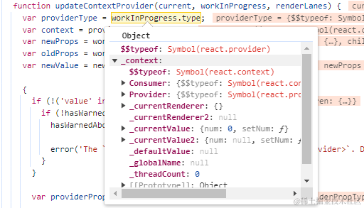
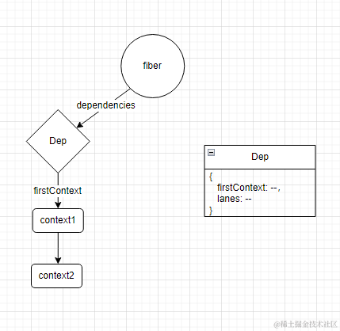
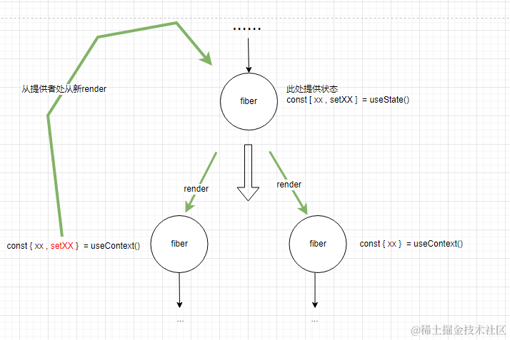
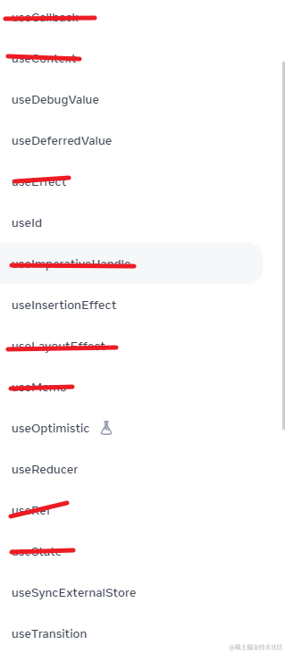

在前面的文章中我们学习了`useState`、`useEffect`、`useLayoutEffect`的基本原理，并看了源码了解了它的执行过程，而本篇文章我们继续学习`react`常用的`hooks`。

## 一、useMemo & useCallback

这两个 hook 的原理基本上是差不多的，我们可以一起来介绍，和前面我们介绍的 hooks 一样，分为初始化和更新两种场景

### 初始化

`useMemo`的初始化会调用`mountMemo`

```js
function mountMemo(nextCreate, deps) {
  var hook = mountWorkInProgressHook(); // 创建当前的hook对象，并且接在fiber的hook链表后面
  var nextDeps = deps === undefined ? null : deps;
  var nextValue = nextCreate();
  hook.memoizedState = [nextValue, nextDeps];
  return nextValue;
}
```

`mountWorkInProgressHook`在上一篇已经分析过了，大部分的`hook`初始化时都要调用这个来创建自己的`hook`对象，但是也会有例外的情况，比如`useContext`，我们后面再说；第一次执行`useMemo`都要调用用户提供的函数，得到需要缓存的值，将依赖和值都放在`hook`的`memoizedState`身上

`useCallback`的初始化会调用`mountCallback`

```js
function mountCallback(callback, deps) {
  var hook = mountWorkInProgressHook();
  var nextDeps = deps === undefined ? null : deps;
  hook.memoizedState = [callback, nextDeps];
  return callback;
}
```

可以看到唯一的区别就是`useCallback`会把传递进来的函数直接缓存起来，而不进行调用求值，经过初始化后组件对应的 fiber 节点上就保存着对应的`hook`信息，而缓存的函数和值也会被保存在这个`hook`中

### 更新

`useMemo`在更新时实际上会调用`updateMemo`，它的实现如下：

```js
function updateMemo(nextCreate, deps) {
  var hook = updateWorkInProgressHook(); // 基于current创建workInProgress的hook对象
  var nextDeps = deps === undefined ? null : deps; // 获取最新的依赖值
  var prevState = hook.memoizedState; // 老的缓存的值

  if (prevState !== null) {
    if (nextDeps !== null) {
      var prevDeps = prevState[1];

      if (areHookInputsEqual(nextDeps, prevDeps)) {
        // 比较最新的依赖值
        return prevState[0]; // 如果相同，说明直接返回缓存中的就好了
      }
    }
  }
  // 说明依赖不同，重新计算
  var nextValue = nextCreate();
  // 再次存入对应的hook对象中
  hook.memoizedState = [nextValue, nextDeps];
  return nextValue;
}
```

每次更新的时候，都会通过`areHookInputsEqual`来判断依赖是否发生了变化，`areHookInputsEqual`会比较这个数组中的每一项，看是否与原来的保持一致，有任何一个不同都会返回`false`，导致重新计算。

```js
function areHookInputsEqual(nextDeps, prevDeps) {
  for (var i = 0; i < prevDeps.length && i < nextDeps.length; i++) {
    if (objectIs(nextDeps[i], prevDeps[i]) /*判断是否相等*/) {
      continue;
    }
    return false;
  }
  return true;
}
```

缓存的核心原理就是`workInProgress`的 hook 对象中的`memoizedState`是直接复用的原来的`hook`对象，因此相关的信息得以被完整的保存下来，只有在需要更新的时候才进行替换 ，`useCallback`的更新逻辑和`useMemo`的逻辑是一样的，在这里就不多花更多的篇幅去介绍了

## 二、useRef

接下来我们来看一下`useRef`的基本原理，我们先来回顾一下`useRef`的作用，它是一个用于保存数据的引用，可以作为基本类型、复杂类型、DOM 元素、类组件实例等数据的引用，用于存储的值，在组件更新过程中始终保持一致，因此非常适合用于保存需要持久化的数据。

### 初始化

初始化时会通过`mountRef`来创建引用对象

```js
function mountRef(initialValue) {
  var hook = mountWorkInProgressHook(); // 创建hook对象
  {
    var _ref2 = {
      // 创建ref对象
      current: initialValue,
    };
    hook.memoizedState = _ref2; //将其保存在hook的memoizedState上
    return _ref2; // 返回
  }
}
```

初始化的逻辑很简单，创建一个`ref`对象，将其保存在对应`hook`的`memoizedState`属性身上。

### 更新时

```js
function updateRef(initialValue) {
  var hook = updateWorkInProgressHook();
  return hook.memoizedState;
}
```

`ref`的更新就更加简单了，直接返回原来的引用就好，因为`hook`的信息都是基于老的`hook`直接复用的，因此信息还是原来的信息，所以在整个 react 运行时过程中，这个引用就像一个静态的变量一样，永远被持久的存储了下来。

### DOM 元素&类组件实例

在我们专栏的[《深入理解 react》之 commit 阶段](https://juejin.cn/post/7355448283227570202) 这篇文章中我们有分析过 ref 在有些特殊情况下会将一些特殊信息存储下来，例如 DOM 元素或者类组件实例的情况

```js
...
const ref = React.useRef();

<h1 id="h1" ref={ref}>hello</h1>
或者
<ClassComponent ref={ref}/>
或者
<FunctionComponent ref={ref}/>
...

```

创建 Ref 引用的过程发生在`render`阶段，以上几种情况都会给当前的组件的 fiber 上打上`Ref`的标签，等到`commit`阶段处理，处理的逻辑就是将相关的信息赋值到对应的 ref 引用上达到持久存储的目的。

在 commit 阶段会通过`commitAttachRef`来将`fiber`身上的`stateNode`属性的信息赋值给引用对象上，对于类式组件来说就是实例对象；对于原生元素来说，就是 DOM 元素。

当然对于函数式组件来说，就是`useImperativeHandle`返回的对象，我们后面再去了解它是如何做到的

## 三、useContext

`useContext`相信大家在工作中经常用到，它可以很方便的将状态提升到更上层，然后在任意子孙组件都可以消费状态信息，避免层层传递`props`而导致的尴尬境地，接下来我们就来研究它是如何实现的吧！

在使用`useContext`之前我们得有一个`context`吧，因此先来看一下`React.createContext()`做了什么吧！

```js
function createContext(defaultValue) {
    var context = { // 创建一个context对象，就是长下面这个样子
      $$typeof: REACT_CONTEXT_TYPE,
      _currentValue: defaultValue,
      _currentValue2: defaultValue,
      _threadCount: 0,
      Provider: null,
      Consumer: null,
      _defaultValue: null,
      _globalName: null,
    };
    context.Provider = { // Provider类型的组件，提供者
      $$typeof: REACT_PROVIDER_TYPE,
      _context: context,
    };

    {
      var Consumer = { // Context类型的组件，消费者
        $$typeof: REACT_CONTEXT_TYPE,
        _context: context,
      };
      // 给Consumer绑定一些属性
      Object.defineProperties(Consumer, {
        Provider: {
          get: function () {
            return context.Provider;
          },
          set: function (_Provider) {
            context.Provider = _Provider;
          },
        },
        ...
        Consumer: {
          get: function () {
            return context.Consumer;
          },
        },
      });
      context.Consumer = Consumer;
    }
    // 返回这个context
    return context;
}
```

我保留了核心的 context 创建过程, 可以看的出来还是比较容易理解的，在`context`的内部有`Provider`和`Consumer`，它们都是`ReactElement`类型的对象，可以直接在用户层使用 JSX 来消费，根据逻辑我们可以看的出来`context`和`Provider`以及`Consumer`都是互相引用着的

一般来说这个创建 context 的过程是最先发生的，紧接着会先触发`Provider`的`render阶段`，最后再触发`useContext`，因为我们知道`useContext`需要在`renderWithHooks`中执行，而`renderWithHooks`是发生在`beginWork`过程的，因此它是自上而下的这么一个顺序

### Provider

`Provider`是一个`ReactElement`类型的元素，它拥有属于一类的 fiber 类型,在它的父节点被调和的时候，它对应的 fiber 节点也会被创建出来，对应的`tag`类型是**10**

```js
export const ContextProvider = 10;
```

我们在使用`Provider`的时候，同时也会将自定义信息注入进来

```js
<Provider value={{... }}>
  <.../>
</Provider>
```

此时也会被保存在`Provider`类型的`fiber`的`pendingProps`身上，在真正调和这个`Provider`的时候会进入`updateContextProvider`进行处理

```js
function updateContextProvider(current, workInProgress, renderLanes) {
    var providerType = workInProgress.type; // 就是context信息 { _context:context , $$typeof: xxx }
    var context = providerType._context;
    var newProps = workInProgress.pendingProps;
    var newValue = newProps.value; // 用户给定的
    pushProvider(workInProgress, context, newValue);
    ...
    return workInProgress.child;
}
```

`Provider`身上会有`context`的信息，因为它们互相引用着



然后在这里面会调用`pushProvider(workInProgress, context, newValue);`，这里面会将用户给定的值赋值给`context`中的`_currentValue`保存起来

```js
function pushProvider(providerFiber, context, nextValue) {
   ...
   context._currentValue = nextValue;
}
```

自此之后提供者任务完成,将一个上层的**状态和方法**保存在了`context`这个公共区域之中，接下来就是下层如何进行消费

### useContext

我们可以使用`useContext`来消费上层的状态和其他 hook 不同的一点是，无论初始化还是更新阶段，都是调用的`readContext`来获取相关的信息

```js
function readContext(context) {
    var value =  context._currentValue ; // 直接取出context
    ...
    {
      var contextItem = {
        context: context,
        memoizedValue: value,
        next: null
      };

      if (lastContextDependency === null) {
        // 如果是第一个 useContext
        lastContextDependency = contextItem;
        currentlyRenderingFiber.dependencies = { // context 信息是放在dependencies属性上的
          lanes: NoLanes,
          firstContext: contextItem
        };
      } else {
        // 如果有多个,形成单向链表
        lastContextDependency = lastContextDependency.next = contextItem;
      }
    }
    return value;
}
```

通过上面的分析我们可以知道,`useContext`并非和之前的`hook`一样会在`fiber`的`memoizedState`上形成一个链表，而是会在`dependencies`属性上形成一个链表，假设我们用了两个`useContext`来获取上层的信息

```js
function App (){
  const context1 = useContext(Context1);
  const context2 = useContext(Context2);

  return (...)
}

```

那么对应的 Fiber 结构就应该是这一个样子的



由于`beginWork`是自上而下的，因此在`reactContext`获取状态时，值早已在祖先节点上被更新为了最新的状态，因此在使用`useContext`时消费的也是最新的状态

如果从`useContext`的地方触发了更新，由于触发的更新的`setXXX`是由祖先节点提供的，实际上会从祖先节点开始发起更新，从祖先组件的整棵子树都会被重新`reder`，如下图所示:



### Consumer

当然除了使用`useContext`我们还可以通过`Consumer`这样的方式来进行消费，用法如下:

```js
import AppContext from "xxx";

const Consumer = AppContext.Consumer;

function Child() {
  return <Consumer>{(value) => xxx}</Consumer>;
}
```

在`render`阶段中当`beginWork`来到了`Consumer`类型的节点时，会触发`updateContextConsumer`

```js
function updateContextConsumer(current, workInProgress, renderLanes) {
  var context = workInProgress.type; //Consumer类型的fiber将context信息存贮在type属性上
  context = context._context;
  var newProps = workInProgress.pendingProps; // 获取porps
  var render = newProps.children;

  {
    if (typeof render !== "function") {
      // 意味着被Consumer包括的必须是个函数
      报错;
    }
  }

  var newValue = readContext(context); // 依然是调用readContext
  var newChildren;

  newChildren = render(newValue); // 这样就把最新的状态交给下层去消费了

  reconcileChildren(current, workInProgress, newChildren, renderLanes); // 继续调和子节点
  return workInProgress.child;
}
```

可以看到实际上`Consumer`内部依然是通过`readContext`来获取`context`信息的,原理和`useContext`一致

> 小结  
> 通过上面的分析我们可以得出一个结论，`context`最基本的原理就是利用`beginWork`自上而下进行这样的特点,将状态通过上层先存贮第三方，然后下层的节点因为后进行`beginWork`就可以无忧的消费提存存贮在第三方的状态了，而这个第三方实际上就是我们的`context`

## 四、useImpertiveHandle

`useImpertiveHandle`这个 hook 的作用想必大家都知道，函数式组件本身是没有实例的,但是这个`hook`可以让用户自定义一些方法暴露给上层的组件使用，我们来看看它是怎么做的

### 初始化时

初始化时`useImpertiveHandle`执行的是`mountImperativeHandle`

```js
function mountImperativeHandle(ref, create, deps) {
  // 这个ref实际上就是上层组件的一个ref引用{ current:xxx }
  // 其实本质上调用的是mountEffectImpl
  var effectDeps =
    deps !== null && deps !== undefined ? deps.concat([ref]) : null;
  var fiberFlags = Update;
  //因为传入的是Layout, 所以实际上和useLayoutEffect的执行时机一样
  return mountEffectImpl(
    fiberFlags,
    Layout,
    imperativeHandleEffect.bind(null, create, ref),
    effectDeps
  );
}
```

在上一篇中我们有分析`effect`类型的 hook 的执行时机以及原理等,如果忘了可以复习一下
[《深入理解 react》之 hooks 原理（上）](https://juejin.cn/post/7357990322063114266),我们可以看到这个实际上和上一篇文章中提到的`useLayoutEffect`执行时机是一样的，都是在`Mutation`阶段**同步执行**，唯一的区别就是`useLayoutEffect`执行的是用户自定义的函数，而`useImpertiveHandle`执行的是`imperativeHandleEffect.bind(null, create, ref)`

```js
function imperativeHandleEffect(create, ref) {
  var refObject = ref;
  {
    if (!refObject.hasOwnProperty("current")) {
      // 引用必须具有 current属性
      error("报错");
    }
  }

  var _inst2 = create(); // 调用用户提供的函数,得到的是一个对象,用户可以在这个对象上绑定一些子组件的方法 { fun1, fun2 ,... }

  refObject.current = _inst2; // 赋值给父组件的引用
  return function () {
    // 并且提供销毁函数,方便删除这个引用
    refObject.current = null;
  };
}
```

可以看到，整体还是比较好理解的，本质上就是把父组件传下来的 ref 引用赋个值而已，这样父组件的 ref 就能够使用子组件的方法或者状态了，实际上通过上面的分析如果你不想要使用`imperativeHandleEffect`,使用下面的降级方式,效果完全相同

```js
function Child(props , ref){
  useLayoutEffect(()=>{

    ref.current = { // 当deps发生改变的时候,直接给ref.current赋新值就好了

    }

  } , [deps])

  return (...)
}

```

### 更新时

更新时执行的是`updateImperativeHandle`

```js
function updateImperativeHandle(ref, create, deps) {
  // 将ref的引用添加为依赖
  var effectDeps =
    deps !== null && deps !== undefined ? deps.concat([ref]) : null;
  // updateEffectImpl 和 imperativeHandleEffect 我们都分析过了
  return updateEffectImpl(
    Update,
    Layout,
    imperativeHandleEffect.bind(null, create, ref),
    effectDeps
  );
}
```

在上一篇中我们提到过`updateEffectImpl`在依赖不变时会传入不同标识，方便`commit`阶段区分出来然后跳过执行，这里也是一样的

当依赖未产生变化时 `imperativeHandleEffect` 便不会执行，`ref`还是原来的信息；只有当依赖变化才会重新赋最新的值

## 五、最后的话

本篇文章我们学习了`useMemo`、`useCallback`、`useContext`、`useImperativeHandle`、`useRef` ， 加上前面的文章，这么算下来我们已经把`react`目前发布了的`hooks`学了一大半了，而且基本常用的`hook`都已经了解了



当然还有一部分我们还没有学习，我们将在后面的文章中将其作为新特性来进行剖析，毕竟相信大家和笔者一样,剩下的`hook`用的频率并不高，所以一起期待后续的文章吧!

后面的文章我们会依然会深入剖析 react 的源码，学习 react 的设计思想，如果你也对 react 相关技术感兴趣请订阅我的[《深入理解 react》](https://juejin.cn/column/7348420268175114290 "https://juejin.cn/column/7348420268175114290")专栏，笔者争取至少月更一篇，我们一起进步，有帮助的话希望朋友点个赞支持下，多谢多谢！
