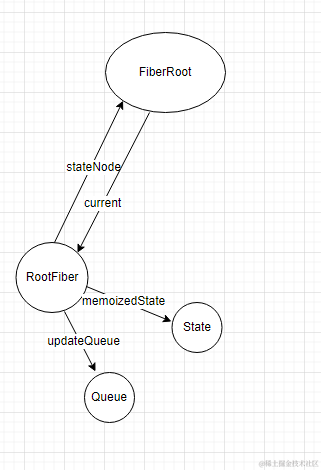
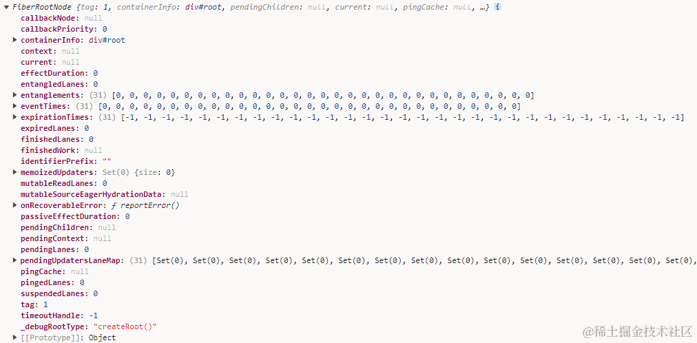
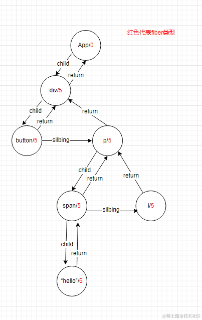
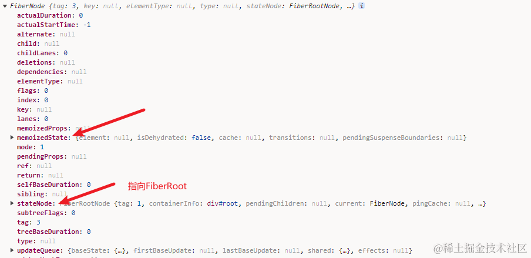
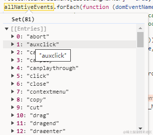

## 一、前面的话


废话不多说，今天我们直接来看一下 react 的初始化流程，学习初始化流程可以让我们知道react如何从 **JSX** 一步步映射到界面上是非常重要的。

众所周知，在 react v18版本中我们通常使用下面的方式来渲染我们的根组件 **App**

```js
// 第一步：创建root
const root = ReactDOM.createRoot(document.getElementById("root"));
// 第二步：渲染
root.render(<App />);
```

这个过程主要分为两步：

1. 创建根节点root
2. 调用render方法渲染组件

文本会尝试从源码的角度去繁化简，一步步分析它是如何最终呈现到页面上的，耐心读完本篇文章，你会收获以下问题的答案：

1. fiberRoot 和 rootFiber 傻傻分不清楚？
2. 什么是事件优先级？
3. fiber的结构是什么样子的？
4. react的事件是注册在哪里的？
5. react使用了什么方法来解决事件过多的性能问题？
6. 以及其他的更多内容...


> 温馨提示  
> 源码是去繁化简，保留核心后的内容，若希望了解每个细节，可以移步到[react仓库](https://github.com/facebook/react)

## 二、预准备阶段

在开始渲染之前，react18会有一个预准备阶段，主要是用来创建一个根节点，它是从 `ReactDOM.createRoot` 开始的，我们一起看一下：

```JS
 function createRoot(container, options) {
    // ... 一些校验信息
    var isStrictMode = false;
    var concurrentUpdatesByDefaultOverride = false;
    var identifierPrefix = "";
    var onRecoverableError = defaultOnRecoverableError;
    var transitionCallbacks = null;
    // ...options 参数，一般没有
    // 创建root
    var root = createContainer(
      container,
      ConcurrentRoot, // 1
      null,
      isStrictMode,
      concurrentUpdatesByDefaultOverride,
      identifierPrefix,
      onRecoverableError
    );
    listenToAllSupportedEvents(container);
    return new ReactDOMRoot(root); // 对root进行封装
  }
```

入口函数实际上的逻辑很简单，主要做了两件事情：
1. 创建root节点
2. 事件监听

需要注意的是当我们使用`createRoot()`的方式创建的时候会有一个特殊的标识，标记这个应用属于 `Concurrent` 模式，作为后面的调和过程的决策依据，实际上有两种模式：

```JS
var LegacyRoot = 0; // 使用 ReactDOM.render(<App/> , document.getElementById("#root"))
var ConcurrentRoot = 1; // 使用 ReactDOM.createRoot(document.getElementById("#root")).render(<App/>)
```

另外在初始化之后所有的交互都是基于事件驱动的，因此要提前把事件注册好，接下来我们一步一步来， 看看每一步做了什么

### 创建root

我们需要深入 `createContainer` 当中看一下

```JS
// createContainer 很简单，他的作用就是创建一个 FiberRoot，我们把它叫做根节点
function createContainer(
    containerInfo,
    tag,
    hydrationCallbacks,
    isStrictMode,
    concurrentUpdatesByDefaultOverride,
    identifierPrefix,
    onRecoverableError,
    transitionCallbacks
  ) {
    var hydrate = false;
    var initialChildren = null;
    return createFiberRoot(
      containerInfo,
      tag,
      hydrate,
      initialChildren,
      hydrationCallbacks,
      isStrictMode,
      concurrentUpdatesByDefaultOverride,
      identifierPrefix,
      onRecoverableError
    );
  }
  
// 上面的相当于是直接调用了 createFiberRoot , 直接看下这个做了什么  
// createFiberRoot

function createFiberRoot(
    containerInfo, // 这个就是#root DOM
    tag, // 代表并发模式，值为1
    // 这下面都是false 或是null ,现在没什么用
    hydrate,
    initialChildren,
    hydrationCallbacks,
    isStrictMode,
    concurrentUpdatesByDefaultOverride, 
    identifierPrefix,
    onRecoverableError,
    transitionCallbacks
  ) {
    // new 出一个 FiberRootNode类的实例
    var root = new FiberRootNode(
      containerInfo,
      tag,
      hydrate,
      identifierPrefix,
      onRecoverableError
    );
    // 再创建一个Fiber节点，代表根Fiber节点，它是Fiber类型。
    var uninitializedFiber = createHostRootFiber(tag, isStrictMode);
    // 再将他们循环引用起来
    root.current = uninitializedFiber;
    uninitializedFiber.stateNode = root;
    // 创建一个初始state并赋值给 第一个Fiber节点
    {
      var _initialState = {
        element: initialChildren,
        isDehydrated: hydrate,
        cache: null,
        // not enabled yet
        transitions: null,
        pendingSuspenseBoundaries: null,
      };
      uninitializedFiber.memoizedState = _initialState;
    }
    // 初始化第一个fiber节点的 upateQueue (也就是更新队列)
    initializeUpdateQueue(uninitializedFiber);
    return root;
  }
```

这个函数其实信息就比较多了，它做了这么几件事情

1. 真正的创建根Root节点
2. 创建第一个Fiber节点
3. 将他们互相引用起来
4. 初始化第一个fiber的 `memoizedState` 和 `upateQueue`

当这一步走完之后，内存中其实存在了这么一种结构




这整体过程还是比较简单了，我们需要了解的就是 `FiberRoot` 和 `RootFiber` 这两种类型了。

### FiberRoot 与 RootFiber

`FiberRoot` 其实就是一种根节点类型，在react整个运行时一个react应用有且只有一个实例，react也是靠他来切换fiber树来实现的更新，因此非常重要，接下来我们看看它的实现是什么样子的

```js
 function FiberRootNode(
    containerInfo,
    tag,
    hydrate,
    identifierPrefix,
    onRecoverableError
  ) {
    this.tag = tag; // leagcyRoot/concurrentRoot 
    this.containerInfo = containerInfo; // root根节点
    this.pendingChildren = null;
    this.current = null; // 当前视图的Fiber树
    this.pingCache = null; // 
    this.finishedWork = null; // 被提交的fiberTree
    this.timeoutHandle = noTimeout; // 定时器任务（宏任务）
    this.context = null; // 上下文
    this.pendingContext = null; // getContextForSubtree(parentComponent) 的值
    this.callbackNode = null; // scheduler 体系的 Task 类型
    this.callbackPriority = NoLane; // scheduler 体系的 优先级 1、2、3、4、5
    this.eventTimes = createLaneMap(NoLanes); 
    // 长度32位的数据 number[]32 , 某个事件触发的时间点 markRootUpdated 在finished的时候再清除。
    this.expirationTimes = createLaneMap(NoTimestamp); 
    // 长度32位的数据 number[]32 , 某个事件触发的过期时间 markStarvedLanesAsExpired 
    // 在finished的时候再清除，根据lane 和 eventTime 算出来的。

    // 优先级调度相关
    this.pendingLanes = NoLanes;
    this.suspendedLanes = NoLanes;
    this.pingedLanes = NoLanes;
    this.expiredLanes = NoLanes;
    this.mutableReadLanes = NoLanes;
    this.finishedLanes = NoLanes; // commit  render 
    this.entangledLanes = NoLanes;
    this.entanglements = createLaneMap(NoLanes);
    // 就是一个标识字符，一般为空
    this.identifierPrefix = identifierPrefix;
    this.onRecoverableError = onRecoverableError;

    {
      this.mutableSourceEagerHydrationData = null;
    }

    {
      this.effectDuration = 0;
      this.passiveEffectDuration = 0;
    }

    {
      this.memoizedUpdaters = new Set();
      var pendingUpdatersLaneMap = (this.pendingUpdatersLaneMap = []);
      // 只有在 addFiberToLanesMap  movePendingFibersToMemoized 才会用到，
      for (var _i = 0; _i < TotalLanes; _i++) {
        pendingUpdatersLaneMap.push(new Set());
      }
    }
    ...
  }
```

可以看到，真正赋值的就是 `#root DOM节点`（以下我们都称`#root`表示DOM节点） 和 tag 标识，其他就是各种各样的字段，每一个属性都有它特定的作用，我们可以先混个脸熟，后面再进行了解和学习，实例化之后 `FiberRoot` 的实例长这个样子。


接下来我们了解一下react的Fiber类型
****

我相信大家可能或多或少都知道react的Fiber类型，毕竟这是react中最明星的一个概念，`RootFiber`就是第一个Fiber类型的节点，为了确保内容的完备性，我依然会花一点篇幅介绍一下`Fiber`类型，对它已经非常了解的同学可以跳过下面的内容

在react中，fiber是一种特殊的数据结构，它既不是通俗意义上的树，也并非通俗意义上的链表，有点像他们的结合体，它频繁的存在于react运行时的初始化流程、更新流程中。毫不夸张的说 `fiber` 是react实现**hooks**、**更新中断**、**优先级**等特性的基石，如果没有`fiber`，要想实现这些特性就显得举步维艰。

在react中，如果从类型上划分，fiber一共有26种，它们分别是

```js
// 掌握 0、1、2、3、4、5、6、7
export const FunctionComponent = 0; // 函数组件
export const ClassComponent = 1; //类组件
export const IndeterminateComponent = 2; // 在不知道是函数组件还是类组件之前未决策的组件
export const HostRoot = 3; // 当前应用的第一个fiber组件
export const HostPortal = 4; // A subtree. Could be an entry point to a different renderer.
export const HostComponent = 5; // 原生DOM组件
export const HostText = 6; // 原生text组件
export const Fragment = 7; // 空白组件

// 了解即可
export const Mode = 8;
export const ContextConsumer = 9;
export const ContextProvider = 10;
export const ForwardRef = 11;
export const Profiler = 12;
export const SuspenseComponent = 13;
export const MemoComponent = 14;
export const SimpleMemoComponent = 15;
export const LazyComponent = 16;
export const IncompleteClassComponent = 17;
export const DehydratedFragment = 18;
export const SuspenseListComponent = 19;
export const ScopeComponent = 21;
export const OffscreenComponent = 22;
export const LegacyHiddenComponent = 23;
export const CacheComponent = 24;
export const TracingMarkerComponent = 25;
```

我们在开发过程中书写的任何一个组件都有与之相对应的fiber节点存在，不同的类型使用fiber节点的`tag`属性来区分。

fiber通常不是由单个节点的存在而具备意义的，fiber与fiber之间会构成一棵类似树的结构，我们姑且把它称为**fiber树**，假设现在有这样的一个JSX结构

```jsx
const App = ()=>{
  return (
    <div>
      <button></button>
      <p>
        <span>hello</span>
        <i></i>
      </p>
    <div>
  )
}
```
那么最终在内存中就会有这样的一棵fiber树



通过观察我们可以总结一下fiber树的结构特点，每一个节点最多只有一个`child`指针指向自己的第一个子节点；每一个节点最多只有一个`sibling`指针指向自己的下一个兄弟节点；除了根fiber节点外每一个节点都有一个`return`指针指向自己的父节点。

好了fiber树就暂时先介绍到这里，在专栏的其他文章中我们还会继续探讨更多fiber节点有意思的特点，回到我们最初的话题，在初始化的过程中，`createHostRootFiber(tag, isStrictMode)`创建了第一个fiber节点，它长什么样子呢？

```js
function createHostRootFiber(
    tag, // 1
    isStrictMode,
    concurrentUpdatesByDefaultOverride
  ) {
    var mode; // mode最终是1 ，因为我们使用createRoot的方式创建的应用
    if (tag === ConcurrentRoot) {
      mode = ConcurrentMode;
      if (isStrictMode === true) {
        mode |= StrictLegacyMode;
        {
          mode |= StrictEffectsMode;
        }
      }
    } else {
      mode = NoMode;
    }
    // 可以看到，第一个fiber类型是 HostRoot 值为3，这是一个常量。
    return createFiber(HostRoot, null, null, mode);
  }
  
//createFiber
var createFiber = function (tag, pendingProps, key, mode) {
   return new FiberNode(tag, pendingProps, key, mode); // 其实就是new了一个fiber实例
};
// 重点来了
 function FiberNode(tag, pendingProps, key, mode) {
    this.tag = tag; // 其实就是fiber类型 26种
    this.key = key; // 开发者指定的key，可以为null
    this.elementType = null;
    this.type = null;
    this.stateNode = null; // Fiber
    // 结构属性
    this.return = null;
    this.child = null;
    this.sibling = null;
    this.index = 0;
    this.ref = null;
    // 状态属性
    this.pendingProps = pendingProps;
    this.memoizedProps = null;
    this.updateQueue = null;
    this.memoizedState = null;
    this.dependencies = null;
    this.mode = mode; // Effects
    // 优先级 副作用
    this.flags = NoFlags;
    this.subtreeFlags = NoFlags;
    this.deletions = null;
    this.lanes = NoLanes;
    this.childLanes = NoLanes;
    this.alternate = null;
    ...
  } 
```

初始化之后，第一个fiber节点长这个样子，它也是整个fiber树中唯一没有`return`或者说`return`指向空的节点。




> 小结  
> 以上我们分析了下第一个Fiber类型的节点 `RootFiber` 和整个应用的根节点 `FiberRoot` 的区别，他俩互相引用着，


### 事件注册

react为了提升性能，使用了**事件委托**的机制，如果想要深入了解事件委托可以看看[这篇文章](https://juejin.cn/post/7192584563799883832?searchId=202403261112020C851855F0FE8187274D)

事件委托简单点来讲就是在真正的业务场景下用户大概率会在各种各样的节点上注册各种各样的事件，来监听用户的操作，react把所有的交互都在`#root`节点上统一来做监听，这样在`#root`节点上注册有限的几个事件就好了，相比于在真正的具体节点上注册成千上万的事件来说，可以说极大的提升了性能。

而做这件事情的就是这个函数`listenToAllSupportedEvents(container);` 在react18版本中统一在 `#root` 节点上进行的代理，接下来我们看看它里面发生了什么

```js
function listenToAllSupportedEvents(rootContainerElement) {
    if (!rootContainerElement[listeningMarker]) { // 为了防止重复注册
      rootContainerElement[listeningMarker] = true; // 打上标签
      allNativeEvents.forEach(function (domEventName) {
        if (domEventName !== "selectionchange") { // selectionchange 不会冒泡，且只有在Document下监听才可以，因此过滤掉，在后面特殊处理一下
          if (!nonDelegatedEvents.has(domEventName)) {
            listenToNativeEvent(domEventName, false, rootContainerElement);
          }
          listenToNativeEvent(domEventName, true, rootContainerElement);
        }
      });
      //
      var ownerDocument =
        rootContainerElement.nodeType === DOCUMENT_NODE
          ? rootContainerElement
          : rootContainerElement.ownerDocument;
      if (ownerDocument !== null) { // selectionchange只有注册在Document上才能生效
        // 防止重复注册
        if (!ownerDocument[listeningMarker]) {
          ownerDocument[listeningMarker] = true;
          listenToNativeEvent("selectionchange", false, ownerDocument);
        }
      }
    }
  }
```

在这一步，react会把几乎所有的浏览器事件都进行注册，一共有82种事件，如下图所示


在这82种事件中有三类它们分别是`selectionchange`、`不支持冒泡执行的`、`普通事件`，因此要将他们分别处理，在上面的代码逻辑中大家也能看得出来，主要的原因还是因为每一种事件的特性，比如：

`selectionchange`事件在普通dom元素上注册是没用的，类似`cancel`、`abort`等事件不存在冒泡的概念，详情可以看看关于事件的[MDN文档](https://developer.mozilla.org/zh-CN/docs/Web/Events)


而且大家可以看到，为了尽可能的模拟原生的事件执行流，其实react分别在冒泡和捕获阶段进行了监听，这是v18版本进行的改进，在v17以以前的版本中是通过数组模拟的冒泡捕获阶段，无法和原生执行流保持一致。


关于函数注册的到底是什么函数，我们可以在 `listenToNativeEvent` 这里面一探究竟，由于判断情况比较多，我们假设事件是`click`，去繁化简，紧抓核心就行。

```js
//listenToNativeEvent(domEventName, true, rootContainerElement);
function listenToNativeEvent(domEventName, isCapturePhaseListener, target) {
    ...
    var eventSystemFlags = 0;
    if (isCapturePhaseListener) {
      eventSystemFlags |= IS_CAPTURE_PHASE // 常量4;
    }
    addTrappedEventListener(
      target, // 就是 #root
      domEventName, // 例如'click'
      eventSystemFlags, // 捕获是 4 冒泡是 0
      isCapturePhaseListener // 是否是捕获
    );
 } 
// addTrappedEventListener 
function addTrappedEventListener(
    targetContainer,
    domEventName,
    eventSystemFlags,
    isCapturePhaseListener,
    isDeferredListenerForLegacyFBSupport
  ) {
    // 根据每一种事件到底是什么来决策优先级是什么
    var listener = createEventListenerWrapperWithPriority(
      targetContainer,
      domEventName,
      eventSystemFlags
    ); 
    // click会来到这里，这是真正注册listener的地方
    unsubscribeListener = addEventBubbleListener(
      targetContainer,
      domEventName,
      listener
    );
  }
```
这段代码做了两件事情  
1. 根据这个事件的类型创建具体的事件监听函数
2. 注册这个函数到 `#root`身上

我们来看一下关于`listener`的创建过程

```js
function createEventListenerWrapperWithPriority(
    targetContainer, // #root
    domEventName, // click
    eventSystemFlags // 0
 ) {
    // 事件优先级
    var eventPriority = getEventPriority(domEventName);
    var listenerWrapper;
    switch (eventPriority) {
      case DiscreteEventPriority:
        // 离散事件 例如 click 、change 、input
        listenerWrapper = dispatchDiscreteEvent;
        break;

      case ContinuousEventPriority:
        // 持续执行事件 例如 scroll 、mousemove
        listenerWrapper = dispatchContinuousEvent;
        break;
        // 默认事件 例如 error
      case DefaultEventPriority:
      default:
        listenerWrapper = dispatchEvent;
        break;
    }

    return listenerWrapper.bind(
      null,
      domEventName,
      eventSystemFlags,
      targetContainer // #root
    );
  }
```

这里要引出第一个react优先级的概念 `事件优先级` ，为了更好的用户体验，每一种事件根据它的特点都会被分配一个优先级用来帮助后面决策到底谁先被调度，比如当用户在一个输入框输入文字的事件，用户的心智是希望立马反应过来，否则就会觉得卡顿，相反类似 `scroll` 这样的事件由于是持续触发的，它的优先级低一点，用户并不会觉得有多么卡顿。

判定优先级的实现就是`getEventPriority`这个函数

```js
function getEventPriority(domEventName) {
    switch (domEventName) {
      case "cancel":
      case "click":
      case "close":
      case "contextmenu":
      case "copy":
      case "cut":
      case "auxclick":
      case "dblclick":
      case "dragend":
      case "dragstart":
      case "drop":
      case "focusin":
      case "focusout":
      case "input":
      case "invalid":
      case "keydown":
      case "keypress":
      case "keyup":
      case "mousedown":
      case "mouseup":
      case "paste":
      case "pause":
      case "play":
      case "pointercancel":
      case "pointerdown":
      case "pointerup":
      case "ratechange":
      case "reset":
      case "resize":
      case "seeked":
      case "submit":
      case "touchcancel":
      case "touchend":
      case "touchstart":
      case "volumechange": 
      case "change":
      case "selectionchange":
      case "textInput":
      case "compositionstart":
      case "compositionend":
      case "compositionupdate": 
      case "beforeblur":
      case "afterblur":
      case "beforeinput":
      case "blur":
      case "fullscreenchange":
      case "focus":
      case "hashchange":
      case "popstate":
      case "select":
      case "selectstart":
        return DiscreteEventPriority;
      case "drag":
      case "dragenter":
      case "dragexit":
      case "dragleave":
      case "dragover":
      case "mousemove":
      case "mouseout":
      case "mouseover":
      case "pointermove":
      case "pointerout":
      case "pointerover":
      case "scroll":
      case "toggle":
      case "touchmove":
      case "wheel":
      case "mouseenter":
      case "mouseleave":
      case "pointerenter":
      case "pointerleave":
        return ContinuousEventPriority;
      default:
        return DefaultEventPriority;
    }
  }
```

如果是 `click` 事件那么返回的就是 `dispatchDiscreteEvent`，我们暂且不用管它的实现，我们知道它是一个函数就可以了，总之它通过 `addEventBubbleListener` 被注册到 `#root` 身上，

```js
function addEventBubbleListener(target, eventType, listener) {
  target.addEventListener(eventType, listener, false);
  return listener;
}
```

这段代码很简单，是个前端都会写，没什么好说的，到此我们的事件注册完毕！

> 小结  
> 通过上面我们知道，在 `createRoot` 的过程中，我们创建了 RootFiber 和 FiberRoot 在`#rrot`身上注册了所有的浏览器事件，当他们触发的时候会调用一个listenr ，例如 'click' ，就会调用 `dispatchDiscreteEvent`这个函数


但其实初始化流程还没完，最终暴露给用户的其实是 `ReactDOMRoot` 类型的实例 

```js
function createRoot(){
  return new ReactDOMRoot(root);
}
// 但其实也就是包了一层，核心还是 FiberRoot 节点
function ReactDOMRoot(internalRoot) {
  this._internalRoot = internalRoot;
}

// 原型对象
ReactDOMRoot.prototype.render = function (children) {
  // ...
  var root = this._internalRoot;
  updateContainer(children, root, null, null);
};
```

只不过它的原型上面挂了一个 `.render` 方法，这样开发者才有机会调 `root.render(<App/>)` 这样的方法，而调用这个方案就意味着初始化完成，react 进入 `render` 阶段，这个阶段内容比较多，我们在下一章节进行分析，恭喜你，本篇结束。


## 三、最后的话

好了今天的内容我们了解了react的初始化部分，笔者在看react源码的时候，每次都是从`createRoot` 开始看，看完初始化后面的内容就比较断了，这个 `createRoot` 和英语单词里的 `abandon` 真的有的一拼，因此这一次绝对不要放弃了，希望我们一起死磕源码，直到最后，加油！ 

今天的内容也不算很难，作为开胃菜简单点还是比较容易上手的，后面的文章我们会深入剖析react的源码，学习react的设计思想，如果你也对react相关技术感兴趣请关注我的[《深入理解react》](https://juejin.cn/column/7348420268175114290)专栏，我们一起进步，有帮助的话希望朋友点个赞支持下，多谢多谢！


