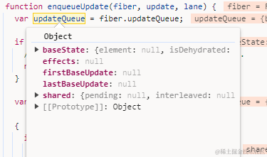
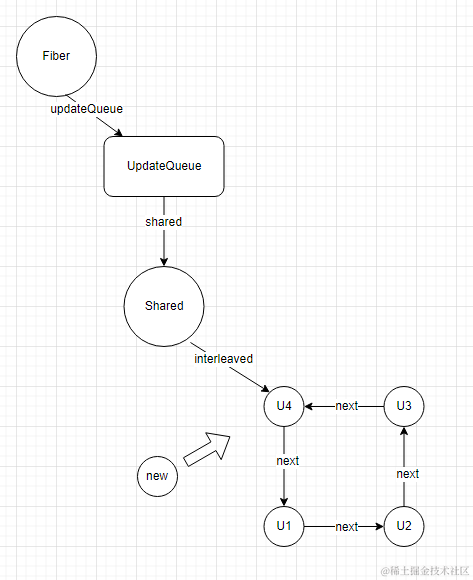
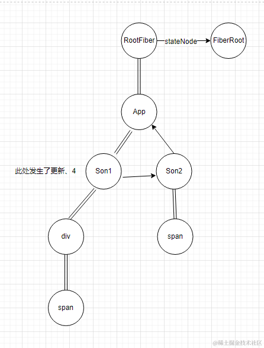

## 一、前面的话

在笔者学习react源码的过程中，**优先级**的概念是我花时间相对比较多的板块，也是我认为深入理解react最重要的一个模块之一，通过专栏前面两章的铺垫，我们终于可以好好来理解一下关于优先级的知识了，本篇文章依然会通过展开源码的方式，循序渐进的学习为什么会出现各种各样的优先级，为什么要这样区分它们，以及它们在react的执行流中是如何运作的，接下来我们就一起开始学习吧！

!
在学习之前最好带着问题来思考，本篇主要探讨关于以下问题的知识：

1. 为什么要区分事件优先级和更新优先级？
2. react的Lane模型如何理解？
3. fiber上的`updateQueue`是什么结构，优势是什么？
4. 其他更多的内容...


## 二、更新优先级


### Lane模型

阅读本专栏的同学可能或多或少都了解过react，可能也都知道在react体系中是使用Lane模型来描述优先级的，但是本文为了完备性，还是介绍一下Lane模型，已经熟悉的同学可以跳过这个点

Lane可以翻译为“赛道”，想象一下赛车场上的不同赛道，有的赛道是用于高速赛车，有的则是用于低速练习。在React中，不同的更新任务也被分配到不同的Lane上，每个Lane都有自己的优先级。

为了在计算上有一个更好的性能，react使用31位的**位图**的形式来表示不同的优先级，意味着有31种优先级，它们分别是：

```js
export const NoLane: Lane = /*                          */ 0b0000000000000000000000000000000;
export const SyncLane: Lane = /*                        */ 0b0000000000000000000000000000001; // 1
export const InputContinuousHydrationLane: Lane = /*    */ 0b0000000000000000000000000000010; // 2
export const InputContinuousLane: Lane = /*             */ 0b0000000000000000000000000000100; // 4

export const DefaultHydrationLane: Lane = /*            */ 0b0000000000000000000000000001000; //16
export const DefaultLane: Lane = /*                     */ 0b0000000000000000000000000010000; //32

const TransitionHydrationLane: Lane = /*                */ 0b0000000000000000000000000100000;
const TransitionLanes: Lanes = /*                       */ 0b0000000001111111111111111000000;
const TransitionLane1: Lane = /*                        */ 0b0000000000000000000000001000000;
...
const TransitionLane16: Lane = /*                       */ 0b0000000001000000000000000000000;

const RetryLanes: Lanes = /*                            */ 0b0000111110000000000000000000000;
const RetryLane1: Lane = /*                             */ 0b0000000010000000000000000000000;
...
const RetryLane5: Lane = /*                             */ 0b0000100000000000000000000000000;

export const SomeRetryLane: Lane = RetryLane1;

export const SelectiveHydrationLane: Lane = /*          */ 0b0001000000000000000000000000000;

const NonIdleLanes: Lanes = /*                          */ 0b0001111111111111111111111111111; 

export const IdleHydrationLane: Lane = /*               */ 0b0010000000000000000000000000000;
export const IdleLane: Lane = /*                        */ 0b0100000000000000000000000000000;

export const OffscreenLane: Lane = /*                   */ 0b1000000000000000000000000000000;

```

采用Lane模型，react可以很好的用**一个值**来表示多种优先级的**叠加状态**，也可以快速的从这种叠加状态中分离最紧急的优先级，并且可以通过位运算做到性能很好，后续我会出一个关于**位运算**相关的文章，在这里我们仅仅是了解作用即可。

根据上面的Lane模型的定义，我们可以看到，一共有这么几类优先级

1. 同步优先级 (SyncLanes)
2. 持续优先级(InputContinuousLanes)
3. 默认优先级(DefaultLanes)
4. 过渡优先级(TransitionLanes)
5. Retry优先级(RetryLanes)
6. 空闲优先级（IdleLanes）
7. Offscreen优先级(OffscreenLanes)


### 前情回顾

在本专栏的 [《深入理解react》之初始化流程](https://juejin.cn/post/7350200488456159243) 这篇文章文章中我们大概分析了react从 `createRoot` 开始到 `updateContainer` 的流程，在里面我们有了解过关于**事件优先级**的概念，简单来讲，react中对所有的事件进行了分类，每一种事件都根据它们的特性分配了相对应的优先级，在react中一共有4种**事件优先级**

```js
var DiscreteEventPriority = SyncLane;  // 离散事件
var ContinuousEventPriority = InputContinuousLane; // 持续触发事件
var DefaultEventPriority = DefaultLane; // 默认事件
var IdleEventPriority = IdleLane; // 空闲事件
```

### 源码

每一种优先级都对应一种Lane，这是为了更好的将事件优先级与Lane代表的优先级做转换，接下来我们跟着上次的执行流继续看源码，然后一步步介绍优先级相关的知识，上一次我们聊到了 `updateContainer` 这个函数

```js
function updateContainer(element, container, parentComponent, callback) {
    // element 就是 <App/> container 是 #root  parentComponent是null，callback 是null
    ...
    var current$1 = container.current; // 这个就是 RootFiber 第一个fiber节点
    var eventTime = requestEventTime(); // 获取当前事件 从网页打开，到执行到这里的时间间隔，而非从1970年到现在的时间间隔
    var lane = requestUpdateLane(current$1); // 获得更新优先级
    ...

    var update = createUpdate(eventTime, lane); // 创建update
    update.payload = {
      element: element,
    };
    callback = callback === undefined ? null : callback;
    update.callback = callback;
    var root = enqueueUpdate(current$1, update, lane); // 将这个update添加到fiber树中
    if (root !== null) {
      scheduleUpdateOnFiber(root, current$1, lane, eventTime); // 开始调度更新
    }
    return lane;
  }
```

如果把react的UI渲染分为两种的话，可以分为**挂载**和**更新**，分别代表页面从0到1的过程和因为发生交互导致的更新，`updateContainer` 则是所有挂载过程中必经的一个过程，无论采用`createRoot(...).render(...)`的方式还是`ReactDOM.render(...)`的方式，都会走这里。

它做的事情大概如下：

1. 获取更新优先级
2. 创建update对象
3. 将update对象加入fiber的更新队列
4. 开始更新的调度

但是从另外一个角度来看，其实无论是初始化还是更新它们其实本质上流程都是一样的，都是先创建一个更新任务，然后存进对应的fiber中，再发起一个调度任务，后面我们慢慢来聊这个点，继续回到源码

源码中有一个 `requestUpdateLane` 的函数，是用来获得当前的**更新优先级**的，这是继前面提到的**事件优先级**之后的第二种react优先级。它代表了当前的这次更新的优先级，我们来看看它里面的内容：


```js
function requestUpdateLane(fiber) {
    var mode = fiber.mode;
    // 1. 同步
    if ((mode & ConcurrentMode) === NoMode) { // 如果不属于并发模式直接选择同步更新
      return SyncLane;
    } 
    // 2.transition
    var isTransition = requestCurrentTransition() !== NoTransition;
    if (isTransition) {
      ...
      return currentEventTransitionLane;
    } 
    // 3.当前是什么样的更新
    var updateLane = getCurrentUpdatePriority();

    if (updateLane !== NoLane) {
      return updateLane;
    } 
    // 4.事件
    var eventLane = getCurrentEventPriority();
    return eventLane;
  }
```

在react中如果是调用了`redner`、`setState`、`setXXX`、`forceUpdate`等更新相关的API都会获取当前的更新优先级 ，也就是`requestUpdateLane`，经过精简过后的代码，逻辑也比较清晰，就是依次判断当前的更新属于什么类型，如果当前的模式不是并发模式，那么大前提都不通过，一律属于同步优先级，不支持并发更新；如果属于transition优先级，返回当前的过渡优先级；这里要解释一下`getCurrentUpdatePriority`是什么意思，它代表的是当前处于什么样的更新优先级，往往和事件有关，因为`requestUpdateLane`的触发需要调用react更新相关的API，而这些API的调用往往都是藏在事件里面的，例如对于下面的组件来说：

```jsx
const App = ()=> {
   const [num , setNum] = useState(0)
   const onClick = ()=> setNum(num + 1)
   return <button onClick={onClick}>{num}</button>
}
```

当我们点击按钮的时候，实际上并不是直接调用`onClick`，而是调用的是`#root`提前经过事件委托的那个函数，这个我们在 [《深入理解react》之初始化流程](https://juejin.cn/post/7350200488456159243) 这篇文章中有介绍过，大家可以去看看，其实也就是这个`dispatchDiscreteEvent`函数，在这个函数中做了一些事情他会收集到这个`onClick`，然后调用它，并且在中间还做了这样一件事情：

```JS
function dispatchDiscreteEvent(
    domEventName,
    eventSystemFlags,
    container,
    nativeEvent
  ) {
    var previousPriority = getCurrentUpdatePriority();
    try {
      setCurrentUpdatePriority(DiscreteEventPriority);
      // 这个函数中包含执行onClick，并且是同步执行
      dispatchEvent(domEventName, eventSystemFlags, container, nativeEvent);
    } finally {
      setCurrentUpdatePriority(previousPriority);
    }
  }
```

可以看到，在执行`onClick`的时候，全局的 `currentUpdatePriority` 已经被设置成了对应的事件优先级，等事件执行完毕，再恢复成原来的优先级，**因此在某个事件产生的更新如果去获取`更新优先级`的话，在不满足前两个判断的情况下，它必然会获取到对应的这个`事件优先级`**。

但是有一些更新并不是由事件产生的，可能是由IO等异步操作产生的，它们的执行可能没有对应的事件，这个时候就走第4个判断，`getCurrentEventPriority`，我们来看看它的实现：

```js
function getCurrentEventPriority() {
    var currentEvent = window.event;
    if (currentEvent === undefined) {
      return DefaultEventPriority; // 命中这个
    }
    return getEventPriority(currentEvent.type);
}
```

由IO等异步操作产生的没有事件，因此返回的是 `DefaultEventPriority` ，它对应的就是`DefaultLane`，比如

```jsx
const App = ()=> {
   const [num , setNum] = useState(0)
   useEffect(()=>{
     fetchData().then(res => setNum(res))
   } , [])
   
   return null
}
```

上面的 `setNum()` 产生的就是一个无事件的更新，获取的更新优先级就是 `DefaultLane`

好了讲到这里不知道大家会不会有一个疑问，为什么这里要把事件优先级了再分一下更新优先级呢，已经有了事件优先级不够了吗，反正页面的所有交互都是用事件驱动的，每一种事件规定一种优先级，然后交给后面的流程不就完了吗？


实际上，最核心的原因是因为**事件和更新并非一一对应**，换句话说，**在一个事件中有可能产生多种优先级的更新**，你不信的话看看下面的代码：

```jsx
const App = () => {
   const [num, setNum] = React.useState(0);
   const [count, setCount] = React.useState(0);

   return (
      <div>
        <h1 id="h1">{num}</h1>
        <button onClick={() => {
          setNum(num + 1) // SyncLane
          React.startTransition(()=>{
            setCount(count + 1) // TransitionLane
          })
        }}>
          {count}
        </button>
      </div>
    );
};
```

`startTransition` 可以将某个状态的改变降低优先级至过渡优先级，因此在这一个 `onClick` 就产生了两种不同优先级的更新，因此当UI发生了某个交互的时候，不能简单的将事件的优先级当作它的更新优先级，而是要再次根据细节判断一下以获取它准确的**更新优先级** ，在真实的场景下，有可能存在更加复杂的情况，因此这样的判断显得非常有必要了，现在你知道为什么存在**更新优先级**了吧？

## 三、更新队列

根据上面我们对于 `updateContainer`的分析，就要来看创建队列的流程了，`createUpdate`的实现如下：


```js
var UpdateState = 0;
var ReplaceState = 1;
var ForceUpdate = 2;
var CaptureUpdate = 3;
function createUpdate(eventTime, lane) {
   var update = {
     eventTime: eventTime,
     lane: lane,
     tag: UpdateState, // 0
     payload: null,
     callback: null,
     next: null, // 看到这个就知道是个链表了
   };
   return update;
}
```

创建update对象很简单，没什么好说的，它身上带有本次更新的优先级和发生时间，包括这次更新的物料（payload），也就是那个`<App/>`。


接下来是`enqueueUpdate` ，如何加入fiber的更新队列的，这是个重点

```js
function enqueueUpdate(fiber, update, lane) {
    var updateQueue = fiber.updateQueue;
    if (updateQueue === null) {
      return null;
    }
    var sharedQueue = updateQueue.shared;
    ...
    enqueueConcurrentClassUpdate(fiber, sharedQueue, update, lane);
  }
```

根据我们之前创建好的那个根fiber节点，它的`updateQueue`是这样的


```js
function enqueueConcurrentClassUpdate(fiber, queue, update, lane) {
    var interleaved = queue.interleaved; // null
    if (interleaved === null) {
      update.next = update; // 说明是第一个
      ...
    } else {
      update.next = interleaved.next;
      interleaved.next = update;
    }
    queue.interleaved = update;
    return markUpdateLaneFromFiberToRoot(fiber, lane);
}
```

可以看到基本的逻辑就是如果当前的 `interleaved` 存在的话就把当前的更新对象放在链表头节点，把上一个链表的头点挂在当前更新对象的下一个节点，以此构成一个环形链表，如果`interleaved`不存在构建一个环形链表



为什么要把`updateQueue`设计成为一个**环形链表**呢？而且还是指向队尾的这么一个环形链表，其实这样做的最重要的目的是提高性能，因为react执行流中需要频繁的将新的更新对象加入链表末尾，传统的做法每次都需要遍历一遍才能插入链表末尾，而上图这种结构可以直接访问`interleaved`就是最后一个链表节点了，第一个也很方便找到，因为最后一个节点的下一个节点就是第一个节点。这一步做完之后就要通过`markUpdateLaneFromFiberToRoot`进行标记了

```js
function markUpdateLaneFromFiberToRoot(sourceFiber, lane) {
    sourceFiber.lanes = mergeLanes(sourceFiber.lanes, lane);
    var alternate = sourceFiber.alternate;
    if (alternate !== null) {
      alternate.lanes = mergeLanes(alternate.lanes, lane);
    }
    var node = sourceFiber;
    var parent = sourceFiber.return;
    while (parent !== null) {
      parent.childLanes = mergeLanes(parent.childLanes, lane);
      alternate = parent.alternate;
      if (alternate !== null) {
        alternate.childLanes = mergeLanes(alternate.childLanes, lane);
      } 
      node = parent;
      parent = parent.return;
    }
    if (node.tag === HostRoot) {
      var root = node.stateNode;
      return root;
    } else {
      return null;
    }
  }
```


它的逻辑其实主要就是打标记，fiber节点有两个属性`lanes` 和 `childLanes`，分别代表**自己**当前产生的优先级集合和**子树**产生的更新更新优先级集合，假设我们有这么一棵fiber树，



假设在某个时刻Son1这里产生了一次更新，更新的优先级为4，并且其他节点此时的优先级集合都为0，那么打完标记后就是这个样子



最终把`FiberRoot`返回，这样做的主要作用是在真正执行后期任务（构建新的fiber树）的时候，由于是从根节点开始的，如果顺着`childLanes`与本次更新的`renderLanes`相匹配的节点往下找，直到找到`lanes`为`renderLanes`的时候，不符合的就跳过，这样有助于减少创建fiber节点的消耗，在这个例子中`Son2`就会被跳过。

至此将任务添加到更新队列的就算完成了，接下来开始正式的调度更新，出于篇幅原因，在下一篇文章中我们要认识一个新的优先级——**任务优先级**


## 四、最后的话

由于本专栏我是希望将它打造成一个产品的，因此会严格控制一下每一篇的篇幅，希望尽可能短小精悍，因此不得不在这里结束，但是今天的内容我们知道了许多的东西，比如`updateQueue`的结构和优势、更新优先级的意义等，下一篇的内容会更加精彩，让我们一起期待一下吧！

后面的文章我们会深入剖析react的源码，学习react的设计思想，如果你也对react相关技术感兴趣请关注我的[《深入理解react》](https://juejin.cn/column/7348420268175114290)专栏，我们一起进步，有帮助的话希望朋友点个赞支持下，多谢多谢！


