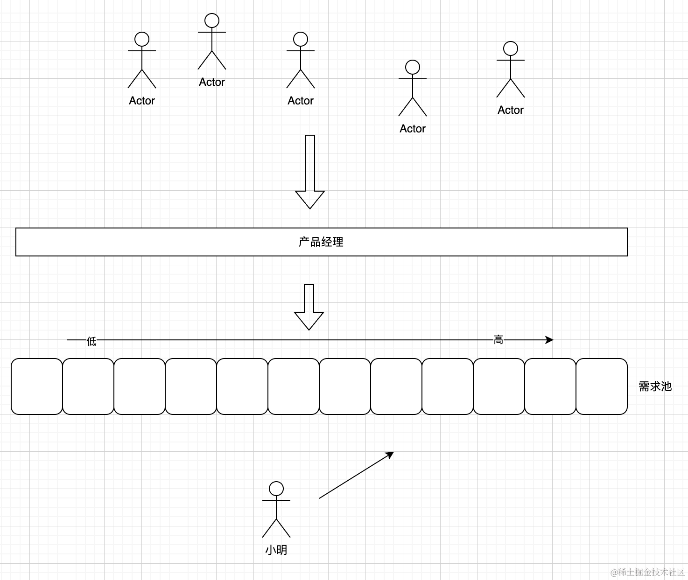
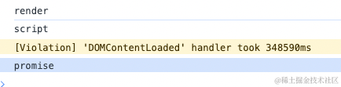
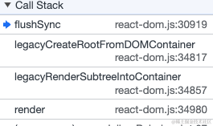
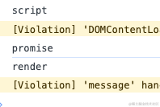

## 一、前面的话

在上一篇中我们了解了**事件优先级**和**更新优先级**，这一篇中我们会开始学习新的优先级概念了，它决定着整个渲染流程的如何计算状态，也决定着如何交给**Scheduler**进行调度，因此至关重要，读完本篇文章对于以下问题会有更加深入的理解：

1. 批量更新原理？
2. 为什么会有任务优先级？
3. 任务优先级如何跟调度优先级进行映射的？
4. 如何实现高优先级打断低优先级的？
5. reactv18在挂载时两种模式的表现区别？
6. 其他的内容...


## 二、任务优先级

所有的具有**更新优先级**的**更新（Update）** 都需要经过`scheduleUpdateOnFiber`来进行调度，来看看它都发生了什么

```js
function scheduleUpdateOnFiber(root, fiber, lane, eventTime) {
   // 标记
   ...
   markRootUpdated(root, lane, eventTime);
   // 从FiberRoot开始调度更新
   ...
   ensureRootIsScheduled(root, eventTime); 
}
```

主要做了两件事情
1. 标记时间
2. 正式调度

```js
function markRootUpdated(root, updateLane, eventTime) {
    root.pendingLanes |= updateLane; 
    if (updateLane !== IdleLane) {
      root.suspendedLanes = NoLanes;
      root.pingedLanes = NoLanes;
    }
    var eventTimes = root.eventTimes;
    var index = laneToIndex(updateLane);
    eventTimes[index] = eventTime;
}
```

将本次更新的优先级叠加到`root.pendingLanes`上，表示在任意时刻下react整个应用中需要执行的更新的优先级集合。root身上也有一个`eventTimes`，它是一个31位的数组，保存着对应优先级下的更新的发生时间

接下来进入 `ensureRootIsScheduled` 看看具体细节

```JS
function ensureRootIsScheduled(root, currentTime) {
    var existingCallbackNode = root.callbackNode; // 其实就是Task对象
    markStarvedLanesAsExpired(root, currentTime); // 把当前所有的有优先级对应的过期时间给标记上，主要是标记数组.

    var nextLanes = getNextLanes( // 获取任务优先级
      root,
      root === workInProgressRoot ? workInProgressRootRenderLanes : NoLanes
    ); // 会产生一个优先级集合。

    if (nextLanes === NoLanes) {
      // Special case: 这个时候只有可能是当前没有任务
      if (existingCallbackNode !== null) {
        cancelCallback$1(existingCallbackNode);
      }

      root.callbackNode = null;
      root.callbackPriority = NoLane;
      return;
    } 
    var newCallbackPriority = getHighestPriorityLane(nextLanes); // 从任务优先级中选出最高的
    var existingCallbackPriority = root.callbackPriority;
    if (
      existingCallbackPriority === newCallbackPriority && 
      // 这个地方其实就是 批量更新的核心了，在同一个事件下多次触发 setState 只有第一次会往下走，其他情况下都会 在这里被 return 掉。
      !(
        ReactCurrentActQueue$1.current !== null &&
        existingCallbackNode !== fakeActCallbackNode
      )
    ) {
      return;
    }

    if (existingCallbackNode != null) { // 这个时候说明有一个优先级高的来了，上一个调度的任务就应该被取消掉。因为 newCallbackPriority 就是最高的，这里就是高打断低的逻辑
      cancelCallback$1(existingCallbackNode);
    } 

    var newCallbackNode;

    // 看看当前的优先级是否命中 同步
    if (newCallbackPriority === SyncLane) { // 同步优先级
      // 同步调度
    } else {
      var schedulerPriorityLevel;
      switch (lanesToEventPriority(nextLanes)) {
        case DiscreteEventPriority:
          schedulerPriorityLevel = ImmediatePriority;
          break;
        case ContinuousEventPriority:
          schedulerPriorityLevel = UserBlockingPriority;
          break;
        case DefaultEventPriority:
          schedulerPriorityLevel = NormalPriority;
          break;
        case IdleEventPriority:
          schedulerPriorityLevel = IdlePriority;
          break;
        default:
          schedulerPriorityLevel = NormalPriority;
          break;
      }
      // 返回的是一个Task对象
      newCallbackNode = scheduleCallback$1(
        schedulerPriorityLevel,
        performConcurrentWorkOnRoot.bind(null, root)
      );
    }

    root.callbackPriority = newCallbackPriority; // 只可能这一个地方有这样的赋值。
    root.callbackNode = newCallbackNode;
  } 
```

这个函数的内容比较多，但不怕内容多，我们总结下一下做了哪些事情，然后一一把它吃透就行：
1. 标记过期时间，防止饥饿问题
2. 获取任务优先级
3. 根据任务优先级交给调度器


### 第一步：标记过期时间

```js
function markStarvedLanesAsExpired(root, currentTime) {
    var pendingLanes = root.pendingLanes; // 此刻需要调度的优先级集合
    var suspendedLanes = root.suspendedLanes; // 一般情况下就是0
    var pingedLanes = root.pingedLanes; // 一般情况下就是0
    var expirationTimes = root.expirationTimes; // 32位数组
    var lanes = pendingLanes; 

    while (lanes > 0) {
      var index = pickArbitraryLaneIndex(lanes);
      var lane = 1 << index;
      var expirationTime = expirationTimes[index];

      if (expirationTime === NoTimestamp) { // 说明未标记
        if (
          (lane & suspendedLanes) === NoLanes ||
          (lane & pingedLanes) !== NoLanes
        ) {
          // Assumes timestamps are monotonically increasing.
          expirationTimes[index] = computeExpirationTime(lane, currentTime);
        }
      } else if (expirationTime <= currentTime) {
        //  说明有存在过期的 优先级 赶紧执行
        root.expiredLanes |= lane;
      }

      lanes &= ~lane; // 将lane从lanes中剔除掉，继续进行下一个，知道所有的优先级标记完为止
    }
  } 
```

这个函数就是根据当前的优先级集合把每一个优先级对应的过期时间填充进去，如果此刻有过期的优先级，将它添加到`expiredLanes`中，等到下一次调度的时候，会检查有没有过期的，过期的优先级会当作同步任务立即执行，防止出现饥饿问题

### 第二步：获取任务优先级

首先在介绍这个概念之前，我们要思考为什么要有任务优先级呢？

实际上任务优先级的出现也很自然，其实在这一步之前大家可以想象一下react的任务池子里面（也就是root.pendingLanes）中已经堆积了可能许许多多种更新（Update）对象了，但是因为javascipt是单线程的原因，一次性只能执行一个，因此react需要从这么多池子中选出最紧急的一个优先级来进行执行，这个就是选出来的就是**任务优先级**，只不过在选最取的时候不是选取的一个，而是一批优先级，我们可以从`getNextLanes`中看看相关的内容：

```js
function getNextLanes(root, wipLanes) { 
    var pendingLanes = root.pendingLanes;
    if (pendingLanes === NoLanes) {
      return NoLanes;
    }
    var nextLanes = NoLanes; // 默认为noLanes
    // 如果当前的pendingLanes是一个 Idle类的优先级， 那么 nonIdlePendingLanes 就会变成 0 
    var nonIdlePendingLanes = pendingLanes & NonIdleLanes; // 非空闲优先级  0b0001111111111111111111111111111;

    if (nonIdlePendingLanes !== NoLanes) { // 说明 pendingLanes不是一个空闲优先级，属于优先级微高吧
      // 如果当前的pendingLanes不是空闲优先级，那么就会执行下面的代码 
      var nonIdleUnblockedLanes = nonIdlePendingLanes
      if (nonIdleUnblockedLanes !== NoLanes) {
        nextLanes = getHighestPriorityLanes(nonIdleUnblockedLanes);
      } else {
        var nonIdlePingedLanes = nonIdlePendingLanes ;
        if (nonIdlePingedLanes !== NoLanes) {
          nextLanes = getHighestPriorityLanes(nonIdlePingedLanes);
        }
      }
    } else {
      var unblockedLanes = pendingLanes ;
      if (unblockedLanes !== NoLanes) {
        nextLanes = getHighestPriorityLanes(unblockedLanes);
      } 
      ...
    }

    if (nextLanes === NoLanes) {
      return NoLanes;
    } 
   
    // 当nextLanes 属于 InputContinuousLane 时
    if ((nextLanes & InputContinuousLane) !== NoLanes) { //0b0000000000000000000000000000100;
      nextLanes |= pendingLanes & DefaultLane; // 0b0000000000000000000000000010000;
    } 
    var entangledLanes = root.entangledLanes; // 只有属于transitions优先级的时候才会有用。
    if (entangledLanes !== NoLanes) {
      var entanglements = root.entanglements;
      var lanes = nextLanes & entangledLanes;

      while (lanes > 0) {
        var index = pickArbitraryLaneIndex(lanes);
        var lane = 1 << index;
        nextLanes |= entanglements[index];
        lanes &= ~lane;
      }
    }
    return nextLanes;
  }
```
这个是如何获取**任务优先级**的关键函数，为了简化代码，我删除了关于**Suspense**相关的优先级的逻辑，我们主要聚焦于正常情况下如何获取**任务优先级**，这个函数的主要逻辑是如何从`pendingLanes`中提取优先级，无论是事件、IO、Transition触发的更新都是非空闲的优先级，因此大部分情况下都是`nonIdleUnblockedLanes`，函数会通过`getHighestPriorityLanes`来分离出最高优先级集合。

```js
function getHighestPriorityLanes(lanes) {
    switch (getHighestPriorityLane(lanes)) {
      case SyncLane:
        return SyncLane;

      case InputContinuousHydrationLane:
        return InputContinuousHydrationLane;

      case InputContinuousLane:
        return InputContinuousLane;

      case DefaultHydrationLane:
        return DefaultHydrationLane;

      case DefaultLane:
        return DefaultLane;

      case TransitionHydrationLane:
        return TransitionHydrationLane;

      case TransitionLane1:
      ...
      case TransitionLane16:
        return lanes & TransitionLanes; // 返回一个集合

      case RetryLane1:
      ...
      case RetryLane5:
        return lanes & RetryLanes; // 返回一个集合
        
      case SelectiveHydrationLane:
        return SelectiveHydrationLane;
      case IdleHydrationLane:
        return IdleHydrationLane;
      case IdleLane:
        return IdleLane;
      case OffscreenLane:
        return OffscreenLane;

      default:
        {
          error("Should have found matching lanes. This is a bug in React.");
        } // This shouldn't be reachable, but as a fallback, return the entire bitmask.

        return lanes;
    }
  }

```

可以看到除了`Transition`类的更新和`RetryLane`类的更新会返回一个优先级**集合**，其他类型的更新优先级都是返回单个优先级，这是为了更好的优化调度过程，因为`Transition`类的更新实际上就是一种更新。

整体的逻辑就是会从`pendingLanes`中获取最右侧的优先级，判断它属于哪一种，判断是返回一个Lane的集合还是单个Lane，但无论如何它一定是代表着当前最紧急的优先级。

接下来获得任务优先级后会有下面的操作

```js
var newCallbackPriority = getHighestPriorityLane(nextLanes); // 从任务优先级中选出最高的
```

我们在上一篇中有提到过Lane其实就是有这么几种

1. 同步优先级 (SyncLanes)
2. 持续优先级(InputContinuousLanes)
3. 默认优先级(DefaultLanes)
4. 过渡优先级(TransitionLanes)
5. Retry优先级(RetryLanes)
6. 空闲优先级（IdleLanes）
7. Offscreen优先级(OffscreenLanes)

而这一步 `newCallbackPriority` 的获取恰恰就说明了获取的是每一类中最高的那个优先级，获得最高的优先级后就可以交给`Scheduler`来进行调度了

但是在此之前我们来看一下这个细节

```js
...
var newCallbackPriority = getHighestPriorityLane(nextLanes);
var existingCallbackPriority = root.callbackPriority;
    if (
      existingCallbackPriority === newCallbackPriority && 
      // 这个地方其实就是 批量更新的核心了，在同一个事件下多次触发 setState 只有第一次会往下走，其他情况下都会 在这里被 return 掉。
      !(
        ReactCurrentActQueue$1.current !== null &&
        existingCallbackNode !== fakeActCallbackNode
      )
  ) {
    return;
}
...

root.callbackPriority = newCallbackPriority
```

由于`ensureRootIsScheduled`是每产生一个更新优先级都是会触发的，当第一次产生后会产生一个对应的`任务优先级`会交给调度器执行，那么下一次产生相同的更新优先级之后，就会在这里直接返回，而不会产生重复的任务优先级，这个就是react18`批量更新`的原理，例如：

```js
const App = ()=>{
  const [num , setNum] = useState(0);
  const [count , setCount] = useState(0);
  
  const onClick = ()=>{
    setNum(num + 1)
    setCount(count + 1)
    setNum(n => n + 1)
  }
  
  return (
    <button onClick={onClick}>{num}</button>
  )
}
```

在这种情况下批量更新就会起作用，产生了3次更新优先级，但是只产生一次任务优先级，前提是他们的优先级相同。

同时如果 `existingCallbackNode` 和之前的不同而且存在，只能说明这一次产生的优先级更高，因此需要中断之前正在进行或者还未进行的优先级，方法就是`cancelCallback$1(existingCallbackNode);`，其实就是将`Scheduler`体系下的堆顶函数置空就行，这个可能需要大家看一下专栏的[《深入理解react》之调度引擎——Scheduler](https://juejin.cn/post/7348466339361194035) 这篇文章。


通过这样的方式高优先级任务就可以打断低优先级的任务，从而更好的响应用户了。

### 第三步：交给调度器调度

现在我们已经获得了任务优先级了（当前pendingLanes中的最紧急的），然后就可以真正的去执行了，根据代码逻辑分为两个方向，同步和非同步

如果获得的任务优先级是 `SyncLane` 说明很紧急，因此需要同步执行，这个时候就根本不需要借助调度器，因为经过调度器的任务都至少要在下一个宏任务中执行，因此 `SyncLane`的就同步执行就好了。

同步执行所提交的任务都是 `performSyncWorkOnRoot`，如果是未开启并发模式，那么直接将任务添加到`syncQueue`在后续的流程中一起执行。

非同步所提交的任务都是 `performConcurrentWorkOnRoot`，他会根据当前的任务优先级进行一个转换，将其转换为`Scheduler`的**调度优先级**，然后交给`Scheduler`来调度执行，转换的逻辑如下：

```js
switch (lanesToEventPriority(nextLanes)) {
    case DiscreteEventPriority:
      schedulerPriorityLevel = ImmediatePriority;
      break;

    case ContinuousEventPriority:
      schedulerPriorityLevel = UserBlockingPriority;
      break;

    case DefaultEventPriority:
      schedulerPriorityLevel = NormalPriority;
      break;

    case IdleEventPriority:
      schedulerPriorityLevel = IdlePriority;
      break;

    default:
      schedulerPriorityLevel = NormalPriority;
      break;
  }
```

换句话说每一种**任务优先级**都会映射为一种**调度优先级**，`Scheduler`会提供一个API来调度给定的任务。

```js
newCallbackNode = scheduleCallback$1(
    schedulerPriorityLevel,
    performConcurrentWorkOnRoot.bind(null, root)
);
```
最后 `Schduler` 会将`Task`返回交给root保存方便在特定的时候任务的取消。

如果想要更深入的了解`调度优先级`的详细细节，可以看看专栏的[《深入理解react》之调度引擎——Scheduler](https://juejin.cn/post/7348466339361194035) 这篇文章。


## 三、加深理解

其实讲到这里大家可能会有点懵懵的感觉，这个时候就要发挥例子和故事的作用了

小明是一个程序员，他工作总是感觉特别烦躁，因为有一大群人跟他提问题，有些问题大，有些问题小，有些问题很急，有些问题不急，他总是被领导骂，因为领导说他总被业务方投诉，说他解决问题不及时，但是小明也很憋屈，因为他真的没怎么休息过，一直在处理问题，于是小明开始优化了下自己的工作流程


他分析了一下自己的投诉报告，主要有两个问题：

1. 其实都是那些特别着急的人投诉的，他回想起来确实是的，因为这几个人当时提的问题都很着急，但是小明又在忙着解决其他人的问题，而往往花的时间比较长的那个问题似乎也没有那么紧急，因此浪费了大量的时间给一些可能不紧急的任务上面
2. 在某些时刻，其实有一部人提的问题其实是重复的，小明需要重复的去看这些问题，浪费了不少时间，因此小明花了一个周末时间，制定了一套的方案，专门来解决这个问题



每一个提bug的人都是一个**事件**，但是同一个人也有可能提出不同优先级的问题，因此小明创建了一个**问题模板**，每个提问题的人，填一下这个模板，交给产品经理，产品经理更具一套机制，判断这是否是同一个问题，这个问题的优先级如何，然后判断好之后会放到需求池对应的盒子里。


小明做的事情很简单，就是不断的从需求池最左侧取任务就好了，然后就开始解决问题，但是小明需要在自己的桌面前定一个闹钟，虽然大部分任务都可以在30分钟之内搞定，但是可能也有某些难搞的问题需要很久，这样的话就会影响那些很着急的任务，因此**每隔30分钟**要停下来当前的工作去喝杯茶，在他喝茶的这段期间开放通道允许产品经理再放一些任务，因为在他工作的这段期间有可能也会产生更紧急的问题，在喝茶期间会再次检查有没有比当前正在做的任务更紧急的，如果有就停下来当前的工作


至此，小明的投诉率下降了很多，其乐融融


## 四、挂载的异步情况


在v18版本中，我们可以使用两种方式来挂载我们的应用

### leagcy模式

```jsx
 const rootNode = document.getElementById('root');
ReactDOM.render(<App />, rootNode);
console.log("script")
Promise.resolve().then(()=> console.log("promise"))
```

他的运行结果是：



可以发现整个挂载实际上是一个同步，因为**render阶段**哪怕是一个微任务它也会在 `’script‘` 之后才对，很多小伙伴看到，在legacy模式下，他的执行栈是下面这样的，意味着最后会执行`flushSync`，`render阶段`就是通过它执行的，因此在`script`和`promise`之前



### concurrent模式

```js
const root = ReactDOM.createRoot(document.getElementById("root"));
root.render(<App />);
console.log("script")
Promise.resolve().then(()=> console.log("promise"))
```

结果是


可以看到在这种模式下挂载阶段的`render阶段`是在下一个宏任务中执行的，这与我们的预期相符，因为经过`Scheduler`调度的任务都至少是在下一个宏任务才有机会执行，而这种模式下挂载任务就是交给`Scheduler`去执行的，而非同步执行。

## 五、最后的话

到这里关于`react`优先级的内容就介绍完了，我们学习了`任务优先级`、`调度优先级` 以及在v18版本中的两种挂载异步区别，在专栏的后续内容，我们就可以正式进入`render阶段`啦！当然本篇内容可能有很多不足之处，欢迎大家指出！

后面的文章我们会深入剖析react的源码，学习react的设计思想，如果你也对react相关技术感兴趣请关注我的[《深入理解react》](https://juejin.cn/column/7348420268175114290)专栏，我们一起进步，有帮助的话希望朋友点个赞支持下，多谢多谢！

