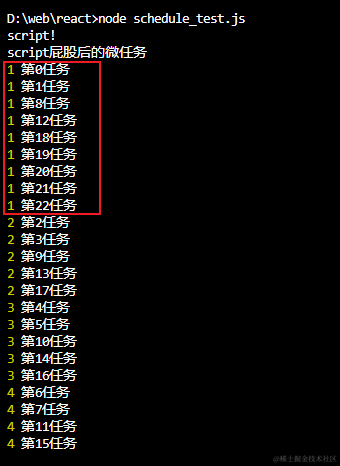
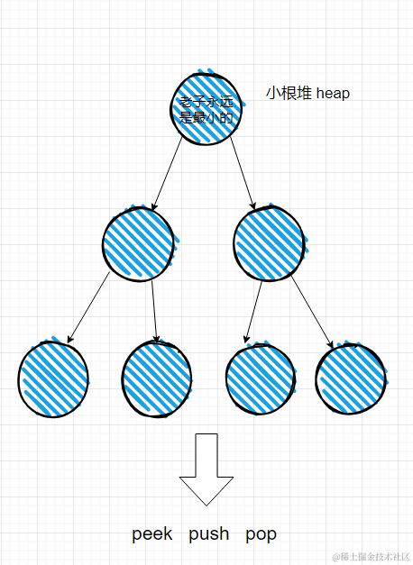
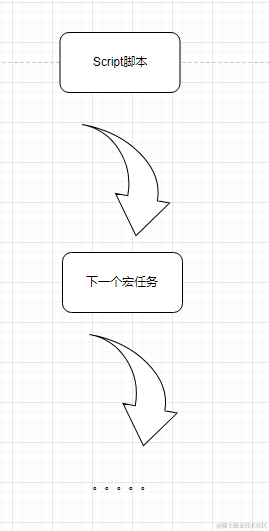
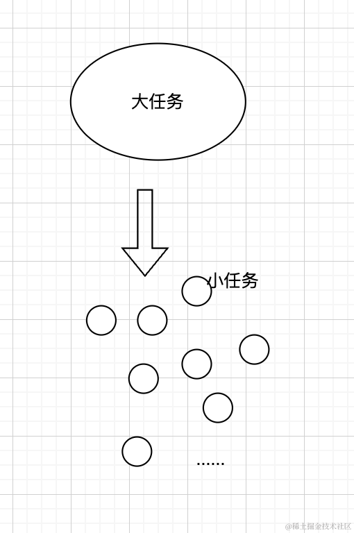
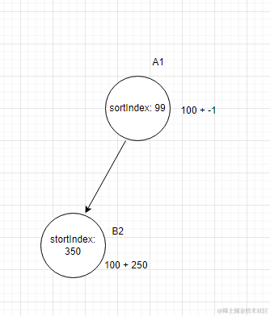
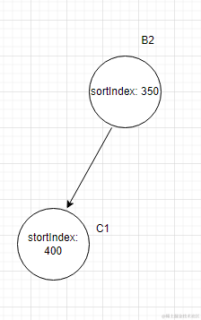

## 一、前面的话

时间过得真快，从2022年6月份react发布[18版本](https://github.com/facebook/react/tree/v18.2.0)以来(以下简称v18)，时间已经过去了近两年，很多伙伴都体验到了v18带来的新特性，其中并发模式最让人眼前一亮，只要我们使用`createRoot()`的方式来渲染我们的应用，就有机会体验到**并发模式**带来的极致爽感，而支撑并发模式的核心莫过于 react 执行流中的调度引擎——**Scheduler**。


`调度`其实并不是一个新词，在计算机行业中，从操作系统到浏览器，包括一些大型的应用层中都有调度任务的需求，调度这件事情的本质其实就是当面临很多独立的任务的时候，如何在**合理的时机**去执行它们。而今天我们研究的对象就是 Scheduler ，探索它是如何调度 react 产出的任务的。


让人兴奋的是 Scheduler 是一个独立的包，意味着它可以**独立**于 react 在任何其他的库中使用。更重要的是它的整个源码不过**600**多行，在深入理解react之前，将 Scheduler 吃透是一个很不错的选择，因为看懂它根本不用看完 react 那深似海的执行流，本文尝试以源码级等角度剖析一下 Scheduler 的实现过程，在深入理解 react 之前打下一个坚实的基础，读完本篇文章或许你会知道以下问题的答案？

1. 为什么需要Scheduler以及它解决了什么问题？
2. 什么是Scheduler中的优先级？
3. Scheduler使用什么数据结构维护任务的？
4. Scheduler是如何实现任务切分的？
5. Scheduler的执行流是什么样的？
6. 更多其他的......

话不多说，我们开始吧！

## 二、概念

### 为什么需要？

我们为什么需要调度器呢？

首先是解决卡顿问题，这来自于一个最基本的硬伤，js引擎和绘制渲染都是在同一个线程里面执行的，两者是互斥的，因此要保证用户正常使用不卡顿，屏幕必须要保证一定帧率的**刷新频率**，这个频率通常是每秒60帧。而由于 react 会产生一些CPU密集性的大任务，例如几万个**虚拟DOM**的diff、遍历等等。这种大任务会阻塞浏览器的绘制，导致页面**卡顿**。

其次是 react 会产生一些具有**优先级概念**的任务，优先级高的任务可能在后面产生，因此需要能够打断优先级低的任务，让优先级高的先执行。以更好的响应用户提高用户体验，比如用户点击，鼠标移动等。

以上就是 react 为什么需要一个调度器！

### 解决的问题

因此在react的执行流中，会产生非常多的任务，这些任务的执行时间有长有短，优先级有大有小。它们统统都会丢给Scheduler来进行处理，Scheduler会有一套自己的机制来决定该如何在合适的时机执行这些任务，来解决**CPU密集型**和**IO密集型**的场景。

## 三、体验

正如前面所说 Scheduler 可以单独使用，千言万语不如亲自试一试，因此我们可以直接创建一个工程来体验一下：

```sh
npm init
npm i scheduler -S
```

Scheduler 会暴露很多方法，其中最重要的就是这个 `unstable_scheduleCallback`，它的含义是以某种优先级去调度一个任务。

```js
// test.js
const { unstable_scheduleCallback } = require("scheduler")

const tasks = [1,1,2,2,3,3,4,4,1,2,3,4,1,2,3,4,3,2,1,1,1,1,1]

tasks.forEach((priority , i) => {
  unstable_scheduleCallback(priority , ()=>{
    console.log(priority , `第${i}任务`)
  })
})


console.log("script!")

Promise.resolve().then(res => console.log("script屁股后的微任务"))
```

上面的代码是将一些不同**优先级**（其中值越小优先级越高）的任务陆续交给 Scheduler 来调度，然后顺便测试下调度的执行时机的异步情况。
然后在 **nodejs** 中运行一下，结果如下：



通过结果我们可以得出结论，Scheduler 会按照优先级的顺序来执行给定的任务，优先级高的就会先执行，如果优先级相同的情况下再按照先注册优先执行。并且只要是交给 Scheduler 的任务都会异步执行，并且是在下一个宏任务中执行。（至于每一个任务是否都是在下一个宏任务，这个我们后面源码部分再了解，先留作疑问！）


> 小结：Scheduler 暴露了一些方法供用户使用，其中 `unstable_scheduleCallback` 可以按照优先级高的先执行来进行调度。

## 四、源码

接下来我们深入窥探一下源码，不过不用担心，我会将不重要的信息过滤掉，帮助大家理解其中最为核心的部分，但是当看完本篇文章，建议还是去细细看下源码，这样会更加的印象深刻，也可以用自己的思考验证一下笔者的理解是否正确。

### 小根堆



熟悉算法与数据结构的同学对这个结构可以说相当了解了，小根堆的本质就是一棵二叉树，它的堆顶永远维持着最小值（业务中对应的就是优先级最高的任务），对外暴露3个方法，往堆中塞入一个元素，弹出堆顶元素，获取堆顶元素。

它的具体实现在[这里](https://github.com/facebook/react/blob/main/packages/scheduler/src/SchedulerMinHeap.js)，如果对具体实现感兴趣的伙伴可以关注这个专栏，我后期会出一篇 react 中的算法的文章，来详细剖析一下它们的细节，但在这里可以把它当成一个黑盒就好了。 

```js

// 比较策略
function compare(a, b) { // 使用节点的 sortIndex作为判断依据 ，如果比较不了，就是用ID，也就是顺序了
  // Compare sort index first, then task id.
  var diff = a.sortIndex - b.sortIndex;
  return diff !== 0 ? diff : a.id - b.id;
}

```

Scheduler 是使用上面得比较策略来维护堆顶元素的。


### 优先级

在 Scheduler 中有5种[优先级](https://github.com/facebook/react/blob/main/packages/scheduler/src/SchedulerPriorities.js)

```js
var ImmediatePriority = 1;
var UserBlockingPriority = 2;
var NormalPriority = 3;
var LowPriority = 4;
var IdlePriority = 5;
```

每一种优先级都对应了相应的过期时间 

```js
var IMMEDIATE_PRIORITY_TIMEOUT = -1; 
var USER_BLOCKING_PRIORITY_TIMEOUT = 250;
var NORMAL_PRIORITY_TIMEOUT = 5000;
var LOW_PRIORITY_TIMEOUT = 10000; 
var maxSigned31BitInt = 1073741823; 
```

### 入口 

首先了解几个重要的全局变量

```js
var taskQueue = []; // 任务队列 
var timerQueue = []; // 延时队列

var taskIdCounter = 1; // 任务id.
var currentTask = null; // 当前正在进行的任务
var currentPriorityLevel = NormalPriority; // 当前任务的优先级

var isPerformingWork = false; // 是否在执行flushWork函数
var isHostCallbackScheduled = false; // 是否有任务在调度
var isHostTimeoutScheduled = false; // 是否有定时器来调度延时任务
```

`taskQueue` 和 `timerQueue` 本质上是一个小根堆，只不过使用数组来实现这个小根堆而已。接下来看入口函数

```js
function unstable_scheduleCallback(priorityLevel, callback, options) {
  var currentTime = exports.unstable_now(); // 获取当前时间
  var startTime;

  if (typeof options === 'object' && options !== null) { // 只有在options的情况下才会走这里
    ...
  } else {
    startTime = currentTime;
  }

  var timeout;

  switch (priorityLevel) {
    case ImmediatePriority:
      timeout = IMMEDIATE_PRIORITY_TIMEOUT; // -1
      break;

    case UserBlockingPriority:
      timeout = USER_BLOCKING_PRIORITY_TIMEOUT; //250
      break;

    case IdlePriority:
      timeout = IDLE_PRIORITY_TIMEOUT; // 12天 很大很大
      break;

    case LowPriority:
      timeout = LOW_PRIORITY_TIMEOUT; // 10000ms
      break;

    case NormalPriority:
    default:
      timeout = NORMAL_PRIORITY_TIMEOUT; // 5000ms
      break;
  }

  var expirationTime = startTime + timeout;
  var newTask = {
    id: taskIdCounter++,
    callback: callback,
    priorityLevel: priorityLevel,
    startTime: startTime,
    expirationTime: expirationTime,
    sortIndex: -1
  };

  if (startTime > currentTime) { // 只有在有delay的情况下，才会成立，一般情况下都是等于。
    ...
  } else {
    newTask.sortIndex = expirationTime; // sortIndex其实就是过期时间，越早过期（数值越小）越先执行。
    push(taskQueue, newTask); // 放入taskQueue
    if (!isHostCallbackScheduled && !isPerformingWork) { 
      // 第一个任务的时候会走这里，因为默认既没有调度日任务，也没有执行flushWork函数
      isHostCallbackScheduled = true;
      requestHostCallback(flushWork);
    }
  }

  return newTask;
}
```

这段代码理解起来并不难，总的来说做了3件事情：

1. 根据已知信息创建一个Task任务，也就是一个**Task类型**的对象 
2. 将该 task 放入小根堆中
3. 如果是第一个任务，那么执行 `requestHostCallback(flushWork)` 进行调度

### 如何调度

那么 `requestHostCallback` 做了什么呢？

```js
function requestHostCallback(callback) {
  scheduledHostCallback = callback; // 其实就是flushWork

  if (!isMessageLoopRunning) { // 这个变量代表是否有宏任务在执行
    isMessageLoopRunning = true; // 如果没有去唤醒下一个宏任务
    schedulePerformWorkUntilDeadline();
  }
}
```

当第一个任务被流入 Scheduler 期间是没有正在进行的宏任务的，因此可以看看 `schedulePerformWorkUntilDeadline` 发生了什么

```js
schedulePerformWorkUntilDeadline = function () {
    port.postMessage(null);
};
```

Scheduler 用了很多补丁来实现这个 `schedulePerformWorkUntilDeadline`，但是现代浏览器基本上都支持 [MessageChannel](https://developer.mozilla.org/en-US/docs/Web/API/MessageChannel) ，因此调用它意味着会在下一个宏任务的时候唤醒注册在另外一个**port**的回调函数。也就是这一个 ` channel.port1.onmessage = performWorkUntilDeadline;`

```js
var performWorkUntilDeadline = function () {
  if (scheduledHostCallback !== null) { // 其实也就是之前赋值的flushWork
    var currentTime = exports.unstable_now();// 获取当前的时间
    startTime = currentTime;  //全局的startTime，用来记录当前这批任务的调度开始时间，用来判断是否用完切片用的。
    var hasTimeRemaining = true; // 永远只可能为true.
    var hasMoreWork = true;
    try {
      hasMoreWork = scheduledHostCallback(hasTimeRemaining, currentTime); // 也就是执行flushWork
    } finally {
      if (hasMoreWork) {
        schedulePerformWorkUntilDeadline(); // 如果task队列中还有，继续在下一个宏任务中调度
      } else {
        // 如果清空了队列，清空一下全局变量。
        isMessageLoopRunning = false;
        scheduledHostCallback = null;
      }
    }
  } else {
    isMessageLoopRunning = false;
  } 
};
```

`performWorkUntilDeadline` 其实就是做了一件事情，执行 `flushWork`，我们来看下它做了什么：

```js
function flushWork(hasTimeRemaining, initialTime) { // initialTime是这一批任务的开始时间
  isHostCallbackScheduled = false; // 这个变量只有在flushWork的时候才会被释放。
  isPerformingWork = true;
  var previousPriorityLevel = currentPriorityLevel;
  try {
    ...
    return workLoop(hasTimeRemaining, initialTime);
  } finally {
    currentTask = null;
    currentPriorityLevel = previousPriorityLevel;
    isPerformingWork = false;
  }
}
```
`flushWork` 其实也仅仅只是调用了 `workLoop`，而 `workLoop` 才是调度的核心。

```js
function workLoop(hasTimeRemaining, initialTime) {
  var currentTime = initialTime;
  currentTask = peek(taskQueue);
  while (currentTask !== null) {
    if (currentTask.expirationTime > currentTime && (!hasTimeRemaining || shouldYieldToHost())) {
      // 如果 expriationTime > currentTime 说明任务还没有过期，否则过期了，过期了会尽可能早点执行，因此不会进入到这里
      // 没有过期的情况下 ， hasTimeRemaining 一般情况下就是为true，所以主要是看 shouldYieldToHost 结构，返回true（说明时间片已经用完了，需要异步执行）进入到这里，否则
      break;
    }

    var callback = currentTask.callback;

    if (typeof callback === 'function') {
      currentTask.callback = null; // 如果当前任务的函数置为null
      currentPriorityLevel = currentTask.priorityLevel;
      var didUserCallbackTimeout = currentTask.expirationTime <= currentTime; // 说明当前任务过期了，
      var continuationCallback = callback(didUserCallbackTimeout); // 这个才是真正用户提供的任务函数
      currentTime = exports.unstable_now();

      if (typeof continuationCallback === 'function') {
        currentTask.callback = continuationCallback; // 可能会继续执行。
      } else {
        if (currentTask === peek(taskQueue)) {
          pop(taskQueue);
        }
      }

      ...
    } else {
      pop(taskQueue);
    }

    currentTask = peek(taskQueue);
  } 

  if (currentTask !== null) {
    return true;
  } 
  return false
}
```

这个函数的逻辑是 Scheduler 的核心，我们一点一点来理解。

根据我们之前的分析，当执行流进入到 `workLoop` 的时候意味着已经是下一个宏任务了




因此由于在 Script 当中我们已经把不同优先级的任务都**同步的**注册完了，因此来到 `workLoop` 的时候堆中应该是有多个任务才对，并且按照优先级大小顺序排列的。


### 小任务

Scheduler 并没有采取每一个宏任务只完成一个**task**这样的策略，因为这样性能明显不会很好，因为有的任务可能耗时很短，如果留有很大的一块宏任务区间只完成一个很小的任务难免有些浪费，因此 Scheduler 会合并这些小任务在一个宏任务中一起完成，方法就是调度过程中使用一个 `while` 循环来依次取出 `taskQueue` 中的任务，并执行它们。

因此 Scheduler 当遇到小任务的时候，采取的策略是在同一个时间片内一起执行，直到它们的累计时长超过了规定的阈值之后才让出主线程。这个阈值在 Scheduler 中是5ms，我们可以在[源码](https://github.com/facebook/react/blob/main/packages/scheduler/src/SchedulerFeatureFlags.js#L12C13-L12C31)中窥探的到。

```js
var frameYieldMs = 5; // 切片大小
```

判断的方法就是 `shouldYieldToHost` 

```js
var frameInterval = frameYieldMs;
function shouldYieldToHost() {
  var timeElapsed = exports.unstable_now() - startTime;
  if (timeElapsed < frameInterval) {
    return false; // 说明不应该中断，时间片还没有用完
  } 
  return true; // 说明时间片已经用完了
}
```

因为我们知道这一批任务开始的时间，只要所有任务加起来的时间超过 **5ms** 我们就认为要交出主线程了，所以把 `while` 循环 `break` 掉。

最后判断一下 `taskQueue` 中是还存有任务，如果存在返回 true，否则返回 false，这个决定  `performWorkUntilDeadline` 中的 `hasMoreTask` 是否继续调度（可以翻翻看看前面的分析），直到把队列清空为止，而整个过程都是在宏任务中异步完成，根本不会阻塞主线程渲染UI ，自然也就不会使用户感受到卡顿了。

****

### 大任务

但是并不是所有的任务都是小任务啊，有的任务很大，可能远远超过5ms，这个时候该怎么办呢？

实际上，有两种可能，第一种就是用户不管它，直接把这个大任务交给 Scheduler 来进行调度，结果就是 workLoop 在执行完这个任务的时候，已经花了不少时间，下一个任务会 `break` 掉 `while` 循环，然后在下一个任务会在下一个宏任务中调度执行，但是在这个大任务在执行过程中就会阻塞UI 的绘制，影响用户体验。

第二种就是用户可以利用 Scheduler 的 `shouldYieldToHost` 方法来对大任务进行拆分，将大任务拆称为一个个的小任务然后交给 Scheduler 来执行，这样的话就不会阻塞主线程绘制UI，获得更流畅的用户体验了，这个该如何去做呢？

这个就需要用户在使用 Scheduler 的时候对大任务的执行方式做一个设计，例如一个同步执行的大任务可以选择将其拆分为若干个独立的小任务用循环去执行，通过类似下面这样的**范式**就可以做到：

```js

let current = 0;
let count = 100000;
const bigWork = ()=>{
    while( current < count && !shouldYieldToHost() ){
        doUnitWork();
        count ++;
    }
    
    if(current < count){
      // 说明任务还没做完，但是时间片已经到了
      return bigWork;
    }
    
    return null;
}

```





用户需要将大任务以上面的范式进行改进，然后将大任务拆成极小的细粒度的小任务，然后每次执行小任务的时候都看一下是否用完了5ms的时间片，如果用完了就结束执行，这时候大任务可能还没有执行完，但是因为全局变量保存了大任务的执行进度因此并不会丢失掉信息，然后返回函数本身，这个时候我们再来看一下 Scheduler 是如何处理这种情况的。

```js
// workLoop 函数内部

var continuationCallback = callback(didUserCallbackTimeout); // 执行过后
currentTime = getCurrentTime();
if (typeof continuationCallback === "function") {
  currentTask.callback = continuationCallback;
} else {
  if (currentTask === peek(taskQueue)) {
    pop(taskQueue);
  }
}
```

可以看到当函数有返回值且返回值为一个函数的时候，本来清空的又会被赋值为该函数，并且最重要一点本次执行的任务不会在 `taskQueue` 中被移除，那么继续往下走，就会在下一个宏任务中被继续调度，因为上一次执行的大任务依然在堆顶，所以这一次执行的依然是它，借助全局变量中保存的信息，任务便会被回复执行，这样即便在大任务的情况下也不会阻塞UI的绘制了。


事实上 react 的并发模式就是通过这样的方式来实现大任务的更新的，如下所示：

```js
function workLoopConcurrent() {
    // Perform work until Scheduler asks us to yield
    while (workInProgress !== null && !shouldYield()) {
      performUnitOfWork(workInProgress); // 处理每一个fiber节点
    }
 }
```


> 小结：  
> 我们通过上面内容知道了 workLoop 的工作流程，Scheduler 的调度流程的主要核心宗旨就是在不阻塞浏览器绘制的大前提下尽可能多的执行任务。如果用户提供的任务很小（耗时短）就会合并起来批量同步执行，如果任务比较大需要用户配合着 Scheduler 将任务拆分成若干小任务分批次的执行。总而言之，Scheduler 总会恰到好处的将我们的给定的任务按照优先级尽快的执行，且并不阻碍UI的绘制。

****


### 饥饿问题

在任务调度的话题里永远都有一个饥饿问题，意思是说在调度器接受到一堆任务之后，它们就会按照优先级的大小排列起来，当调度器取出一个最高优先级的任务执行的过程中，也是有可能继续往队列里面填充任务的，如果这个最高优先级产生的任务的优先级永远都比其他任务优先级高，那其他的低优先级任务就永远不可能得到执行，相当于在排队过程中一直有人插队，这就是著名的**饥饿问题**， Scheduler 是如何解决这个问题的呢？


正如上面所说在 Scheduler 中是用小根堆来维护优先级队列的，我们再来看一下入队列的代码：

```JS
// 简化后的代码
function unstable_scheduleCallback(priorityLevel, callback, options) {
  ...
  var startTime = exports.unstable_now();
  var timeout = 根据优先级确定一个值 // -1 | 250 | 1000 | 5000 | 12 天
  var expirationTime = startTime + timeout;
  var newTask = {
    id: taskIdCounter++,
    callback: callback,
    priorityLevel: priorityLevel,
    startTime: startTime,
    expirationTime: expirationTime,
    sortIndex: -1
  };

  newTask.sortIndex = expirationTime;
  push(taskQueue, newTask); 
  ...

  return newTask;
}

```

决定在堆中是否处于高位的核心是 `sortIndex` ，也就是取决于 `expirationTime` 的大小，而它由两部分构成，分别是 `startTime` 和 `timeout` ，我们可以想象一下，当一个低优先级任务进到队列里的时候，其实随着时间的推移它的优先级会越来越高的，因为优先级的值越小优先级越高，随着时间的推移后进来的任务即便优先级比较高，但是 `startTime` 的值会越来越大的，因此意味着后来者它们一出生就带着更重的负担，相对而言，原来优先级低的任务它们因为先进入队列所以就显得优先级在逐步升高了。

Scheduler 体系下的优先级并不是一个一锤子买卖，在调度任务的过程中它们的优先级也会**动态**的调整。


我们甚至可以推断，当一个优先级到了过期时间之后，它一定会处于堆顶，新进来的任务无论优先级多高都不可能再超越它了。

我们举个简单例子来说明这一点：

例如刚开始有两个任务 A1 B2。 

字母代表任务名，数字代表优先级。假设刚开始 startTime 的值为 100，那么在堆中应该是这样的。




然后根据我们之前分析的调度策略，A1 被取出来执行，假设它花了300ms ，在它任务的末尾又添加了一个优先级为1的任务 C1 ，这个时候在计算 C1 的sortIndex 的时候，就会取当前时间 `startTime` ，由于经过了250ms，所以当前时间一定大于或等于 400 ，最终计算得到的 stortIndex 必然是要高于350的，因此即便后来者优先级再高都不会超过 B2 ，所以B2就会在下一个周期中优先执行。





> 小结  
> 在 Scheduler 中优先级并不是一成不变的，而是在调度过程中动态分配变化的


## 五、最后的话

实际上 Scheduler 中一共维护了两个队列，本文并没有提到关于 `timerQueue` 的相关信息，那是因为在 react 的调度流程中基本不会涉及到 `timerQueue` 所以如果单纯理解 react 其实以上的知识已经足够，出于篇幅原因，timerQueue 相关的信息我会在后续的文章中进行详细分析。

如果你喜欢这样的行文风格，可以关注我的[《深入理解react》](https://juejin.cn/column/7348420268175114290)专栏，持续更新中...


