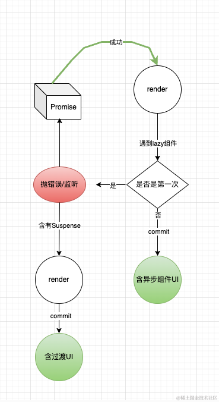

## 一、前面的话

在 react 中为我们提供了一个非常有用的组件，那就是`<Suspense/>`，他可以包裹一个异步组件，当这个异步组件处于`pending`状态的时候会展示一个过渡的 UI，当异步组件处于`resolved`状态的时候会显示真正的 UI，我们来看一下如何使用`Suspense` 和 react 提供的`lazy`结合起来达到异步加载状态的目的

```JSX
import  { lazy , Suspense } from 'react';

const LazyComponent = React.lazy(() => import('./xxx'));

export default function App() {
  return (
    <Suspense fallback={<span>loading...</span>}>
      <LazyComponent/>
    </Suspense>
  )
}
```

它的效果如下：


接下来我们就来一步一步看一下这究竟是怎么做到这一点的！

## 二、lazy 懒加载组件

要先从`lazy`这个 api 开始说起，根据上面的内容，`LazyComponent`是由`lazy`这个调用返回的结果，它能够被直接渲染，在没有 Suspense 加持的情况下，也是可以异步渲染出组件的，如下所示

```js
const LazyComponent = React.lazy(() => import("./LazyComponent.js"));

const FunctionComponent = () => {
  const [count, setCount] = React.useState(1);

  const onClick = () => {
    setCount(count + 1);
  };

  return (
    <div>
      <button onClick={onClick}>{count}</button>
      <LazyComponent />
    </div>
  );
};

const root = ReactDOM.createRoot(document.getElementById("root"));
root.render(<FunctionComponent />);
```

效果如下：


我们看一下`lazy`的实现原理

```js
function lazy(ctor) {
    var payload = { // 创建一个payload
      _status: Uninitialized, // -1
      _result: ctor, // ctor 就是用户传递的哪个()=> import("xxxxx") 实际上等价于 ()=> Promise<any>
    };
    var lazyType = { // 这是一个REACT_LAZY_TYPE类型的ReactElement
      $$typeof: REACT_LAZY_TYPE,
      _payload: payload,
      _init: lazyInitializer, // 下面分析一下lazyInitializer
    };
    // 下面是给lazyType做属性的配置，不重要了解即可
    {
      Object.defineProperties(lazyType, {
        defaultProps: {
          configurable: true,
          get: function () {...},
          set: function (newDefaultProps) { ...},
        },
        propTypes: {
          configurable: true,
          get: function () {... },
          set: function (newPropTypes) {...}
        }
      });
    }

    return lazyType;
}
```

根据我提供的注释我们可以看到，其实 lazy 就是返回了一个`REACT_LAZY_TYPE`类型的 ReactElement 节点，并且用一个状态机记录了当前的这个节点处于什么样的状态，引用者传进来的函数引用

这里要重点分析一下`()=> import('xxxx')`，`import('xxx')`是 ES6 提供的一种异步加载模块的方式，他会返回一个`Promise`，因此可以使用`.then`获取异步加载所得到的数据


接下来我们看一下`lazyInitializer`的实现

```js
function lazyInitializer(payload) {
  if (payload._status === Uninitialized) {
    // 如果是初始化状态
    var ctor = payload._result; // ()=> import('xxx')
    var thenable = ctor(); // 得到一个Promise
    thenable.then(
      // 调用.then
      function (moduleObject) {
        if (payload._status === Pending || payload._status === Uninitialized) {
          // 标记成功
          var resolved = payload;
          resolved._status = Resolved;
          resolved._result = moduleObject;
        }
      },
      function (error) {
        if (
          // 标记失败
          payload._status === Pending ||
          payload._status === Uninitialized
        ) {
          var rejected = payload;
          rejected._status = Rejected;
          rejected._result = error;
        }
      }
    );

    if (payload._status === Uninitialized) {
      // 如果是初始化
      var pending = payload;
      pending._status = Pending; // 标记正在进行
      pending._result = thenable;
    }
  }

  if (payload._status === Resolved) {
    // 如果不是初始化
    var moduleObject = payload._result;
    if (moduleObject === undefined) {
      报错;
    }
    if (!("default" in moduleObject)) {
      报错;
    }
    return moduleObject.default;
  } else {
    // 初始化都会进入到这里
    throw payload._result; // 抛出错误
  }
}
```

经过分析我们会发现`lazyInitializer`会根据`payload`的状态来采取不同的行为：

1. 如果是初始化状态
   在这里它会执行用户传进来的函数，得到一个 Promise，并且开始调用这个 Promise，得到异步的结果，并且标记自己处于`Pedning`状态，然后抛出错误
2. 如果`Resolved`的状态那么就判断这个得到的值是否合法，合法就返回给调用者

但不用担心，此时我们分析了这个函数如果执行的话，直到现在用户只是调用了`lazy`，这个函数还没到执行的时候，现在用户仅仅只是得到了一个`lazy`类型的`ReactElement`类型的节点

而真正让这个函数执行得地方还是得在`render`阶段，当调和到`lazy`类型的节点的时候，会执行`mountLazyComponent`

```js
function mountLazyComponent(
    _current,
    workInProgress,
    elementType,
    renderLanes
  ) {
    var props = workInProgress.pendingProps; // lazy的组件一般没有props
    var lazyComponent = elementType; // ReactElement
    var payload = lazyComponent._payload; // 这就是上面的payload
    var init = lazyComponent._init; // 获取那个init函数，就是我们上面分析的那个
    var Component = init(payload); // 调用它，第一次会抛出错误
    //芭比Q，下面不用看了
    ...

}
```

根据我们上面的分析，在调用`lazyInitializer`函数的时候，如果是第一次调用，会进入第一种情况，状态还是初始化的状态，因此会执行异步函数，得到一个正在调用的`Promise`，然后会调用`.then`获取它的结果，然后将其保存在`payload`中，然后将状态置为`Pending`，最后抛出错误，所以后面的逻辑都不用看了，第一次在这里会抛出错误，阻塞后面的代码，整个 render 阶段被迫提前结束

**如果提前结束了`render阶段`，那么后面该如何运行呢？**

原来当`lazy`类型的 render 过程中，准确的来说应该是`beginWork`中因为第一次执行`init`函数导致抛出错误，阻塞了后面的过程，react 会提前结束`beginWork`环节，然后 react 会捕获这个错误，还记得那个`workLoop`么？它是这样子的：

```js
do {
  try {
    workLoopSync(); // 当这里抛出错误时
    break;
  } catch (thrownValue) {
    handleError(root, thrownValue); // 会来到这里
  }
} while (true);
```

因此实际上 react 并不会因为抛出了这个错误就完蛋了，甚至这个错误是刻意抛出的，为的就是在`handleError`中捕获它，然后做不同的逻辑处理

在`handleError`中会基于抛出错误的节点开始提前进入`completeWork`，然后将整棵树标记为**未完成**的状态，最后因为上层函数拿到这个是否调和完整棵树的状态，决定是否进行`commit`流程

结果就是这棵树没有完成，因此不会进行`commit`阶段，第一次`render`因为`lazy`类型组件的存在就这样匆匆结束了

**那现相信大家和我有同样的问题，那 react 是怎么重启`render`的呢？** ，因为在平常开发中 lazy 组件也是可以渲染出组件的呀，所以一定有一个重启 render 的过程才能做到。

原来在`handleError`的过程中有一个这样的过程，如果发现了抛出错误的参数是一个`Promise`的话，就会认定他是一个懒加载的情况，然后做出重启的操作，正巧我们`init`抛出错误的信息刚好是一个`Promise`，而重启的操作如下：

```js
function throwException(value){// 这个value就是错误信息
  ...
  if (
      value !== null &&
      typeof value === "object" &&
      typeof value.then === "function" // 如果是一个Promise
    ) {
      var wakeable = value; //
      var suspenseBoundary = getNearestSuspenseBoundaryToCapture(returnFiber); // 如有上层有Suspense包裹的话，这里先不谈
      if (suspenseBoundary !== null) {
        ...
      } else{
        attachPingListener(root, wakeable, rootRenderLanes); // 这里就是关键了，它会监听这个Promise的情况
      }
}
```

那么`attachPingListener`发生了什么呢？

```js
简化一下就是这样的;
var ping = pingSuspendedRoot.bind(null, root, wakeable, lanes);
weakable.then(ping, ping);
```

看到了吗，如果这个`Promise`的状态一旦从`Pending`状态变成其他状态，就会执行这个`pingSuspendedRoot`，它里面就藏着重新发起调度的`ensureRootIsScheduled`逻辑，然后会把更新流程重走一遍，从`render`到`commit`，最终就呈现出了 UI。

这里需要注意的一点就是当重启的这一次`render`阶段其实也会遇到`lazy`类型的节点，那它还会抛出错误吗？

其实是不会的，因为这一次来到`lazy`节点时，执行的`init`函数会发现状态已经被修改为`Resolved`的状态了， 会直接返回结果，然后返回的结果通常来说是一个组件，就是异步加载的组件，把它作为子组件再继续构建 fiber 树

```js
function mountLazyComponent(
    _current,
    workInProgress,
    elementType,
    renderLanes
  ) {
    var props = workInProgress.pendingProps; // lazy的组件一般没有props
    var lazyComponent = elementType; // ReactElement
    var payload = lazyComponent._payload; // 这就是上面的payload
    var init = lazyComponent._init; // 获取那个init函数，就是我们上面分析的那个
    var Component = init(payload); // 这一次调用直接获取到值，而不会抛出错误，往下调和异步组件

    workInProgress.type = Component;
    var resolvedTag = (workInProgress.tag = resolveLazyComponentTag(Component)); // 获取对应的fiber类型
    var resolvedProps = resolveDefaultProps(Component, props);
    var child;

    switch (resolvedTag) {
      case FunctionComponent: {
        ...
        child = updateFunctionComponent( // 继续调和
          null,
          workInProgress,
          Component,
          resolvedProps,
          renderLanes
        );
        return child;
      }
      ...
    }

}
```

> 至此 lazy 类型的组件原理我们就分析完了，它其实利用的是`react`强大的异常捕获机制，以及`Promise`灵敏的状态机来实现的，我画个图给大家总结一下


## 三、Suspense 原理

当我们分析了上面的`lazy`类型的组件之后`Suspense`就很好学习了

`Suspense`本质上就是一个`ReactElement`类型的对象，没啥好说的；关键要看在`render`阶段 react 如何处理这种类型的 fiber 组件的，下面一起来看一下

### 初始化

在初始化时仅仅只是创建了 fiber，然后继续调和子组件，由于他的组件就是`lazy`类型的组件，因此还是回到上面的逻辑，`lazy`组件会抛错啊，因此第一次`render`阶段终止了，但是在`handleError`处理错误的时候，因为它被`Suspense`包裹着，因此逻辑会有不同

```js
function throwException(value){ // 这个value就是错误信息
  ...
  if (
      value !== null &&
      typeof value === "object" &&
      typeof value.then === "function" // 如果是一个Promise
    ) {
      var wakeable = value; //
      var suspenseBoundary = getNearestSuspenseBoundaryToCapture(returnFiber); // 如有上层有Suspense包裹的话，这里会判定有，实际上就是遍历祖先节点，看是否有Suspense类型的fiber
      if (suspenseBoundary !== null) {
        suspenseBoundary.flags &= ~ForceClientRender;
        markSuspenseBoundaryShouldCapture( // 打标签应该被捕获
          suspenseBoundary,
          returnFiber,
          sourceFiber,
          root,
          rootRenderLanes
        );
        attachPingListener(root, wakeable, rootRenderLanes); // 监听重启
      } else{
        ...
      }
}
```

实际上这个逻辑和 lazy 还是一样的，就是监听`Promise`的状态，在`Promise`有结果的时候再重启一次`render`，这一点是一致的，通过这个机制可以确保当异步组件加载完成后 react 运行时能够知道在此时更新页面，呈现出最新的 UI

但是我们知道从效果上来看，在有`Suspense`包裹的时候，在异步组件加载过程中应该会立马展示一个过渡 UI，也就是`fallback`对应的参数，而需要做到这一点需要发起一次调度啊，也就是说需要经历一个`render`+`commit`才能做到啊

### 过渡 fiber 节点

原来这一切的一切在第一次 render 的时候就有准备了，在第一次构建 fiber 树的时候，假设我们的组件是下面这样的

```js
<Suspense fallback={...}>
  <Lazy/>
</Suspense>
```

那么实际上在构建`fiber`树的时候会有这样的`fiber`结构


因此它并不是每个组件对应一个`fiber`节点，`Suspense`对应的实际上是有 2 个 fiber 节点，当我们知道这一点之后，当做了监听完的动作之后，我们再回到外层看一下，会执行一个`completeUnitOfWork`的动作，这个动作实际上在上面我们讲到的只有`lazy`的情况也会执行，只不过在只有`lazy`组件的时候它会一直调和到`root`节点，导致`workInProgress`为`null`，而在有`Suspense`会表现的有所不同

因为这是由于出现了异常导致的`completeUnitOfWork`，因此不会走正常的`completeWork`，而是走`unwindWork(current, completedWork);`

在`unwindWork`向上归并的时候，如果遇到有`Suspense`节点的情况会保留这个`Suspense`节点的信息，实际上就是不会一直往上走到 root 节点，而是将`workInProgress`指向这个`Suspense`的 fiber 节点，然后就退出`completeWork`的流程，然后我们再来看一下`render`阶段的引擎函数

```js
do {
  try {
    workLoopSync(); // 这里面需要workInProgress有值才能正常运行
    break;
  } catch (thrownValue) {
    handleError(root, thrownValue);
    // 结束后，还是会执行
  }
} while (true);
```

`handleError`结束后还会继续接着 render，在上面提到的只有 lazy 组件的情况下，因为`workInProgress`不存在所以直接`break`退出了`render`流程，而在`Suspense`组件存在的情况下，会继续从这个`Suspense`开始继续`render`

这一次`render`就会直接调和`fallback`的内容，这一次根本就不会遇到`lazy`类型的组件了，直到整棵 fiber 树调和完成，然后接着正常进行`commit`流程，所以用户看到的就是带有`fallback`的 UI 界面

等到异步组件重新加载完成后，会重新执行一次`render` + `commit` 构建出含有异步组件的界面

> 小结：
> 以上就是 Suspense，主要是 react 在拥有`Suspense`类型的组件的过程中做了处理，使其多了一次默认的`render` + `commit`的流程，从而使用户能够看到含有过渡状态的 UI，我依然用一个图来给大家总结一下



## 四、最后的话

本篇文章中，我们从源码的角度分析了`Suspense`和`lazy`组件的原理，并且梳理了它们的流程，接下来我们继续学习 react 的新特性，吃透 react。

后面的文章我们会依然会深入剖析 react 的源码，学习 react 的设计思想，如果你也对 react 相关技术感兴趣请订阅我的[《深入理解 react》](https://juejin.cn/column/7348420268175114290 "https://juejin.cn/column/7348420268175114290")专栏，笔者争取至少月更一篇，我们一起进步，有帮助的话希望朋友点个赞支持下，多谢多谢！
